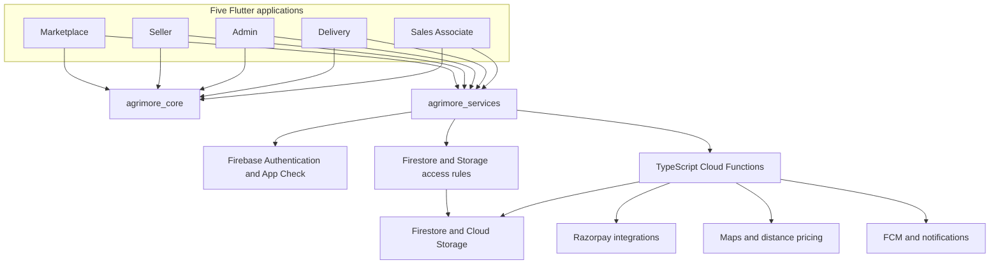

# Agrimore

**Five apps. One agricultural commerce platform.**

Agrimore connects customers, sellers, delivery partners, sales associates, and administrators through a shared Flutter and Firebase platform. This private monorepo contains the applications, shared domain packages, server business logic, access rules, indexes, design assets, and implementation evidence.

| Marketplace | Seller | Admin | Delivery | Sales Associate |
|:---:|:---:|:---:|:---:|:---:|
|  |  |  |  |  |
| Shop and track | Sell and fulfil | Operate and review | Collect and deliver | Sell and earn |

**Repository:** [SaaiSiddhu/Agrimore](https://github.com/SaaiSiddhu/Agrimore) · **Integration branch:** `develop` · **Documentation snapshot:** 2026-10-05

> Source exists for all five roles. Local integration, cloud deployment, signed mobile builds, and connected release acceptance are separate milestones. The F0–F9 mobile foundation programme remains open. Product Credit redemption remains gated.

## Contents

- [Product and business model](#product-and-business-model)
- [The five applications](#the-five-applications)
- [Architecture](#architecture)
- [Repository layout](#repository-layout)
- [Business flows and financial boundaries](#business-flows-and-financial-boundaries)
- [Assets and design library](#assets-and-design-library)
- [Technology and platforms](#technology-and-platforms)
- [Local development](#local-development)
- [Verification](#verification)
- [Cloud configuration and release boundaries](#cloud-configuration-and-release-boundaries)
- [Foundation phases and remaining work](#foundation-phases-and-remaining-work)
- [Documentation map](#documentation-map)
- [Git history and contribution conventions](#git-history-and-contribution-conventions)

## Product and business model

Agrimore is an India-focused agricultural commerce and fulfilment platform. Customers discover products and place orders; sellers manage supply and fulfilment; delivery partners complete the physical journey; sales associates support B2B sales; administrators manage approvals, catalogue operations, financial investigation, and support.

The code contains both seller-oriented commerce and location/warehouse inventory concepts. Older architecture documents describe a warehouse-only direction and omit the Seller app. Read those descriptions alongside current source: all five applications are present, including seller and associate functionality. A design proposal does not establish what is deployed.

Business domains represented in this repository include:

- Product catalogue, variants, inventory, serviceability, and stock management.
- Shopping, cart, coupons, addresses, checkout, and order tracking.
- Seller onboarding, approval, storefront management, order processing, and payouts.
- Delivery assignment, offers, pickup, dropoff verification, proof, incidents, and rider money.
- B2B sales and quote-related flows, associate codes, commissions, and payouts.
- Customer wallet, Product Credit, payment verification, reconciliation, and recovery.
- Administrative catalogue management, banners, notifications, role review, support, and financial controls.

Commission and payout calculations are implemented business mechanisms. Final tax policy, refund decisions, rollout configuration, and commercial rates require approved policy and current server evidence; this README does not invent them.

## The five applications

### 1. Marketplace — customer application

**Source:** [`apps/marketplace`](apps/marketplace) · **Entrypoint:** [`main.dart`](apps/marketplace/lib/main.dart)

The customer experience covers product discovery, catalogue and variant selection, location/address selection, cart and offers, checkout, payment, wallet views, and order history/tracking. It also contains profile/account lifecycle flows, review interfaces, and Product Credit presentation.

| Implementation area | Purpose |
|---|---|
| [`screens`](apps/marketplace/lib/screens) | Authentication and customer journeys |
| [`providers`](apps/marketplace/lib/providers) | App state and asynchronous ownership boundaries |
| [`services`](apps/marketplace/lib/services) | Customer-specific integrations and recovery |
| [`checkout widgets`](apps/marketplace/lib/screens/user/checkout/widgets) | Saved checkout and associate-code presentation |
| [`assets`](apps/marketplace/assets) | Customer branding, images, animations, fonts, map styles, and design boards |

A client payment-success callback is insufficient proof of order creation. Recovery must reconcile the original payment/request tuple through authoritative server logic.

### 2. Seller — supply and fulfilment application

**Source:** [`apps/seller`](apps/seller) · **Entrypoint:** [`main.dart`](apps/seller/lib/main.dart)

The seller application contains catalogue and inventory management, order handling, storefront editing, reviews, posts/followers, and seller financial surfaces. It has its own design system and generated localization resources.

| Implementation area | Purpose |
|---|---|
| [`screens`](apps/seller/lib/screens) | Seller business workflows |
| [`providers`](apps/seller/lib/providers), [`services`](apps/seller/lib/services) | Role-specific state and integrations |
| [`design_system`](apps/seller/lib/design_system) | Seller tokens and components |
| [`l10n`](apps/seller/lib/l10n) | Localization source |
| [`assets`](apps/seller/assets) | Seller brand, Inter fonts, clay icons, and detailed references |

Stock editing must distinguish unknown stock from a confirmed zero. The approved rollout order is **verified stock backfill, then fail-closed enforcement**.

### 3. Admin — operations and governance application

**Source:** [`apps/admin`](apps/admin) · **Entrypoint:** [`main.dart`](apps/admin/lib/main.dart)

The administrator application contains product/category operations, seller approvals, delivery dispatch and reviews, employee management, payout review, wallet tracking, payment-security investigation, support queues, analytics, and promotional content management.

| Implementation area | Purpose |
|---|---|
| [`admin screens`](apps/admin/lib/screens/admin) | Operational modules |
| [`providers`](apps/admin/lib/providers) | Administrative state |
| [`app`](apps/admin/lib/app) | Shell and routing infrastructure |
| [`assets`](apps/admin/assets) | Admin branding, fonts, animations, and design boards |

Administrative UI access does not replace server authorization. Privileged monetary and lifecycle actions must satisfy callable authorization, ledger, and access-rule contracts.

### 4. Delivery — rider application

**Source:** [`apps/delivery`](apps/delivery) · **Entrypoint:** [`main.dart`](apps/delivery/lib/main.dart)

The rider application supports registration and approval, incoming offers, active delivery, route/recovery presentation, pickup and dropoff, verification/proof, history, inbox, incidents/support, identity updates, statements, and bank-change requests.

| Implementation area | Purpose |
|---|---|
| [`delivery`](apps/delivery/lib/delivery), [`offers`](apps/delivery/lib/offers), [`location`](apps/delivery/lib/location) | Delivery execution |
| [`money`](apps/delivery/lib/money) | Rider financial domain |
| [`registration`](apps/delivery/lib/registration), [`identity`](apps/delivery/lib/identity) | Onboarding and identity lifecycle |
| [`design_system`](apps/delivery/lib/design_system), [`l10n`](apps/delivery/lib/l10n) | Rider presentation and localization |
| [`assets`](apps/delivery/assets) | Rider brand, fonts, design boards, and research references |

Background location, permission denial, notification taps, and native resume behavior require device evidence. Source configuration alone does not verify those journeys.

### 5. Employee — Sales Associate application

**Source:** [`apps/employee`](apps/employee) · **Entrypoint:** [`main.dart`](apps/employee/lib/main.dart)

The folder name is `employee`; its product role is **Sales Associate**. It contains the B2B sales dashboard, catalogue-related work, associate-code sharing, commission wallet, and payout flows. Preserve this distinction when navigating documentation or modifying role logic.

| Implementation area | Purpose |
|---|---|
| [`screens`](apps/employee/lib/screens) | Associate workflows |
| [`catalogue`](apps/employee/lib/catalogue) | Sales catalogue domain |
| [`providers`](apps/employee/lib/providers), [`utils`](apps/employee/lib/utils) | State and helpers |
| [`assets`](apps/employee/assets) | Icon, adaptive foreground, splash artwork, images, and design boards |
| [`design system`](docs/design-system/SALES_ASSOCIATE_DESIGN_SYSTEM.md) | Associate presentation contract |

Payout retries must retain a stable request identity so an ambiguous response cannot create a second debit.

## Architecture



### Shared packages

| Package | Responsibility | Source |
|---|---|---|
| `agrimore_core` | Domain models, configuration, constants, utilities, shared contracts | [`core`](packages/agrimore_core) |
| `agrimore_services` | Authentication, Firebase access, payments, notifications, storage, location, and integrations | [`services`](packages/agrimore_services) |
| `agrimore_ui` | Shared themes, widgets, responsive utilities, icons, typography | [`UI`](packages/agrimore_ui) |

Reuse is intentional rather than universal: seller and rider apps own local design systems, and Seller does not directly declare an `agrimore_ui` dependency. Shared contract changes require cross-app review.

### Server and data layer

[`functions/src`](functions/src) contains `admin`, `common`, `customer`, `delivery`, `employee`, and `seller` modules; exports live in [`index.ts`](functions/src/index.ts). The backend combines callable handlers, event-driven work, and scheduled processing.

Firestore stores operational documents and financial state. Cloud Storage handles media/documents. Rules constrain client access; privileged server mutations must still validate actor, ownership, request binding, and permitted lifecycle transitions.

The source contains payment consumption controls, stock checks, wallet/credit ledgers, payouts, commission/reversal logic, and order/delivery validation. Their presence is an implementation fact, not blanket proof of live parity or correctness.

## Repository layout

```text
Agrimore/
├── apps/
│   ├── marketplace/          Customer application
│   ├── seller/               Seller application
│   ├── admin/                Administration application
│   ├── delivery/             Delivery partner application
│   └── employee/             Sales Associate application
├── packages/
│   ├── agrimore_core/        Shared domain and contracts
│   ├── agrimore_services/    Shared integrations
│   └── agrimore_ui/          Shared UI primitives
├── functions/                Firebase backend and Node test scripts
├── firestore.rules           Firestore client authorization
├── storage.rules             Storage authorization
├── firestore.indexes.json    Composite index source
├── firebase.json             Runtime, hosting, and emulator configuration
├── melos.yaml                Bootstrap and convenience scripts
├── app_icons/                Store and brand artwork
├── design/                   Workflow design documentation
├── docs/active/              Implementation and acceptance evidence
├── docs/design-system/       Five-app design contracts and inventories
├── scripts/                  Build and governance utilities
├── evidence/                 Retained evidence artifacts
└── .claude/skills/agrimore/   Repository operating contract
```

Historical APKs and bundles remain in history. They are historical artifacts, not evidence that current source has a signed, releasable build.

## Business flows and financial boundaries

| Flow | Cross-app path | Critical boundary |
|---|---|---|
| Shopping/fulfilment | Customer → seller/operations → delivery → customer | Authoritative price, valid stock, permitted transitions, verification |
| Prepaid checkout | Customer → provider → verification → order | Owner/purpose binding, single consumption, idempotent recovery |
| Cash on delivery | Customer → rider → cash ledger/operations | Collection liability, limits, deposits, settlement |
| Seller settlement | Order/return events → seller ledger → payout review | Goods basis, reversal/retry integrity, account validation |
| Associate commission | Associate-linked sale → ledger → payout | Attribution, policy, request replay protection |
| Product Credit | Quote → hold → checkout → settlement/release | Server expiry, owner binding, gated redemption, recovery |
| Account lifecycle | Any role → shared auth → role-bound state | Listener teardown, stale responses, account-switch ownership |

Delivery quotes currently use a ten-minute lifetime; Product Credit holds use thirty minutes. Expiry after payment capture needs a durable server resolution. Rejecting an expired checkout without changing balances is a safety property; it does not complete fulfilment or refund recovery.

## Assets and design library

### Brand and launch assets

| App | Brand/launcher source | Other asset areas |
|---|---|---|
| Marketplace | [`customer_logo.png`](apps/marketplace/assets/icons/customer_logo.png) | [`images`](apps/marketplace/assets/images), [`icons`](apps/marketplace/assets/icons), [`lottie`](apps/marketplace/assets/lottie), [`fonts`](apps/marketplace/assets/fonts), [`map styles`](apps/marketplace/assets/map_styles) |
| Seller | [`Icons/app_icon.png`](apps/seller/assets/Icons/app_icon.png) | [`images`](apps/seller/assets/images), [`fonts`](apps/seller/assets/fonts), clay icons under images |
| Admin | [`admin_logo.png`](apps/admin/assets/icons/admin_logo.png) | [`images`](apps/admin/assets/images), [`icons`](apps/admin/assets/icons), [`lottie`](apps/admin/assets/lottie), [`fonts`](apps/admin/assets/fonts) |
| Delivery | [`delivery_logo.png`](apps/delivery/assets/images/delivery_logo.png) | [`orange artwork`](apps/delivery/assets/app_icon_delivery_orange.png), [`images`](apps/delivery/assets/images), [`fonts`](apps/delivery/assets/fonts), [`references`](apps/delivery/assets/design-references) |
| Sales Associate | [`app_icon_clean.png`](apps/employee/assets/app_icon_clean.png) | [`adaptive foreground`](apps/employee/assets/launcher_foreground.png), [`splash`](apps/employee/assets/splash_icon.png), [`images`](apps/employee/assets/images) |

Delivery's current pubspec generates its Android launcher from `delivery_logo.png`; the orange icon is separate retained artwork. Asset presence does not imply use in a shipped app.

Customer store artwork is in [`app_icons`](app_icons), including 512×512 Play Store and 1024×1024 App Store files. Each app's `pubspec.yaml` defines its actual launcher generation and bundled assets.

### Complete design-board collections

Tracked inventory measured on 2026-10-05; asset counts include documentation, manifests, and fonts as well as images.

| App | Tracked asset files | Design-board PNGs | Browse collection |
|---|---:|---:|---|
| Marketplace | 190 | 56 | [`marketplace/ui-mockups`](apps/marketplace/assets/ui-mockups) |
| Seller | 292 | 142 | [`seller/ui-mockups`](apps/seller/assets/ui-mockups) |
| Admin | 153 | 56 | [`admin/ui-mockups`](apps/admin/assets/ui-mockups) |
| Delivery | 333 | 196 | [`delivery/ui-mockups`](apps/delivery/assets/ui-mockups) |
| Sales Associate | 145 | 56 | [`employee/ui-mockups`](apps/employee/assets/ui-mockups) |
| **Total** | **1,113** | **506** | Five application collections |

The library includes light/dark studies and contracts for:

- Theme roles, typography, spacing, borders, icons, motion, and haptics.
- Application shells, navigation, headers, forms, and validation.
- Search/filter/sort, selection, records, pagination, and recovery.
- Loading, empty/error states, feedback, dialogs, and discard protection.
- Session ownership, asynchronous handoff, connectivity, and data freshness.
- Account/privacy, notifications, support, money formatting, and media fallback.
- Accessibility, large text, localization, and component governance.
- Seller catalogue/storefront/orders and rider offers/pickup/dropoff/proof/money workflows.

Design boards are reference material. Pubspec declarations determine runtime bundling; a board is not a screenshot proving its screen has shipped. Individual board folders contain their own README/manifest where provided.

Browse the [`five-app screen inventory`](docs/design-system/FIVE_APP_SCREEN_INVENTORY_2026-10-04.md), [`design contracts`](docs/design-system), and [`workflow library`](design). Retain font license files: seller, delivery, and shared UI bundle Inter with SIL OFL notices. Third-party reference images do not receive a blanket reuse license from this README.

## Technology and platforms

| Layer | Repository implementation |
|---|---|
| Applications | Flutter/Dart; Android, iOS, and web source in all five apps |
| Monorepo | Melos 6.x, path dependencies, per-package pubspecs/lockfiles |
| State/routing | Provider; routing and shell implementation vary by app |
| Authentication | Firebase Auth, Google sign-in where declared, role authorization, App Check |
| Data/media | Firestore, Firebase Storage, local preferences/storage |
| Backend | TypeScript, Firebase Admin/Functions; Node.js 22 declared in both runtime configurations |
| Payments | Razorpay Flutter and server integrations |
| Maps/location | Google Maps, geolocation/geocoding, server distance-pricing work |
| Notifications | FCM and local notification integrations |
| Presentation | Shared UI plus app-specific design systems, bundled Noto Sans/Inter |
| Testing | Flutter suites, Node regression/guard scripts, demo emulator scenarios |

Seller, delivery, and employee declare Dart `^3.6.0`; the root and other packages have broader constraints. Use a Flutter SDK satisfying every package, not merely the root minimum. Pubspecs and lockfiles determine dependency versions.

All five platform directory sets exist, but that does not establish five signed builds or production deployments. Firebase Hosting declares four sites: marketplace, admin, delivery, and seller. Employee has web source but no hosting entry in root configuration.

## Local development

### Prerequisites

- Flutter with a compatible Dart SDK and target platform toolchain.
- Node.js 22 and npm for backend work.
- Firebase CLI for explicitly scoped emulator/read-only cloud work.
- A suitable JDK for Firestore emulator work; validate installed tool requirements.
- Android SDK for Android; macOS/Xcode and CocoaPods for iOS.
- Sufficient free disk space. Recent full-suite attempts exhausted disk capacity.

### Clone and bootstrap

```bash
git clone https://github.com/SaaiSiddhu/Agrimore.git
cd Agrimore
git switch develop
flutter doctor -v
dart pub get
dart run melos bootstrap
```

Backend dependencies are separate:

```bash
cd functions
npm ci
npm run build
```

Return to the root before root-level commands. If bootstrap is unavailable, run `flutter pub get` inside each app and shared package using declared path dependencies.

### Run an application

From an app folder, after configuring an approved environment:

```bash
cd apps/marketplace
flutter run -d <device-id>
```

Replace `marketplace` with `seller`, `admin`, `delivery`, or `employee`. For supported local web work, use `flutter run -d chrome`. Existing Melos convenience scripts are `dart run melos run run:marketplace` and `dart run melos run run:admin`; equivalent scripts are not currently declared for the other three apps.

### Configuration and secrets

Native Firebase configuration, Maps restrictions, auth redirects, provider credentials, and push setup must match the intended app/environment. A Firebase options file alone does not establish native registration.

Use [`.env.example`](.env.example) as a key-name/template reference. Server credentials belong in approved server secret configuration, never Flutter assets. `.env`, `_env`, local secret files, signing materials, and credential backup archives remain untracked. Never paste values into documentation, logs, screenshots, or commits.

The default Firebase project is live. Verify emulator routing rather than assume `flutter run` is isolated. Inspect financial test scripts before use: some historical scripts contain live project defaults.

## Verification

### Static and compile checks

From the repository root:

```bash
dart run melos run analyze
node scripts/governance/validate-branch-dispositions.mjs
python3 scripts/governance/foundation_source_inventory.py --check
```

Backend compilation:

```bash
cd functions
npm run build
```

Analysis can return nonzero for warnings/info; inspect the actual error count. Compilation does not prove authorization, payment integrity, or deployed parity.

### Tests and gates

Run `flutter test` inside the relevant app/shared package. Tests exist beyond the customer application; older operating snapshots saying otherwise are stale.

```bash
cd apps/seller
flutter test
```

[`functions/scripts`](functions/scripts) contains static guards and regression suites. Some scripts need demo emulators, fixture providers, or careful project adaptation. Do not indiscriminately run every historical script against the default live project.

From the repository root:

```bash
bash .claude/skills/agrimore/scripts/gate.sh --quick
bash .claude/skills/agrimore/scripts/gate.sh --full
```

The gate also supports `--emulator`; inspect the operating contract and held ports before use. Build/gate work runs on develop or a properly scoped phase branch, never main/staging.

The October 5 consolidation recorded a successful standard gate: backend build, five zero-error analyses, guards, canonical checks, and ledger validation. Focused stock checks passed. **Final full Flutter acceptance did not complete because of disk exhaustion/interruption.** Earlier passing suites remain dated evidence. See [`consolidation evidence`](docs/active/CONSOLIDATION_2026_10_05.md) for exact limits.

## Cloud configuration and release boundaries

| Configuration | Source |
|---|---|
| Runtime, hosting, emulators | [`firebase.json`](firebase.json) |
| Firestore authorization | [`firestore.rules`](firestore.rules) |
| Storage authorization | [`storage.rules`](storage.rules) |
| Composite indexes | [`firestore.indexes.json`](firestore.indexes.json) |
| Backend dependencies/runtime | [`functions/package.json`](functions/package.json) |

Configured emulator ports: Firestore `8080`, Storage `9199`, Functions `5001`, Auth `9099`, UI `4000`.

The live project is `agrimore-66a4e`. Dated October 5 evidence observed 87 functions and 58 READY indexes. Current committed index source contains 79 shapes: 21 were absent from that dated live inventory. The local endpoint inventory has 152 entries; observed differences include 71 source-only names, six live-only names, and 15 Node.js 20 runtime mismatches. Global v1 visibility was incomplete, so observations are bounded rather than complete global absence proof.

Selected immutable deployed source bundles differ from local seller/delivery modules. Name matching and emulator success do not establish live body parity. See [`live comparison`](docs/active/F0_LIVE_REFRESH_2026_10_05.md).

GitHub publication publishes repository content. It does not deploy functions, rules, indexes, hosting, binaries, or production data. Deployment remains owner-operated after compatibility and rollout review. A blanket Functions deployment is unsuitable while six live functions have no corresponding source.

## Foundation phases and remaining work

| Phase | Scope | Remaining release acceptance |
|---|---|---|
| **F0** | Baseline/contracts/cloud parity | Semantic query/dependency mapping, body/runtime/index parity, backup and isolated restore |
| **F1** | Payment integrity | Connected provider capture, replay, recovery/refund, deployed compatibility |
| **F2** | Identity/authorization | Cross-role devices, sessions, claims, account closure, installed-client compatibility |
| **F3** | Checkout/catalogue/stock | Physical backfill, fail-closed rollout, tax policy, distance-provider verification, paid-after-expiry resolution |
| **F4** | Wallet/Product Credit | Mobile hold-expiry recovery, refund/review outcome, scheduler capacity; redemption stays gated |
| **F5** | Settlements/commissions | Payout concurrency, reversals/reconciliation, real provider acceptance |
| **F6** | Orders/delivery | Connected transitions, cancellation/returns/reassignment, verification, trigger retry, rules rollout |
| **F7** | Queries/sessions | Paging/listener ownership, semantic rules/index coverage, live readiness |
| **F8** | Android/iOS | Identity/SDK setup, signed clean builds, all-role devices, push/permissions/background behavior |
| **F9** | Release handover | Connected journeys, dependency manifest, rollback/forward repair, restore rehearsal, owner publication |

The stock audit found 27 missing variant stock fields across 11 products. These need verified per-SKU physical backfill; unknown values must not be fabricated. Native preflight identifies outstanding role registration/configuration and push/signing prerequisites.

## Documentation map

| Topic | Start here |
|---|---|
| Latest integration | [`CONSOLIDATION_2026_10_05.md`](docs/active/CONSOLIDATION_2026_10_05.md) |
| Mobile foundation status | [`MOBILE_FOUNDATION_PROGRESS.md`](docs/active/MOBILE_FOUNDATION_PROGRESS.md) |
| Query/rules/dependency mapping | [`F0_MOBILE_FOUNDATION_SOURCE_MATRIX.md`](docs/active/F0_MOBILE_FOUNDATION_SOURCE_MATRIX.md) |
| Cloud/source comparison | [`F0_LIVE_REFRESH_2026_10_05.md`](docs/active/F0_LIVE_REFRESH_2026_10_05.md) |
| Distance pricing | [`F3_DISTANCE_PRICING_DESIGN.md`](docs/active/F3_DISTANCE_PRICING_DESIGN.md) |
| Stock backfill | [`F3_STOCK_BACKFILL_PLAN.md`](docs/active/F3_STOCK_BACKFILL_PLAN.md) |
| Native compilation/preflight | [`F8_NATIVE_COMPILATION_2026_10_04.md`](docs/active/F8_NATIVE_COMPILATION_2026_10_04.md) |
| Delivery handover | [`DELIVERY_APP_HANDOVER.md`](docs/active/DELIVERY_APP_HANDOVER.md) |
| Finance investigation | [`FINANCE_INVESTIGATION_ACCEPTANCE_MATRIX.md`](docs/active/FINANCE_INVESTIGATION_ACCEPTANCE_MATRIX.md) |
| Screen inventory | [`FIVE_APP_SCREEN_INVENTORY_2026-10-04.md`](docs/design-system/FIVE_APP_SCREEN_INVENTORY_2026-10-04.md) |
| Design contracts/boards | [`docs/design-system`](docs/design-system) and each app's `assets/ui-mockups` |
| Branch disposition authority | [`BRANCH_DISPOSITIONS.md`](docs/active/BRANCH_DISPOSITIONS.md) |
| Operating rules | [`CLAUDE.md`](CLAUDE.md), [Agrimore skill](.claude/skills/agrimore/SKILL.md) |
| History migration/SHA lookup | [`migration report`](docs/active/GITHUB_MIGRATION_2026_10_05.md), [`commit map`](docs/active/GIT_COMMIT_MAP_2026_10_05.json) |
| Historical architecture direction | [`master architecture`](docs/AGRIMORE_MASTER_ARCHITECTURE.md), [`multivendor architecture`](docs/AGRIMORE_MULTIVENDOR_ARCHITECTURE.md) |

Prefer current source and dated active evidence when older documentation conflicts with implementation. Historical SHAs can be translated with the migration map.

## Git history and contribution conventions

The owner-requested migration preserved all **2,613 original commits individually**, including file trees, timestamps/timezones, and merge relationships. Author and committer metadata were normalized to **`SaaiSiddhu <saaisiddu@gmail.com>`**, and co-author trailers removed. Commit IDs changed because identity is part of a commit. Additional documentation commits follow the same identity.

An original-history bare backup is retained locally at `.git/identity-rewrite-backups/2026-10-05-original.git`; it is not included in a normal clone of the new repository. The original GitHub repository was not rewritten.

One consolidated folder carries the permanent `develop`, `staging`, and `main` branches. Develop holds latest integrated work; the other branches retain prior release points. Promotion requires acceptance evidence rather than merely a successful push.

For project work:

- Follow the tracked operating contract and preserve owner work in progress.
- Use a single agent; no delegated agents or workflow orchestration.
- Inspect the exact diff and stage explicit paths.
- Use the requested author/committer identity and no co-author trailer.
- Keep secrets and signing material outside tracked app assets.
- Record what was tested, what it proves, and what remains unverified.
- Treat server financial authority and session ownership as cross-app contracts.

This repository is private. No project-wide open-source license grant is declared here; third-party package/font licenses retain their own terms.
