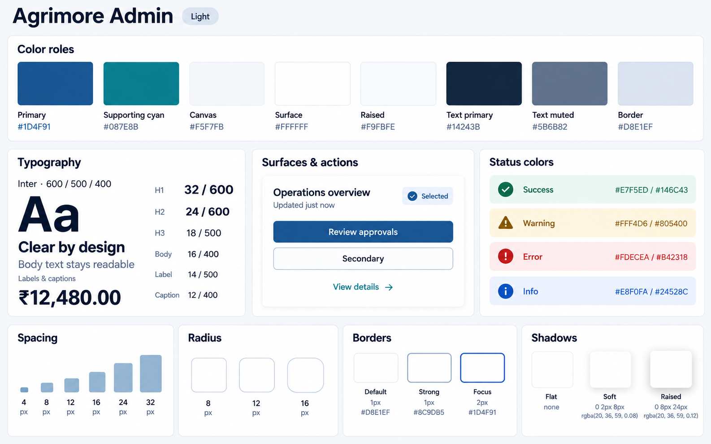
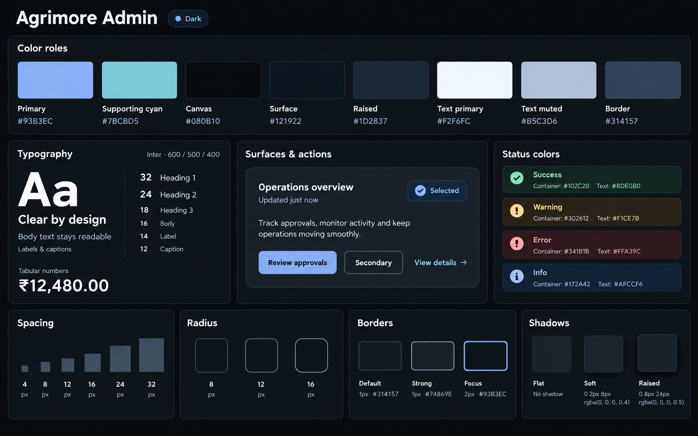

# Agrimore Admin — color roles and theme identity

**Approved and locked · v2 · 2026-10-02**

Professional institutional blue with cyan and steel/slate support.

## Light

## Dark

Each PNG is 1586 × 992 px. See [prompts.md](prompts.md) for exact prompts and token values, [lock.json](lock.json) for provenance and SHA-256 checksums, and the [five-app approval record](../../../../../docs/design-system/COLOR_ROLES_THEME_IDENTITY_LOCK_2026-10-02.md).

These files are design references. They are kept in `assets/ui-mockups/01-color-roles-theme-identity/` and are not registered as runtime Flutter assets by this task. Existing mockups remain historical; this dated v2 pair is the approved reference for this foundation.
