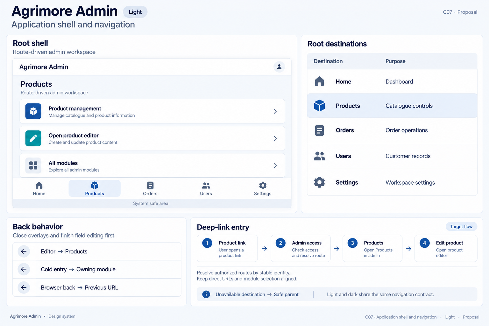
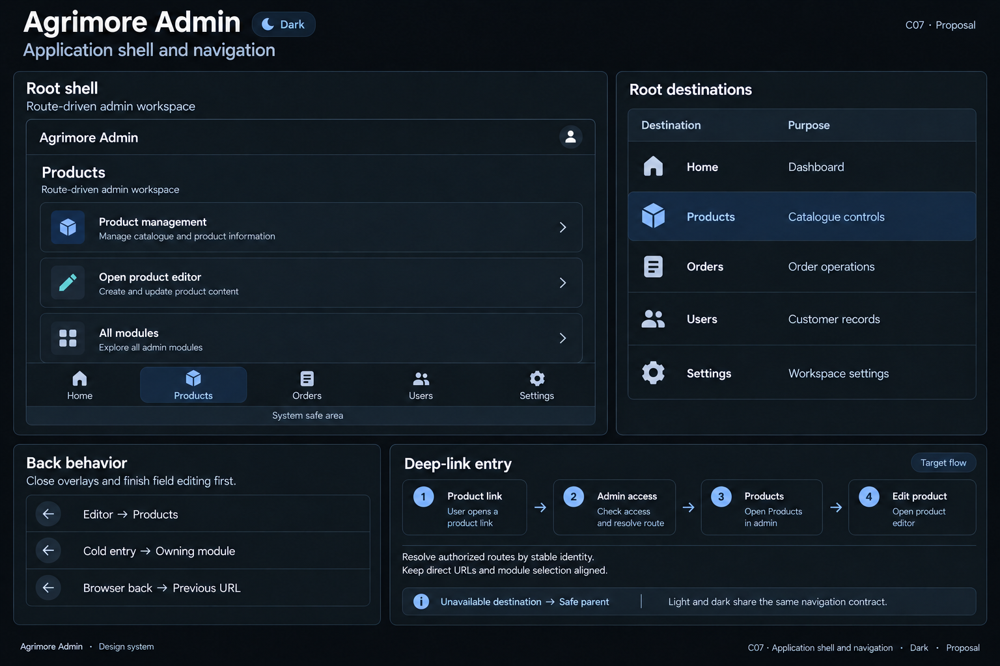

# Agrimore Admin — C07 application shell and navigation

**PROVISIONAL_DIRECTION / TARGET_IMPLEMENTATION · v1 · 2026-10-03.** C01 identity stays approved and locked. Static review references; runtime and asset registration are unchanged.

Identity: Professional institutional blue with cyan and steel/slate support.

| Theme | Board |
| --- | --- |
| Light | [Open light](agrimore-admin-application-shell-navigation-light.png) |
| Dark | [Open dark](agrimore-admin-application-shell-navigation-dark.png) |

[Exact prompts](prompts.md) · [Manifest](manifest.json) · [All five apps](../../../../../docs/design-system/APPLICATION_SHELL_NAVIGATION_BOARDS_2026-10-03.md) · [Codebase/domain mapping](../../../../../docs/design-system/APPLICATION_SHELL_NAVIGATION_DOMAIN_MAP_2026-10-03.md) · [C01 approval](../../../../../docs/design-system/COLOR_ROLES_THEME_IDENTITY_LOCK_2026-10-02.md).

Frame: **Route-driven admin workspace**. Selected specimen: **Products**.

| Root destination | Purpose |
| --- | --- |
| Home | Dashboard |
| Products | Catalogue controls |
| Orders | Order operations |
| Users | Customer records |
| Settings | Workspace settings |

## Current source

Admin uses GoRouter with 53 GoRoute syntax occurrences and one ShellRoute. Its compact shortcuts are Home (Dashboard), Products, Orders, Users and Settings; the mobile drawer exposes the larger module list. Desktop uses a sidebar at widths of 900px or greater. Product add/edit is full-screen outside the shell. Mobile items refer to numeric indices in a shared _navItems list; selection uses prefix matching. The board shows compact navigation and an All modules launcher, not a sidebar.

GoRouter defines parameterized detail/editor URLs and role-aware redirects, with an initial splash route. Signed-out redirects go to auth; intent preservation through auth was not established in this review. Direct URL cold-start, refresh, browser history and authorized-parent fallback still require runtime tests. Existing guarded logout/router lifecycle tests were inspected as sources, not executed.

## Target direction

Keep five compact shortcuts. Expose all operational modules through a full-page or sheet directory in this no-sidebar proposal, preserving current route identities and module availability. Replace fragile index-based lookup with stable route identity only in a future bounded migration. Product editing remains a separate task route; Back falls to Products when no history exists.

Back behavior:

- Editor → Products
- Cold entry → Owning module
- Browser back → Previous URL

Target entry: Product link → Admin access → Products → Edit product.

- Resolve authorized routes by stable identity.
- Keep direct URLs and module selection aligned.

48px minimum interaction targets are proposed; labels and controls must grow for text. Safe areas are system measured. Flow cards explain the intended route relationship, not implemented external-URL support. Illustrations are not pixel-scale runtime screenshots.

## Light

## Dark

