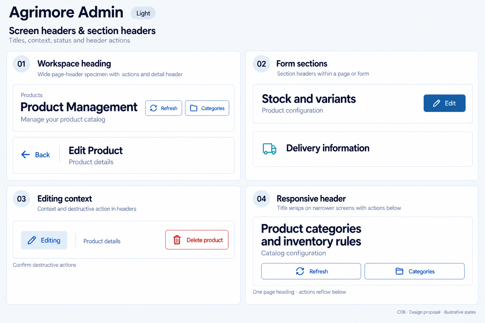
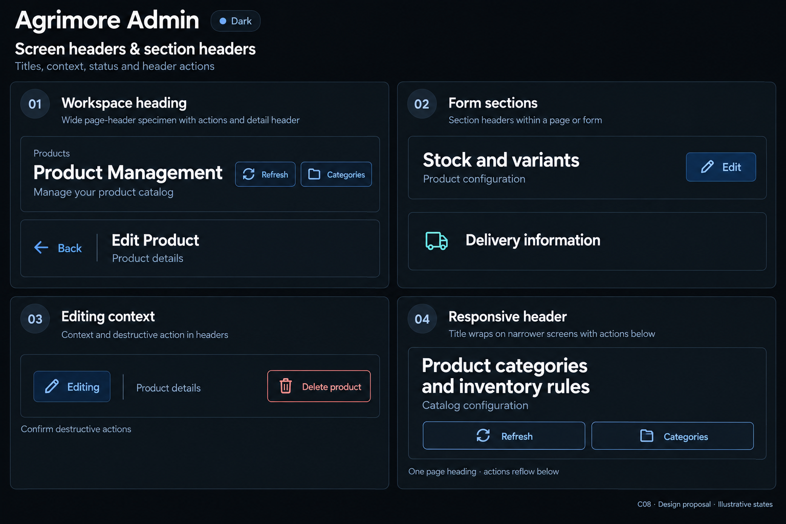

# Agrimore Admin — C08 screen headers and section headers

**PROVISIONAL_DIRECTION / TARGET_IMPLEMENTATION · v1 · 2026-10-03.** C01 identity remains approved and locked. These static boards illustrate a target, not migrated application widgets.

Identity: Professional institutional blue with cyan and steel/slate support.

| Theme | Board |
| --- | --- |
| Light | [Open light](agrimore-admin-screen-headers-section-headers-light.png) |
| Dark | [Open dark](agrimore-admin-screen-headers-section-headers-dark.png) |

[Exact prompts](prompts.md) · [Manifest](manifest.json) · [All five apps](../../../../../docs/design-system/SCREEN_HEADERS_SECTION_HEADERS_BOARDS_2026-10-03.md) · [Domain mapping](../../../../../docs/design-system/SCREEN_HEADERS_SECTION_HEADERS_DOMAIN_MAP_2026-10-03.md) · [C01 approval](../../../../../docs/design-system/COLOR_ROLES_THEME_IDENTITY_LOCK_2026-10-02.md).

## Current implementation

AdminShell's mobile header shows current module label/subtitle, menu, brand icon and initials. Subtitle mapping only explicitly covers indices 0–17, with empty default despite more modules. Product Management adds a pinned gradient SliverAppBar with title, subtitle, Refresh and Categories. Product editor has its own white AppBar with dynamic Add/Edit title, product-name subtitle and Delete action.

## Target direction

One authoritative page heading per surface; shell chrome handles navigation while the page owns its title/context. Use professional blue for hierarchy, cyan support, neutral backgrounds. Keep module identity and destructive actions explicit; Admin is a responsive workspace, not forced into a phone-only UI.

| Panel | Specimen intent |
| --- | --- |
| 01 · Workspace heading | Wide page-header specimen title 'Product Management'; subtitle 'Manage your product catalog'; right side outlined labeled actions 'Refresh' and 'Categories'. Quiet overline 'Products'. Smaller detail strip beneath: Back arrow, title 'Edit Product', subtitle 'Product details'. No sidebar or avatar. |
| 02 · Form sections | Section title 'Stock and variants'; subtitle 'Product configuration'; trailing professional-blue action 'Edit'. Second quiet heading 'Delivery information', subtle cyan outline glyph. Keep white or dark neutral surfaces. |
| 03 · Editing context | Two separate specimens: info chip 'Editing' with pencil icon; neutral context text 'Product details'. Separate outlined destructive header action 'Delete product' using Error text color and trash icon. Caption 'Confirm destructive actions'. No fake synchronized or saved status. |
| 04 · Responsive header | Large-text/narrow specimen title split across two visible lines 'Product categories / and inventory rules'; subtitle 'Catalog configuration'; move 'Refresh' and 'Categories' outlined buttons to a lower row. Footer note 'One page heading · actions reflow below'. |

Source gaps and preservation rules:

- Avoid duplicate module/page titles on compact Product Management; decide shell versus page ownership explicitly.
- Map subtitles by stable module identity rather than partially covered positional indices.
- Remove literal white/gradient assumptions during a future header migration; C01 dark is near-black with pale blue/cyan accents.
- Keep destructive action visible and confirmation behavior; do not invent header Saved or Synced badges.

Use one accessible page heading, 4px title/subtitle gap, quieter section headings, 24px section rhythm and scale-aware height. Proposed actions have minimum 48px hit regions; required task titles wrap and crowded actions move below. Delivery retains its existing 40px visual-circle decision, with larger invisible hit regions proposed. Actual text scaling, translations, accessibility and layout must be verified in later implementation. Synthetic status examples are not financial, duty or delivery confirmation.

## Light

## Dark

