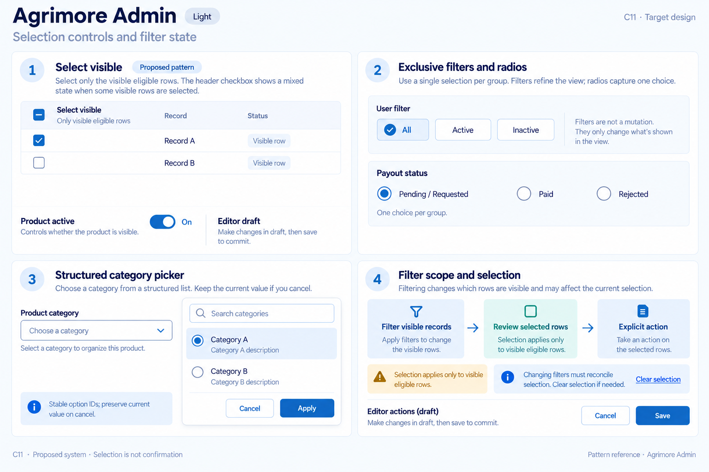
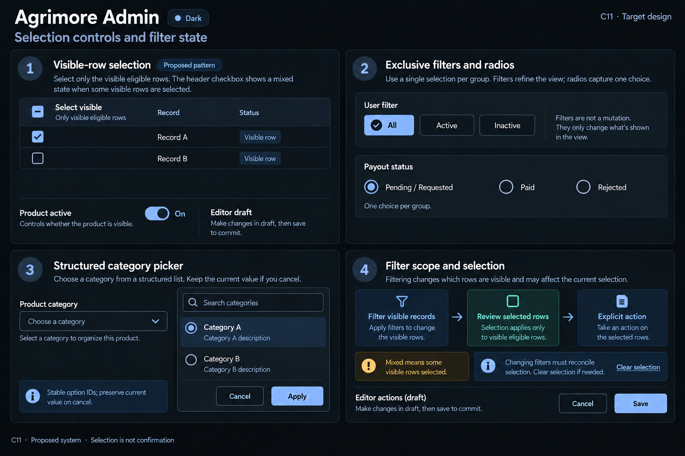

# Agrimore Admin — C11 selection controls and filter state

**PROVISIONAL_DIRECTION / TARGET_IMPLEMENTATION · v1 · 2026-10-03.** C01 remains approved and locked.

Professional-blue dense review controls with cyan grouping, explicit row selection scope and mixed parent checkboxes.

[All ten boards](../../../../../docs/design-system/SELECTION_CONTROLS_FILTER_STATE_BOARDS_2026-10-03.md) · [Domain map](../../../../../docs/design-system/SELECTION_CONTROLS_FILTER_STATE_DOMAIN_MAP_2026-10-03.md) · [Exact prompts](prompts.md) · [Manifest](manifest.json).

## Current source

User management tracks selected IDs with per-row Checkbox and single-choice filter chips; bulk status/delete loops operate on that set. Product form category dropdowns and badge switches are editor inputs. Payout/review queues use choice chips. No select-visible mixed parent was observed in user management.

## Proposed direction

Keep query filters, row selection and editor draft choices separate. A proposed select-visible parent reflects none/some/all visible eligible rows, with readable scope and no assumption that hidden pages are selected.

| Panel | Intent |
| --- | --- |
| Visible-row selection | Proposed pattern: Select visible checkbox MIXED dash; two synthetic rows Record A checked, Record B unchecked. Caption Only visible eligible rows. Separate switch Product active ON, helper Editor draft — Save to commit. Do not show fake bulk actions or user data. |
| Exclusive filters and radios | User-filter chips All selected, Active unselected, Inactive unselected. Separate radio group Payout status: Pending / Requested selected, Paid unselected, Rejected unselected. One choice per group; not a mutation. |
| Structured category picker | Product category field Choose a category; open compact picker with Search categories and radio options Category A selected, Category B unselected. Synthetic labels. Caption Stable option IDs; preserve current value on cancel. No sidebar. |
| Filter scope and selection | Diagram Filter visible records → Review selected rows → Explicit action. Callout Mixed means some visible rows selected. Text Changing filters must reconcile selection. Clear selection text action. Separate editor Save / Cancel action specimens. No success message, permissions claims or real record counts. |

Preservation and gaps:

- Mixed/select-visible parent is a target extension, not current user-management behavior.
- Reconcile selected IDs when filters/pages/permissions change; define retain/clear policy explicitly before bulk actions.
- Selection does not perform bulk mutation; confirmations, permissions and partial failure results need separate implementation review.
- Picker options require stable IDs and unavailable-value handling; do not silently select another category.

## Light

## Dark

