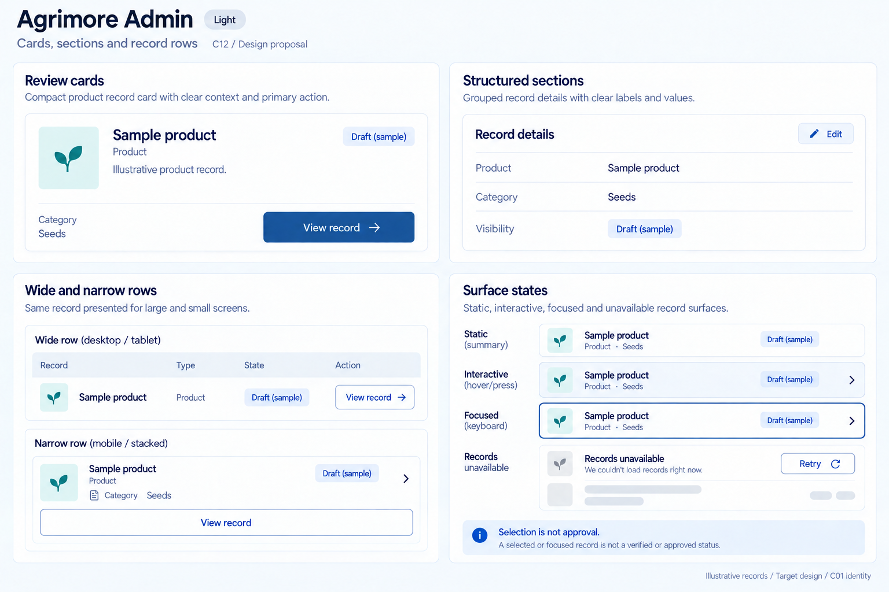
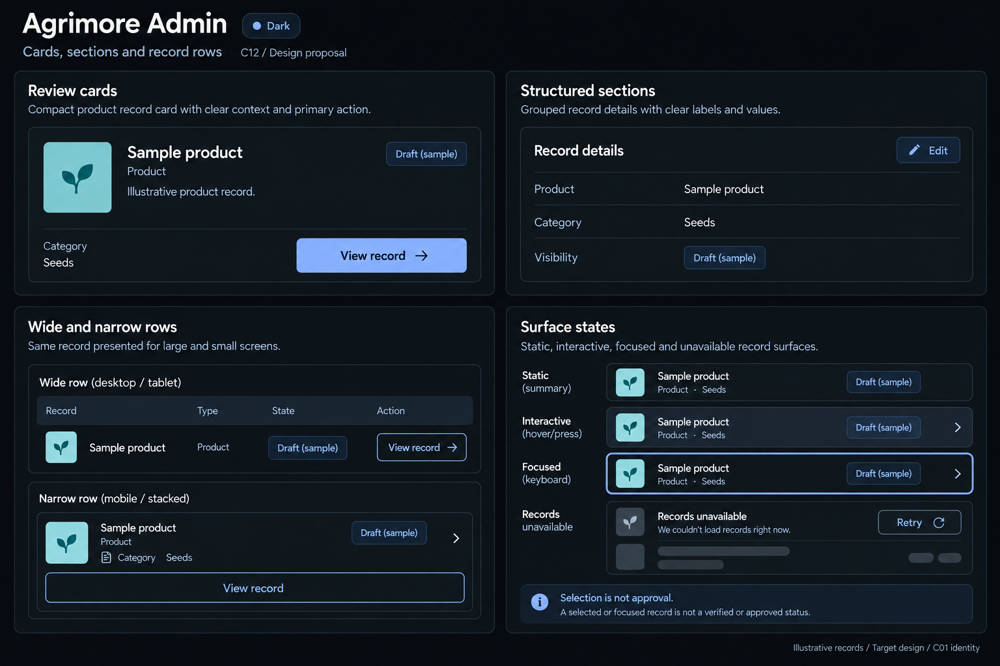

# Agrimore Admin — C12 cards, sections and record rows

**PROVISIONAL_DIRECTION / TARGET_IMPLEMENTATION · v1 · 2026-10-03.** C01 is approved and locked; C12 owner approval is pending.

Professional blue review cards, cyan context cues, steel/slate grouped records and dense but readable wide-to-stacked layouts.

[Ten-board gallery](../../../../../docs/design-system/CARDS_SECTIONS_RECORD_ROWS_BOARDS_2026-10-03.md) · [Codebase/domain map](../../../../../docs/design-system/CARDS_SECTIONS_RECORD_ROWS_DOMAIN_MAP_2026-10-03.md) · [Exact prompts](prompts.md) · [Manifest](manifest.json).

## Current source

AdminProductCard uses Card/InkWell, fixed media, hardcoded dark/light colors and badges. AdminOrderCard uses GestureDetector, white gradients, 20px corners, status strip and shimmer. Different surface and interaction structures need a canonical target, not a claim they already match C01.

## Target direction

Compact record anatomy with identity, type, stage and explicit detail action. Group operational fields once, adapt wide aligned columns to stacked mobile rows, and keep review/selection independent from authorization or mutation.

| Panel | Domain specimen |
| --- | --- |
| Review cards | Compact Sample product record card, Product subtitle, Draft (sample) chip, Category / Seeds, explicit View record button. Professional-blue action; cyan is a tiny context cue, no verified/approved badge. |
| Structured sections | Record details grouped surface with Product / Sample product, Category / Seeds, Visibility / Draft (sample). Label/value grid aligned, neutral surface with hairlines, no gradient status strip. |
| Wide and narrow rows | Wide compact mini table with headers Record / Type / State / Action and one Sample product / Product / Draft (sample) / View row. Below show same record stacked for mobile with View record action. No sidebar, checkbox or batch mutation. |
| Surface states | Static summary, Interactive record and Focused record specimens, clearly separate. Focused has 2px blue outline. Small Records unavailable with Retry and loading skeleton. Caption Selection is not approval. Neutral dark surfaces only. |

Preservation and gaps:

- Future migration must replace hardcoded white order surfaces and differing radii with theme roles.
- GestureDetector-only order cards need keyboard focus/activation and accessible role verification.
- Selection or a review badge does not approve, publish, pay or change permissions.

## Light

## Dark

