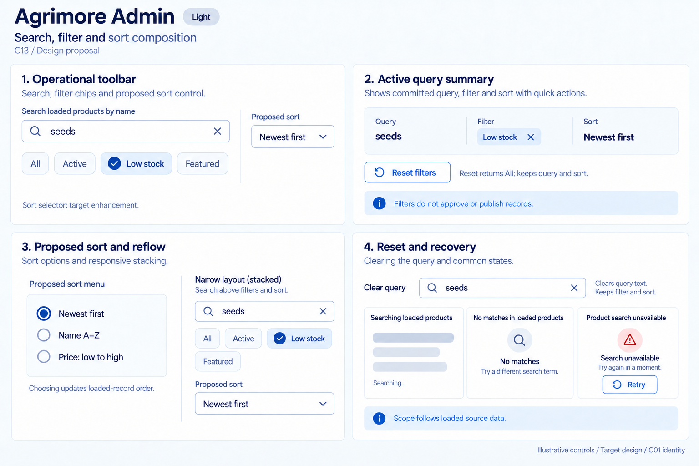
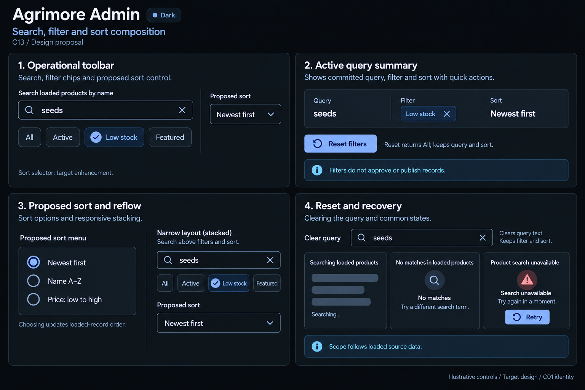

# Agrimore Admin — C13 search, filter and sort composition

**PROVISIONAL_DIRECTION / TARGET_IMPLEMENTATION · v1 · 2026-10-03.** C01 is approved and locked; C13 owner approval is pending.

Professional-blue operational discovery toolbar, cyan context, steel/slate aligned filters and dense wide-to-stacked composition.

[Ten-board gallery](../../../../../docs/design-system/SEARCH_FILTER_SORT_COMPOSITION_BOARDS_2026-10-03.md) · [Codebase/domain map](../../../../../docs/design-system/SEARCH_FILTER_SORT_COMPOSITION_DOMAIN_MAP_2026-10-03.md) · [Exact prompts](prompts.md) · [Manifest](manifest.json).

## Current source

ProductManagementScreen immediately filters loaded product names and exactly one All/Active/Low stock/Featured chip. Clear search removes text only. ProductProvider has price/name/rating/popularity/newest sorting methods, but a sort selector is not exposed in this targeted screen. getAllProducts sorts loaded products newest-first in memory.

## Target direction

Compose query, one operational filter and a visibly proposed provider-backed sort selector. Align controls for wide layouts and stack on phones. Active-chip removal/reset returns All while preserving query and sort; neither selection nor filtering mutates records.

| Panel | Domain specimen |
| --- | --- |
| Operational toolbar | Wide Search loaded products by name field entered seeds with clear X. Operational single-choice chips All unselected, Active unselected, Low stock selected with check, Featured unselected. Proposed sort control Newest first. Caption Sort selector: target enhancement. No sidebar or numeric badges. |
| Active query summary | Aligned summary Query / seeds; Filter / Low stock; Sort / Newest first. Removable Filter: Low stock X, Reset filters action. Helper Reset returns All; keeps query and sort. Small cyan note Filters do not approve or publish records. |
| Proposed sort and reflow | Clearly labelled Proposed sort menu: Newest first selected radio, Name A–Z unselected, Price: low to high unselected. Helper Choosing updates loaded-record order. Small narrow-layout toolbar specimen stacks search over filter/sort controls with same choices. No bulk actions. |
| Reset and recovery | Clear query control with helper Keeps filter and sort. Separate states Searching loaded products skeleton; No matches in loaded products; Product search unavailable with Retry. No fake global count or permissions/approval receipt. Small note Scope follows loaded source data. |

Preservation and gaps:

- Proposed sort selector must connect to ProductProvider deliberately and maintain canonical state across reloads; provider capability is not current screen adoption.
- Low stock already uses shared isLowStock; retain that canonical definition and distinguish stock filter from approval state.
- Current product query uses service data that filters active products; do not claim full inactive/draft discovery coverage.
- Reset/filter/search changes must reconcile stable selected record IDs and bulk action eligibility explicitly; no hidden bulk mutation.

## Light

## Dark

