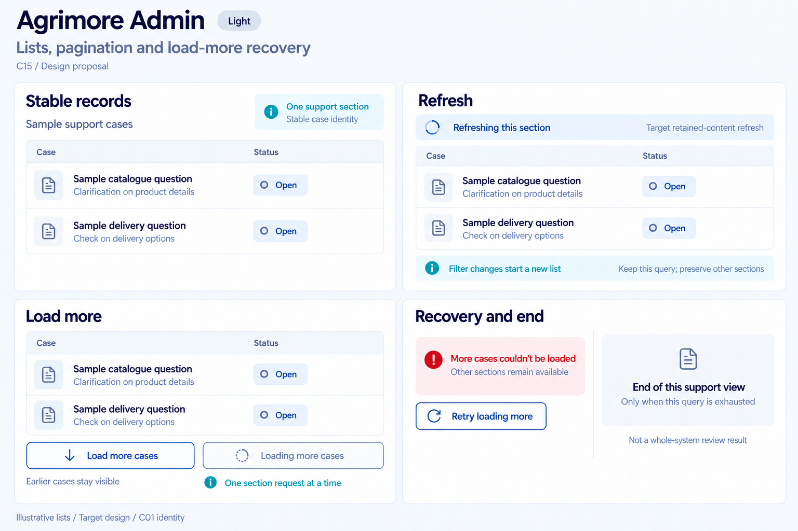
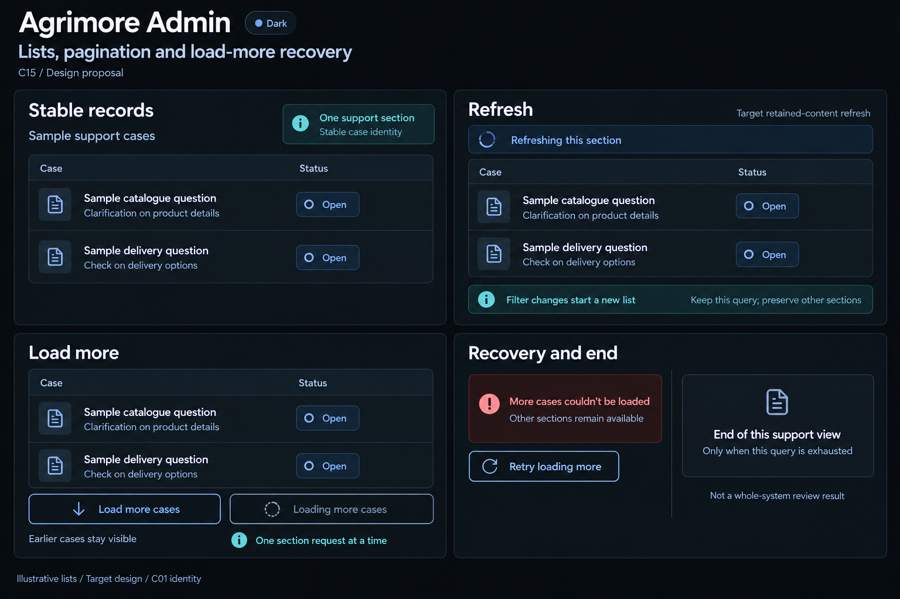

# Agrimore Admin — C15 lists, pagination and load-more recovery

**PROVISIONAL_DIRECTION / TARGET_IMPLEMENTATION · v1 · 2026-10-03.** C01 is approved and locked; C15 owner approval is pending.

Dense professional-blue support-case sections, steel/slate table rows and restrained cyan query-scope cues; each administrative section owns its continuation and recovery.

[Ten-board gallery](../../../../../docs/design-system/LISTS_PAGINATION_LOAD_MORE_RECOVERY_BOARDS_2026-10-03.md) · [Codebase/domain map](../../../../../docs/design-system/LISTS_PAGINATION_LOAD_MORE_RECOVERY_DOMAIN_MAP_2026-10-03.md) · [Exact prompts](prompts.md) · [Manifest](manifest.json).

## Current source

PaginatedQueryList already owns cursor, concurrent-read guard, request-id guard, resetKey and per-instance error state. SupportQueueScreen orders by updatedAt and selects exactly one status or My cases mode, passing a filter key/resetKey. Loaded docs remain on load-more failure with retry above; no explicit end label, append deduplication or general refresh API is present. ActorSupportCasesSection refreshes by changing the widget key. Finance reconciliation separately upserts findings by ID and guards generations.

## Target direction

Reuse the existing paginated section pattern for support queue and People-360, with persistent inline continuation recovery, stable IDs and explicit scoped end markers. Reset filter/entity clears incompatible pages and invalidates old requests. Same-query retained-content refresh is a proposed enhancement; sibling sections remain independent.

| Panel | Domain specimen |
| --- | --- |
| Stable records | Dense support-record rows under "Sample support cases", column labels Case and Status. Two synthetic text titles "Sample catalogue question" and "Sample delivery question"; neutral "Open" sample status chips. No case IDs, assignee names or counts. Cyan annotation "One support section". Helper "Stable case identity". |
| Refresh | Retained sample support rows under a slim "Refreshing this section" strip and spinner. Helper "Keep this query; preserve other sections". Small caption "Target retained-content refresh". Cyan note "Filter changes start a new list". No combined My cases and status filters. |
| Load more | Compact secondary OUTLINED professional-blue control "Load more cases". Separate disabled outlined pending variant "Loading more cases" with spinner. Helper "Earlier cases stay visible". Cyan annotation "One section request at a time". No fake totals, selected counts or reconciliation coverage numbers. |
| Recovery and end | Separate examples. Page failure "More cases couldn’t be loaded", helper "Other sections remain available", OUTLINED "Retry loading more". End "End of this support view", caption "Only when this query is exhausted". Tiny note "Not a whole-system review result". No approval, assignment or permission grant action. |

Preservation and gaps:

- Add ID dedup/update reconciliation before append; current generic component _docs.addAll can duplicate records when order membership shifts between reads.
- Retained same-query refresh and a visible end footer are target enhancements; current resetKey/key refresh clears loaded state.
- Support queue uses status OR My cases, not a combined query. Never invent combined filters or global coverage from a bounded section.
- Initial error and page error need distinct safe surfaces; no raw exception or forbidden-query retry. List retries do not approve cases or repeat mutations.
- Finance scan continuation carries coverage/incomplete metadata and a separate repository cursor; do not claim support-list cursor/complete marker certifies financial reconciliation.

## Light

## Dark

