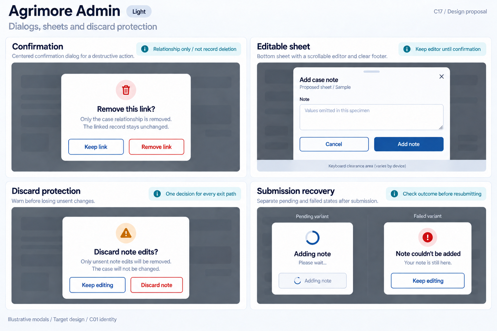
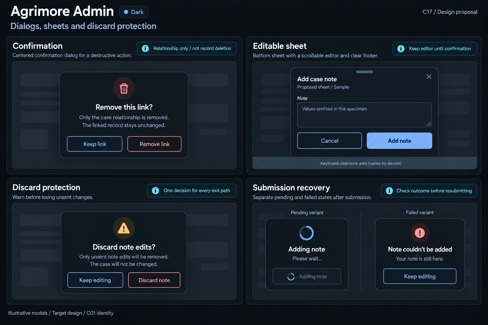

# Agrimore Admin — C17 dialogs, sheets and discard protection

**PROVISIONAL_DIRECTION / TARGET_IMPLEMENTATION · v1 · 2026-10-03.** C01 is approved and locked; C17 owner approval is pending.

Professional-blue operational dialogs, cyan scope explanations, steel/slate dense form surfaces and precise destructive consequences.

[Ten-board gallery](../../../../../docs/design-system/DIALOGS_SHEETS_DISCARD_PROTECTION_BOARDS_2026-10-03.md) · [Codebase/domain map](../../../../../docs/design-system/DIALOGS_SHEETS_DISCARD_PROTECTION_DOMAIN_MAP_2026-10-03.md) · [Exact prompts](prompts.md) · [Manifest](manifest.json).

## Current source

Support unlink dialog explicitly says only the case relationship is removed and linked record unchanged; caller checks confirmed==true and passes expectedVersion to unlinkSupportCaseRecord. _promptForText returns input and closes its dialog before _addNote calls addSupportCaseNote. _noteRequestIds.forPayload(text) provides stable mutation identity. Input prompt has autofocus and a silent minimum-length gate, but no dirty guard or retained editor on backend failure. Shared DialogHelper has themed confirmation/input/sheet primitives but some fixed light styles.

## Target direction

Preserve precise link-removal scope and action-specific server checks. Proposed note sheet keeps editor ownership through submission, retains input on failure and protects local draft dismissal. Note request identity differs from versioned link mutation; unknown action outcome must be reconciled before repeating.

| Panel | Domain specimen |
| --- | --- |
| Confirmation | Centered modal "Remove this link?". Body "Only the case relationship is removed. The linked record stays unchanged." OUTLINED professional-blue "Keep link" and OUTLINED danger "Remove link". Cyan board note "Relationship only / not record deletion". No case/record IDs, delete record action or preconfirmed removal. |
| Editable sheet | Compact bottom sheet "Add case note", caption "Proposed sheet / Sample", labelled close X. A multiline "Note" field with values omitted and small "Values omitted in this specimen". OUTLINED "Cancel" and professional-blue PRIMARY "Add note". Scrolling body/footer boundary and keyboard-clearance strip. Cyan annotation "Keep editor until confirmation". No actual notes, assignees or identifiers. |
| Discard protection | Dialog "Discard note edits?", body "Only unsent note edits will be removed. The case will not be changed." OUTLINED professional-blue "Keep editing" and OUTLINED danger "Discard note". Cyan board note "One decision for every exit path". No case deletion/resolution, server cancellation or Undo. |
| Submission recovery | Independent "Pending variant" disabled outlined spinner "Adding note" and "Failed variant" safe notice "Note couldn’t be added", helper "Your note is still here." Cyan board annotation "Check outcome before resubmitting". No silent editor closure, extra Retry mutation, Case resolved/paid badge or request IDs. Any failed-variant action is secondary "Keep editing", returning to retained editor input, never server retry or discard. |

Preservation and gaps:

- Current note prompt closes before backend action; failed input is not retained in an open modal. Target retains/reopens the same safe payload deliberately.
- The input minimum-length rejection is silent; future inline validation follows C10, with no arbitrary new validation rules.
- No explicit dirty/PopScope guard in this prompt; Back/scrim/close must use the same local-discard decision.
- Unlink consent never authorizes record deletion; preserve expectedVersion and conflict recovery separately from note idempotency.
- No raw callable messages, duplicate dialogs or automatic success on modal close; no live case details/IDs in boards.

## Light

## Dark

