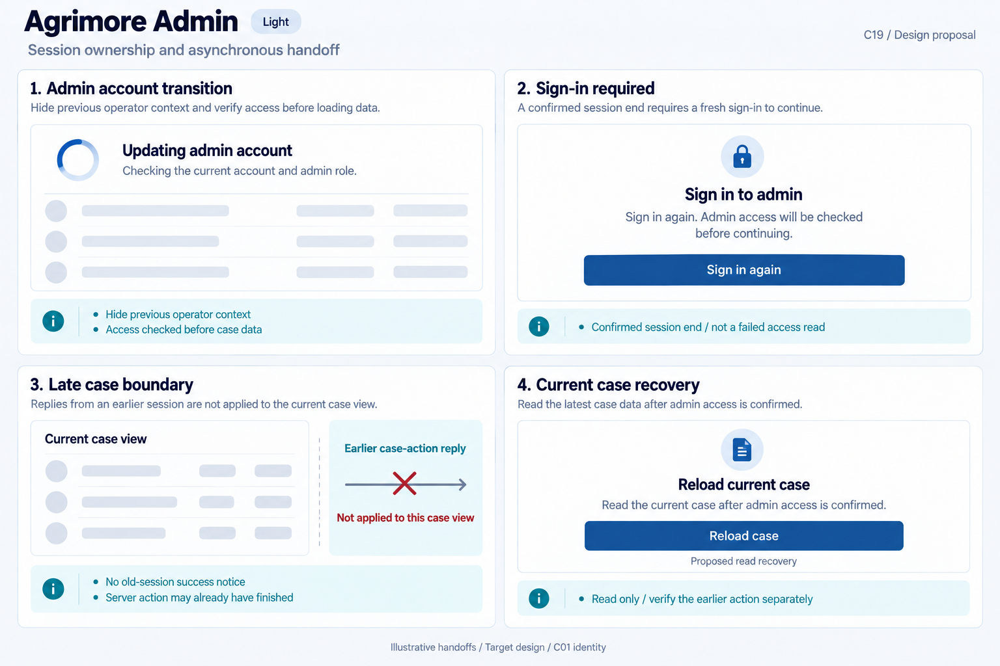
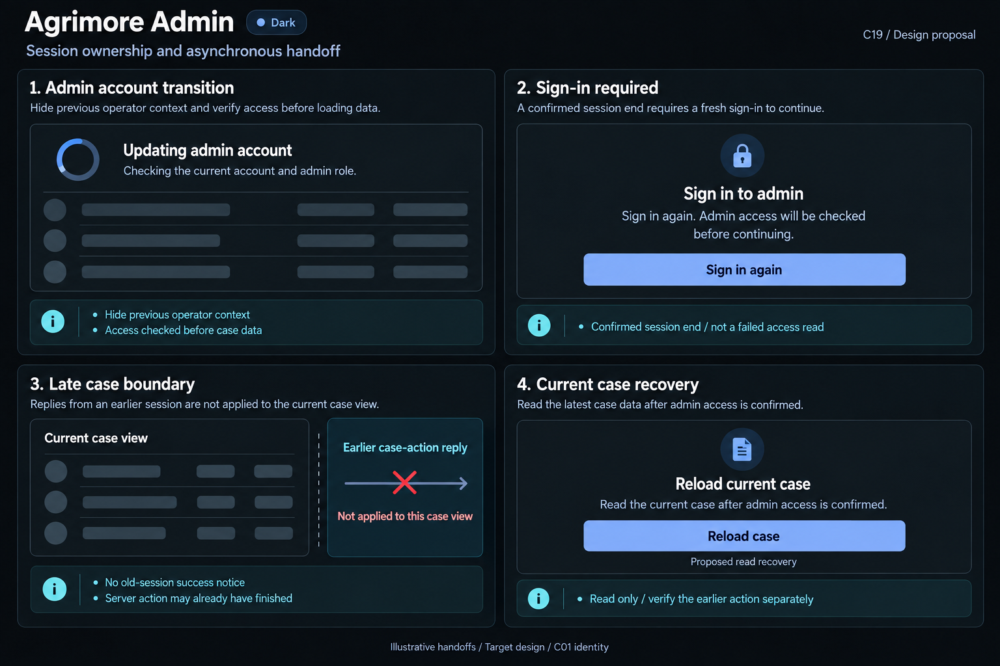

# Agrimore Admin — C19 session ownership and asynchronous handoff

**PROVISIONAL_DIRECTION / TARGET_IMPLEMENTATION · v1 · 2026-10-03.** C01 is approved and locked; C19 owner approval is pending.

Professional-blue administrator rebinding, cyan permission context, steel/slate case placeholders and precise read-versus-mutation controls.

[Ten-board gallery](../../../../../docs/design-system/SESSION_OWNERSHIP_ASYNCHRONOUS_HANDOFF_BOARDS_2026-10-03.md) · [Codebase/domain map](../../../../../docs/design-system/SESSION_OWNERSHIP_ASYNCHRONOUS_HANDOFF_DOMAIN_MAP_2026-10-03.md) · [Exact prompts](prompts.md) · [Manifest](manifest.json).

## Current source

AdminAuthProvider owns user projection/profile reads and exposes sessionVersion/isSessionCurrent; owner binding clears user/error and renews read/epoch. Settings logout captures provider identity, owner, epoch and current route before confirmation, dispatch and navigation; account credential form also owns its opening session. SupportCaseDetailScreen._call captures no explicit auth episode/route/case ticket: success/error, activity refresh and busy cleanup are gated by mounted. CurrentUID is captured for page context. Backend still authenticates callable permissions; mounted-only UI feedback is not proof of unauthorized server writes.

## Target direction

Keep existing settings ownership as a model, extend support action feedback to current admin session and current case. Hide old operator context during role checks. A late case response cannot notify or refresh a replacement case; reload only the current authorised case and reconcile original action outcome before another mutation.

| Panel | Domain specimen |
| --- | --- |
| Admin account transition | Card "Updating admin account", indeterminate spinner and "Checking the current account and admin role." Empty operational-row skeletons. Cyan BOARD note "Hide previous operator context" and "Access checked before case data". No name, case ID, role-approved badge or dashboard metrics. |
| Sign-in required | Card "Sign in to admin", lock icon, body "Sign in again. Admin access will be checked before continuing." professional-blue PRIMARY "Sign in again". Cyan BOARD note "Confirmed session end / not a failed access read". No invitation, approval queue, MFA, phone values or self-approval. |
| Late case boundary | Neutral card "Current case view", EMPTY case-row skeletons. Cyan BOARD diagram "Earlier case-action reply" arrow crossed at "Not applied to this case view". Notes "No old-session success notice" and "Server action may already have finished". No Case resolved, note content, assignee, old account or retry-action control. |
| Current case recovery | Card "Reload current case", body "Read the current case after admin access is confirmed." PRIMARY "Reload case", caption "Proposed read recovery". Cyan BOARD note "Read only / verify the earlier action separately". No Repeat action, resolve case, approve role, delete record, promised rollback or server-success tick. |

Preservation and gaps:

- Mounted alone does not establish current admin/case/route after account replacement; use sessionVersion and route/entity ticket.
- Suppress obsolete dialog results before dispatch as well as obsolete post-call results; action confirmation does not survive owner change.
- Settings logout already verifies current session and route; preserve that implementation rather than duplicate a generic helper.
- Case reload is a read; no retry mutation, role assignment, case resolution or success from old result.
- Failed role/profile read remains separate from confirmed session loss. No admin self-unlock or fabricated expired-session timer.

## Light

## Dark

