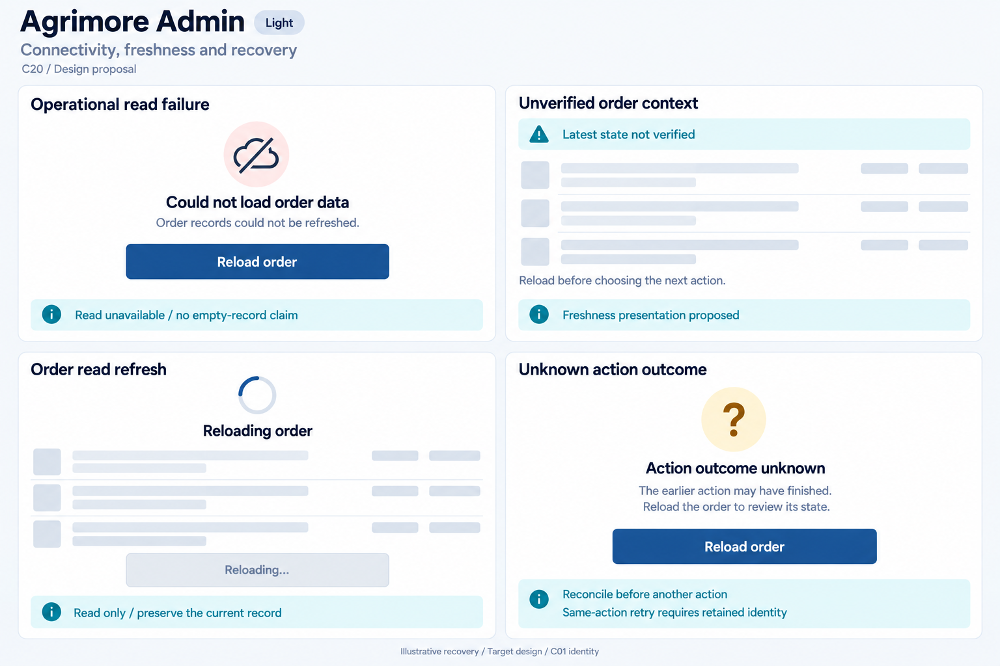
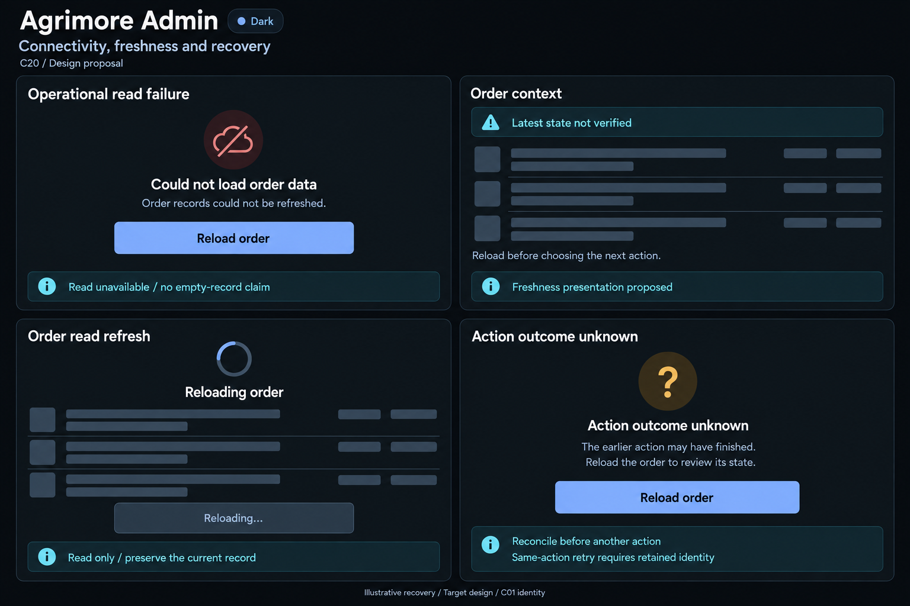

# Agrimore Admin — C20 connectivity, freshness and recovery

**PROVISIONAL_DIRECTION / TARGET_IMPLEMENTATION · v1 · 2026-10-03.** C01 is approved and locked; C20 owner approval is pending.

Professional-blue operational recovery, cyan read/context guidance, steel/slate order surfaces and precise uncertain-action boundaries.

[Ten-board gallery](../../../../../docs/design-system/CONNECTIVITY_FRESHNESS_RECOVERY_BOARDS_2026-10-03.md) · [Codebase/domain map](../../../../../docs/design-system/CONNECTIVITY_FRESHNESS_RECOVERY_DOMAIN_MAP_2026-10-03.md) · [Exact prompts](prompts.md) · [Manifest](manifest.json).

## Current source

Admin OrderProvider loads order reads without a freshness projection in inspected methods. updateOrderStatus retains PendingStatusUpdate for identical order/target/reason after ambiguous failures and reuses requestId; definite response clears it. Bare exceptions return networkError; ambiguous FirebaseFunctionsException currently retains pending identity but maps to validationFailed rather than networkError, so UX needs typed uncertainty treatment. Backend canonical action transaction uses order/adminActions requestId, rejects mismatched target/reason, handles already_applied and expectedCurrentStatus stale_state. Expected status is optional in client/provider; not every caller supplies it. Pending identity is in memory, most recent action only, not universal durable journal.

## Target direction

Separate operational read unavailable, latest-not-verified order context, read refresh and unknown action reconciliation. Show read-only Reload order to inspect server state; same-action retry is a conditional implementation path using retained identity, never a generic Replay or bulk-resume claim.

| Panel | Domain specimen |
| --- | --- |
| Operational read failure | Card "Could not load order data", connection-slash icon, body "Order records could not be refreshed." PRIMARY "Reload order". Cyan BOARD note "Read unavailable / no empty-record claim". No order ID, customer, metric or definitive internet state. |
| Unverified order context | Card "Order context", cyan caution chip "Latest state not verified", EMPTY order-row skeletons. Body "Reload before choosing the next action." BOARD note "Freshness presentation proposed". No Cached/approved/cancelled badge, timestamp or stock/money value. |
| Order read refresh | Card "Reloading order", indeterminate spinner, EMPTY rows, DISABLED "Reloading…" control. Cyan BOARD note "Read only / preserve the current record". No apply-status, success tick or percentage. |
| Unknown action outcome | Card "Action outcome unknown", body "The earlier action may have finished. Reload the order to review its state." PRIMARY "Reload order". Cyan BOARD note "Reconcile before another action" and "Same-action retry requires retained identity". No Apply again, guaranteed cancellation/refund/rollback, completed status or universal resume queue. |

Preservation and gaps:

- Propagate cache/source/pending-write metadata before Last synced/current claims; a fetch completion is not all-dashboard freshness.
- Expose ambiguous callable outcome explicitly rather than treating every validationFailed as definitely rejected.
- Keep identical pending order/action/reason identity for a permitted retry; new payload/new action requires its own identity. No durable restart/bulk resume guarantee.
- Pass/verify expected status at callers where concurrency guard is intended; provider/backend support alone does not prove every caller prevents stale writes.
- Reload order is read-only and does not resolve payment/refund/approval or guarantee no earlier mutation committed. Preserve C19 account/route ownership.

## Light

## Dark

