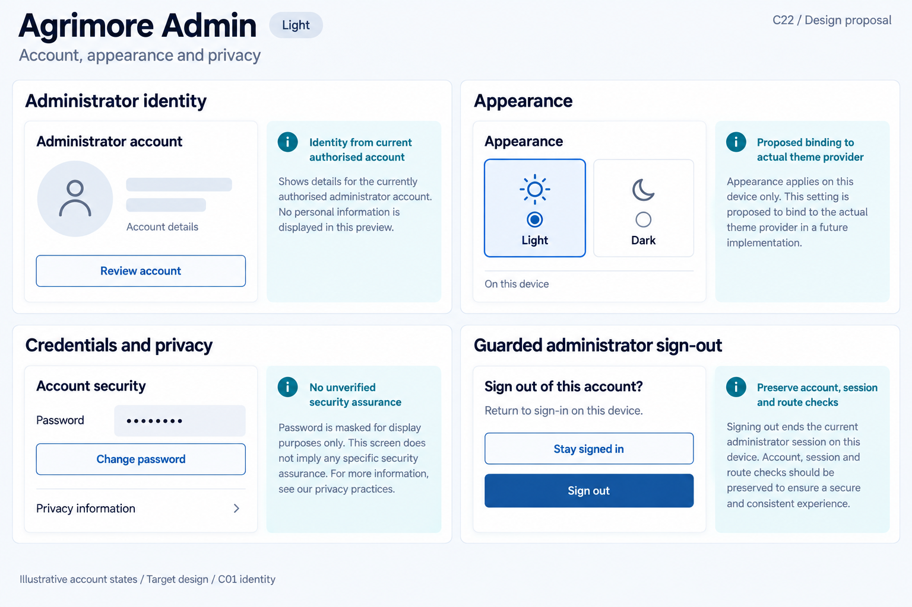
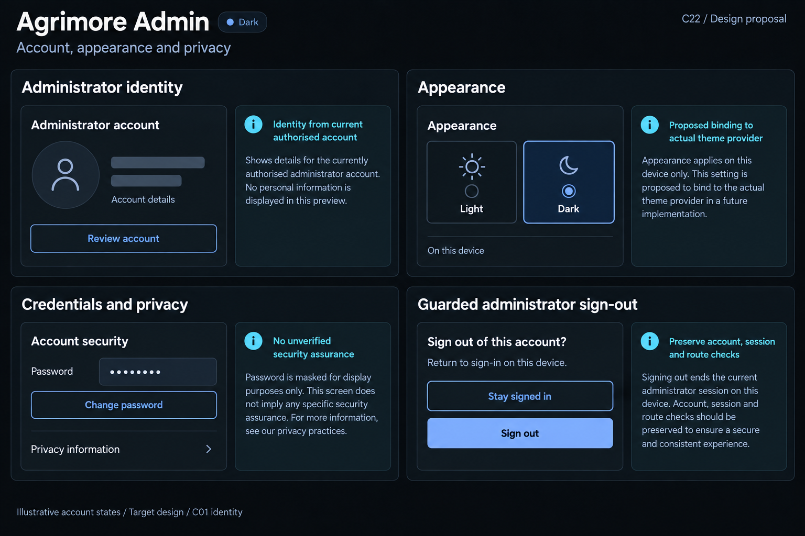

# Agrimore Admin — C22 account, appearance and privacy presentation

**PROVISIONAL_DIRECTION / TARGET_IMPLEMENTATION · v1 · 2026-10-03.** C01 is approved and locked; C22 owner approval is pending.

Professional blue administrator identity, cyan appearance/privacy guidance and restrained steel/slate security context.

[Ten-board gallery](../../../../../docs/design-system/ACCOUNT_APPEARANCE_PRIVACY_PRESENTATION_BOARDS_2026-10-03.md) · [Codebase/domain map](../../../../../docs/design-system/ACCOUNT_APPEARANCE_PRIVACY_PRESENTATION_DOMAIN_MAP_2026-10-03.md) · [Exact prompts](prompts.md) · [Manifest](manifest.json).

## Current source

Admin profile reads user name/email with hardcoded fallbacks; do not copy fallback identity into examples. Provider supports persisted bool Light/Dark. Settings Dark Mode switch only changes local _darkMode plus snackbar, not actual ThemeProvider. Logout already captures owner/version/route, guards in-flight and navigation, and shows truthful failure. Password editing is obscured and owned. Settings privacy dialog contains unsupported blanket encryption/sharing assurances; cache action shows success without a verified clear. No self-delete UI evidenced; MFA presentation is not live enrollment.

## Target direction

Bind two-mode appearance to actual provider, separate account/credentials/privacy information, retain existing strong logout guards and remove unverified privacy/cache/security success promises from target copy.

| Panel | Domain specimen |
| --- | --- |
| Administrator identity | Card "Administrator account", generic outline person icon, EMPTY name skeleton, label "Account details"; SECONDARY "Review account". Cyan BOARD note "Identity from current authorised account". No fabricated admin name/email/role badge/privilege toggle. |
| Appearance | Card "Appearance", TWO choices "Light", "Dark" only, select matching board theme. Below "On this device". Cyan BOARD note "Proposed binding to actual theme provider". No System option, saved toast or cloud-sync promise. |
| Credentials and privacy | Card "Account security", row "Password" with ONLY "••••••••"; SECONDARY "Change password"; separate neutral text row "Privacy information". Cyan BOARD note "No unverified security assurance". No MFA/biometric/verified/encrypted badge, eye control or legal compliance guarantee. |
| Guarded administrator sign-out | Card "Sign out of this account?", body "Return to sign-in on this device." SECONDARY "Stay signed in" and PRIMARY "Sign out". Cyan BOARD note "Preserve account, session and route checks". No admin self-delete, success tick, all-devices logout, clearance or cache-erased claim. |

Preservation and gaps:

- Admin two-choice appearance binding is a target fix; local success snackbar does not prove theme application/persistence.
- No new MFA/biometric enrollment, role elevation, self-delete, all-devices sign-out or complete cache erasure.
- Privacy copy must reflect actual policy and verified processing; obscured password text is not an encryption/security audit.

## Light

## Dark

