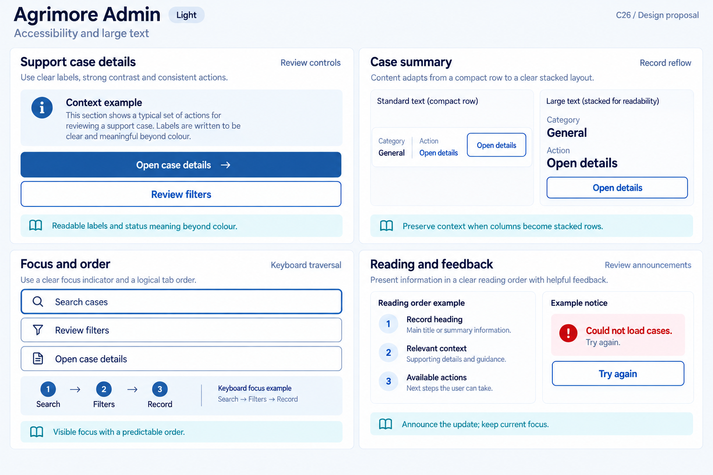
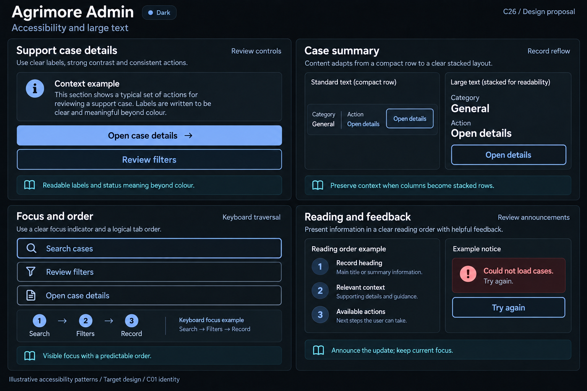

# Agrimore Admin — C26 accessibility and large text

**PROVISIONAL_DIRECTION / TARGET_IMPLEMENTATION · v1 · 2026-10-03.** C01 is approved and locked; C26 owner approval is pending.

Professional-blue keyboard-driven review, cyan reading/reflow guidance and steel/slate audit surfaces.

[Ten-board gallery](../../../../../docs/design-system/ACCESSIBILITY_LARGE_TEXT_BOARDS_2026-10-03.md) · [Codebase/domain map](../../../../../docs/design-system/ACCESSIBILITY_LARGE_TEXT_DOMAIN_MAP_2026-10-03.md) · [Exact prompts](prompts.md) · [Manifest](manifest.json).

## Current source

Admin has mixed Material and legacy table/dialog/card layouts with many maxLines/ellipsis and fixed dimensions; explicit textScaler/focus-order adaptation is sparse in marker search. Support evidence/action UI has tooltips in selected places; actual Material widgets contribute default semantics. Shared CustomButton white text on outlined/text persists where adopted. Dashboard and order panels use independent widgets; table-to-stacked record adaptation is a target, not existing universal behavior.

## Target direction

Prioritize keyboard access through filters/records/detail/dialogs, full audit/context text at large scale, adaptable record rows and labelled status/action meaning. Maintain reading order and focus return on close without assuming every table can become a card or publishing compliance claims.

| Panel | Domain specimen |
| --- | --- |
| Operational contrast | Panel "Review controls": title "Support case details", primary "Open case details", secondary "Review filters"; readable text+info-icon "Context example". Cyan note "Readable labels and status meaning beyond colour". No actual case ID/user/status outcome/export/resolve action. |
| Dense to adaptable | Panel "Record reflow": Standard text specimen a compact row with labels "Category", "General", "Action", "Open details"; Large text specimen SAME info in vertically stacked label/value lines and full-width outlined "Open details". Header "Case summary". Cyan note "Preserve context when columns become stacked rows". No real case, success/status or global-all-tables support claim. |
| Keyboard traversal | Panel "Focus and order": outlined field "Search cases" has strong single professional-blue own border; below outlined "Review filters" and "Open case details". External small guide "Search → Filters → Record" and "Keyboard focus example". Cyan note "Visible focus with a predictable order". No outer ring/glow, fake typed query or resolved case. |
| Review announcements | Panel "Reading and feedback": ordered rows "Record heading", "Relevant context", "Available actions", caption "Reading order example"; independent icon+text notice "Could not load cases. Try again." with outlined "Try again", caption "Example notice". Cyan note "Announce the update; keep current focus". No real audit/private info/compliance/WCAG pass badge. |

Preservation and gaps:

- Absence of explicit Semantics is not proof all Material controls inaccessible; inspect merged tree and labels.
- Legacy dense tables/detail widgets need specific overflow/traversal tests, not one universal responsive claim.
- Focus trapping/restoration for dialogs and focus unobscured by banners/footer require runtime keyboard checks.
- Masked identifiers/export permissions remain separate from readable a11y labels; do not narrate hidden private values or infer case resolution.

## Light

## Dark

