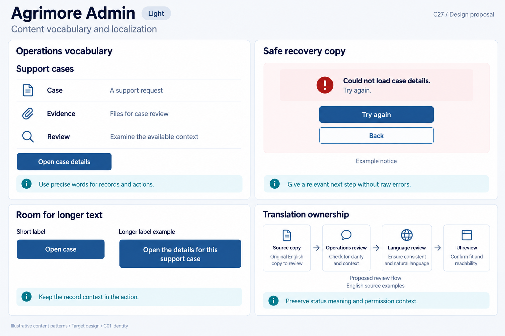
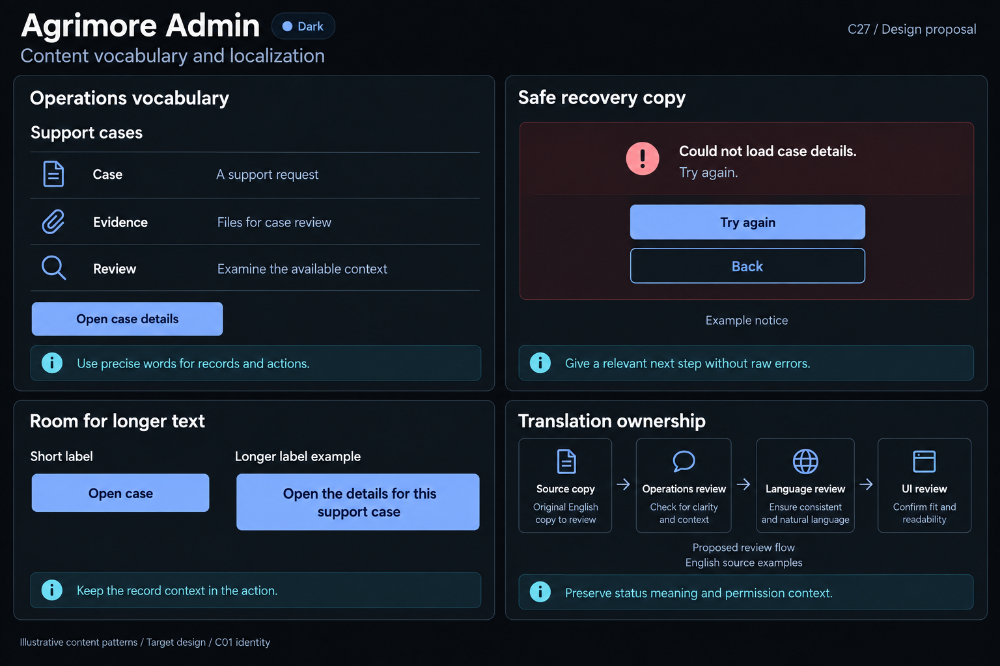

# Agrimore Admin — C27 content vocabulary and localization

**PROVISIONAL_DIRECTION / TARGET_IMPLEMENTATION · v1 · 2026-10-04.** C01 is approved and locked; C27 owner approval is pending.

Professional-blue operations vocabulary with cyan review guidance and steel/slate context surfaces.

[Ten-board gallery](../../../../../docs/design-system/CONTENT_VOCABULARY_LOCALIZATION_BOARDS_2026-10-04.md) · [Codebase/domain map](../../../../../docs/design-system/CONTENT_VOCABULARY_LOCALIZATION_DOMAIN_MAP_2026-10-04.md) · [Exact prompts](prompts.md) · [Manifest](manifest.json).

## Current source

Admin root has no app-localization delegates/support list wired. easy_localization is declared in pubspec but no import or calls were found in the scanned Admin lib tree. Support-case actions and evidence handling use inline English and can render FirebaseFunctionsException.message. Some dense review/detail screens display internal status strings or fallbacks. Shared feedback widgets accept caller messages and keep fixed English defaults; helper reuse alone does not enforce safe or translated copy.

## Target direction

Use clear support-case, evidence and review terms with exact action intent. App catalog ownership should preserve administrative scope/status meaning and permission-specific recovery. Map stable codes to reviewed messages rather than directly rendering transport text, with domain-owned neutral fallback wording for unknown states.

| Panel | Domain specimen |
| --- | --- |
| Operations vocabulary | Panel "Operations vocabulary": title "Support cases"; glossary rows "Case" / "A support request", "Evidence" / "Files for case review", "Review" / "Examine the available context". Primary "Open case details". Cyan note "Use precise words for records and actions". No real case, status, private evidence or resolution. |
| Safe review copy | Panel "Safe recovery copy": notice "Could not load case details. Try again." with icon; primary "Try again", secondary "Back"; caption "Example notice". Cyan note "Give a relevant next step without raw errors". No permission/role claim, destructive retry, stack trace or case outcome. |
| Operations label expansion | Panel "Room for longer text": "Short label" / "Longer label example"; actions "Open case" and "Open the details for this support case". Longer label wraps and grows; no abbreviations or ellipsis. Cyan note "Keep the record context in the action". English illustration, no claimed additional locale. |
| Operations copy review | Panel "Translation ownership": four readable stages "Source copy", "Operations review", "Language review", "UI review"; note "Preserve status meaning and permission context"; caption "Proposed review flow", "English source examples". No named reviewers, assigned admin rights, approval ticks or production policy page. |

Preservation and gaps:

- A localization dependency alone is not app adoption or an approved set of translated languages.
- Keep access denied, missing data and transient read failure distinct; retry is not appropriate for every denial.
- Status mapping must preserve authoritative enum distinctions rather than prettifying several states into a misleading single label.
- Evidence/approval/refund/resolution wording and action outcomes remain server-authoritative; no successful operation or role assignment shown.

## Light

## Dark

