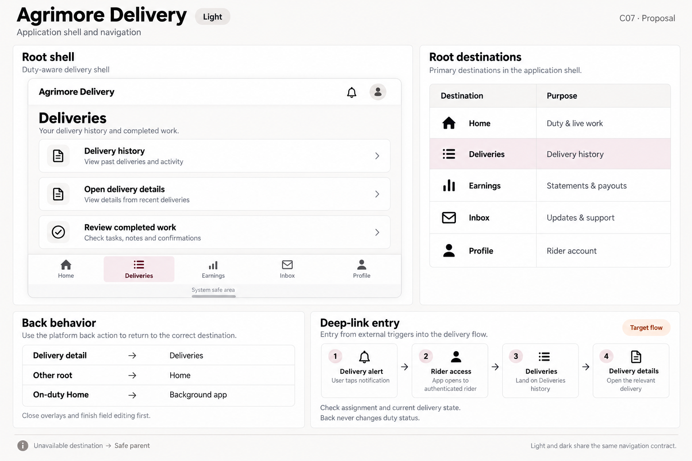
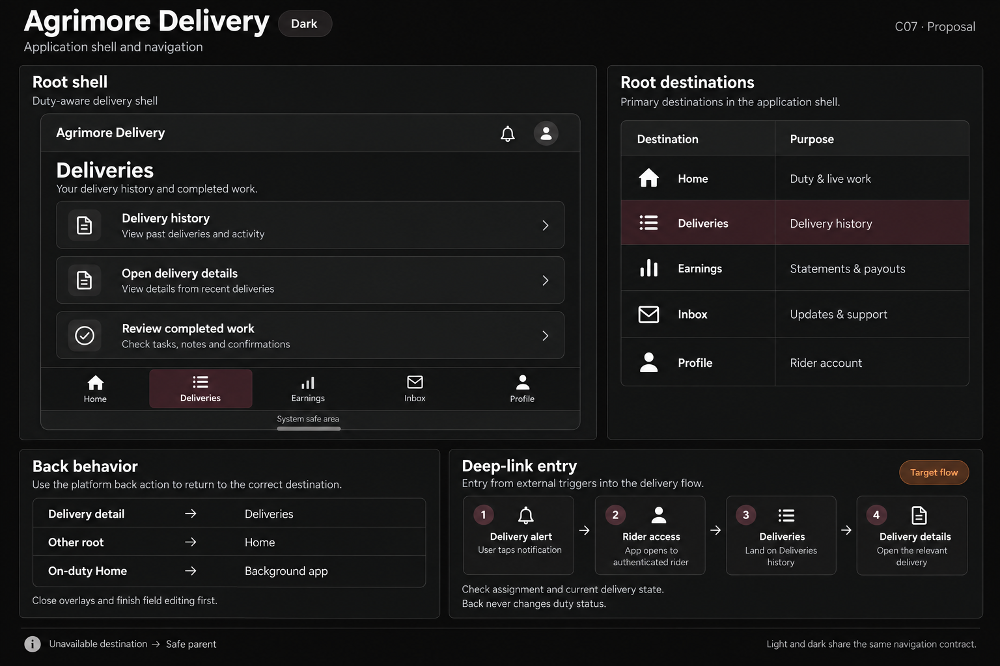

# Agrimore Delivery — C07 application shell and navigation

**PROVISIONAL_DIRECTION / TARGET_IMPLEMENTATION · v1 · 2026-10-03.** C01 identity stays approved and locked. Static review references; runtime and asset registration are unchanged.

Identity: Black/white with burgundy and burnt orange support.

| Theme | Board |
| --- | --- |
| Light | [Open light](agrimore-delivery-application-shell-navigation-light.png) |
| Dark | [Open dark](agrimore-delivery-application-shell-navigation-dark.png) |

[Exact prompts](prompts.md) · [Manifest](manifest.json) · [All five apps](../../../../../docs/design-system/APPLICATION_SHELL_NAVIGATION_BOARDS_2026-10-03.md) · [Codebase/domain mapping](../../../../../docs/design-system/APPLICATION_SHELL_NAVIGATION_DOMAIN_MAP_2026-10-03.md) · [C01 approval](../../../../../docs/design-system/COLOR_ROLES_THEME_IDENTITY_LOCK_2026-10-02.md).

Frame: **Duty-aware delivery shell**. Selected specimen: **Deliveries**.

| Root destination | Purpose |
| --- | --- |
| Home | Duty & live work |
| Deliveries | Delivery history |
| Earnings | Statements & payouts |
| Inbox | Updates & support |
| Profile | Rider account |

## Current source

DeliveryShell lazily retains five roots: Home, Deliveries, Earnings, Inbox and Profile. Deliveries mounts RiderHistoryScreen, not an active-job tab. The Inbox unread stream is shared/memoized. Non-Home back selects Home; at Home, online back requests backgrounding with a SystemNavigator.pop fallback if backgrounding fails; offline permits platform exit. Navigation itself does not mark a rider offline.

OfferLaunch queues an orderId and OfferCoordinator opens incoming offers; main.dart wires delivery_offer FCM/local notification entry. RiderSessionGate clears offer intents and old-session routes on rider changes. Inbox opens delivery/order details imperatively with current record validation. Android declares agrimore-delivery, but no generic URI route resolver was found. The Delivery alert flow shown here targets a delivery detail notification; incoming offers must continue through the dedicated offer coordinator rather than this history-detail flow.

## Target direction

Retain the duty-aware five-root shell and clearly name Deliveries as history. Back on duty must preserve duty state; handle background fallback honestly. Route incoming offers and ordinary delivery detail alerts as separate intent types, with assignment/state validation and one open detail instance.

Back behavior:

- Delivery detail → Deliveries
- Other root → Home
- On-duty Home → Background app

Target entry: Delivery alert → Rider access → Deliveries → Delivery details.

- Check assignment and current delivery state.
- Back never changes duty status.

48px minimum interaction targets are proposed; labels and controls must grow for text. Safe areas are system measured. Flow cards explain the intended route relationship, not implemented external-URL support. Illustrations are not pixel-scale runtime screenshots.

## Light

## Dark

