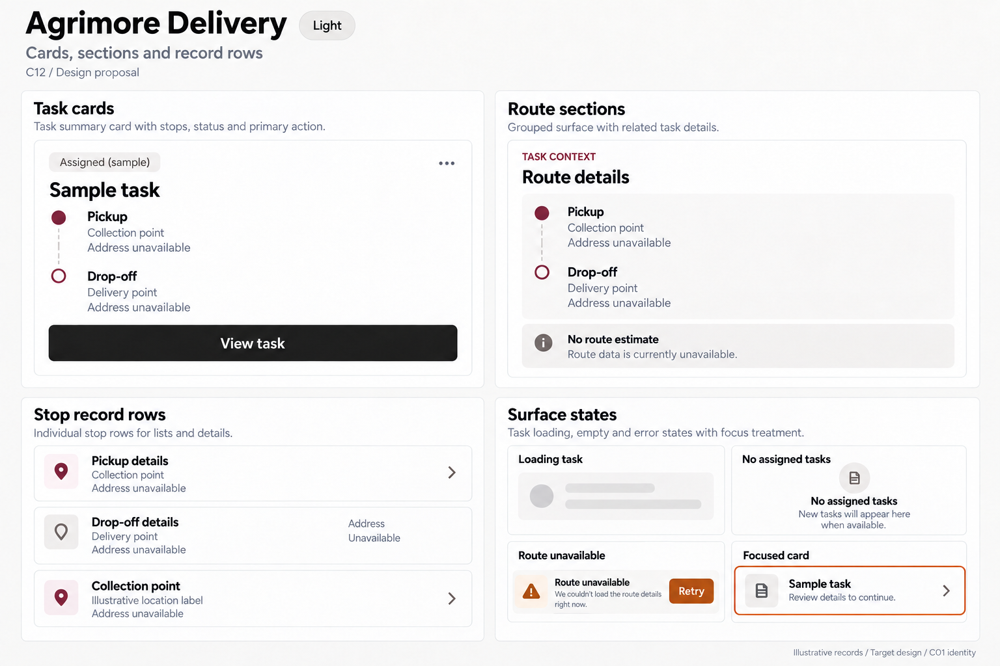
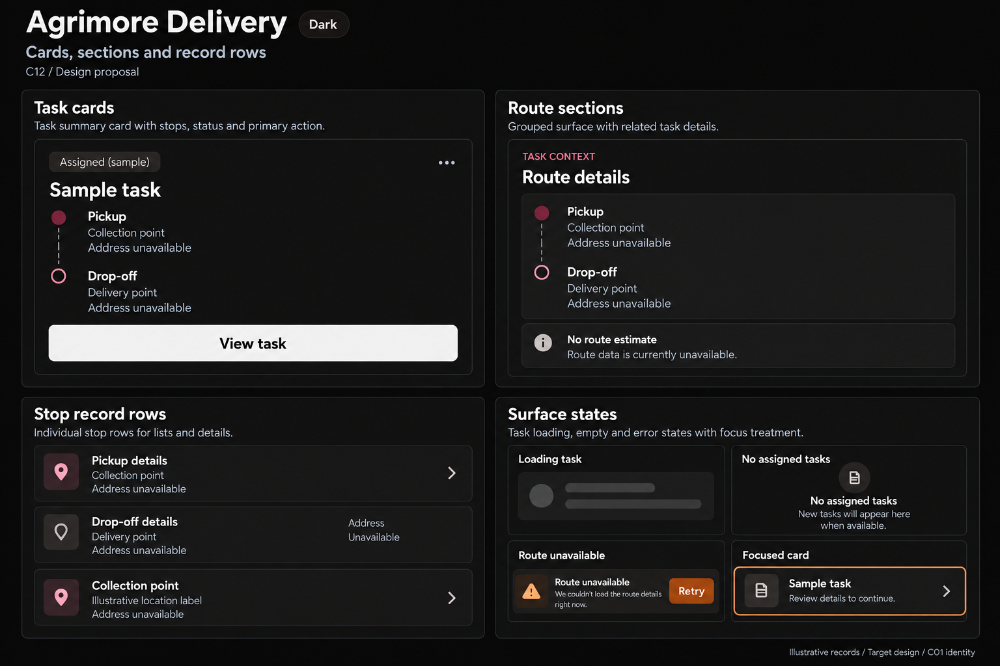

# Agrimore Delivery — C12 cards, sections and record rows

**PROVISIONAL_DIRECTION / TARGET_IMPLEMENTATION · v1 · 2026-10-03.** C01 is approved and locked; C12 owner approval is pending.

High-contrast black/white task cards with burgundy contextual accents and burnt-orange guidance; larger scan targets and simple stop rows.

[Ten-board gallery](../../../../../docs/design-system/CARDS_SECTIONS_RECORD_ROWS_BOARDS_2026-10-03.md) · [Codebase/domain map](../../../../../docs/design-system/CARDS_SECTIONS_RECORD_ROWS_DOMAIN_MAP_2026-10-03.md) · [Exact prompts](prompts.md) · [Manifest](manifest.json).

## Current source

DeliveryCard supports standard, muted, brand, outlined and elevated variants, with interactive state handling through DeliveryInteractive. RiderRouteCard composes route Map/Details and scoped stream/stale-location feedback within the card. DeliverySectionHeader already handles title, subtitle, eyebrow and trailing content.

## Target direction

Compose assignment, route and stop summaries through DeliveryCard. Separate pickup/drop-off identity, task state, route health and ledger information; leave unavailable location/address data explicit.

| Panel | Domain specimen |
| --- | --- |
| Task cards | Large Sample task card, Assigned (sample) neutral status chip, prominent monochrome title. Two stacked stops Pickup / Collection point and Drop-off / Delivery point, generic address subtitle Address unavailable. Main action View task. Orange appears as guidance only. |
| Route sections | Single grouped surface heading Route details, burgundy eyebrow TASK CONTEXT; Pickup and Drop-off rows with connected simple outline markers; No route estimate annotation. Never render map, distance or ETA. |
| Stop record rows | Pickup details navigable row with chevron and strong monochrome label. Static Address / Unavailable row no chevron. Narrow specimen wraps generic multi-line location label. Touch areas generous. |
| Surface states | Loading task skeleton; No assigned tasks quiet empty card; Route unavailable scoped Retry inside its surface. Separate 2px burnt-orange focus outline labelled Focused. Footer Assignment is not completion. No success receipt or tracking promise. |

Preservation and gaps:

- Preserve route-health and stale-location feedback within the affected section.
- Assigned is not picked up, delivered or paid; a card selection never confirms a handover.
- Keep address wrapping and independently labelled actions; never invent ETA, distance, live tracking or handover code.

## Light

## Dark

