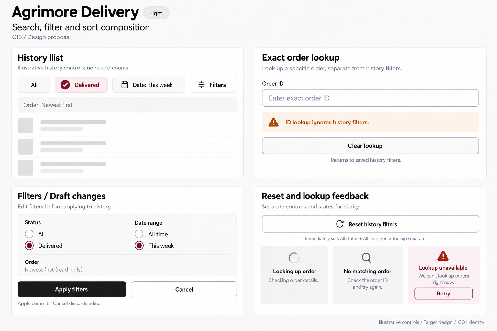
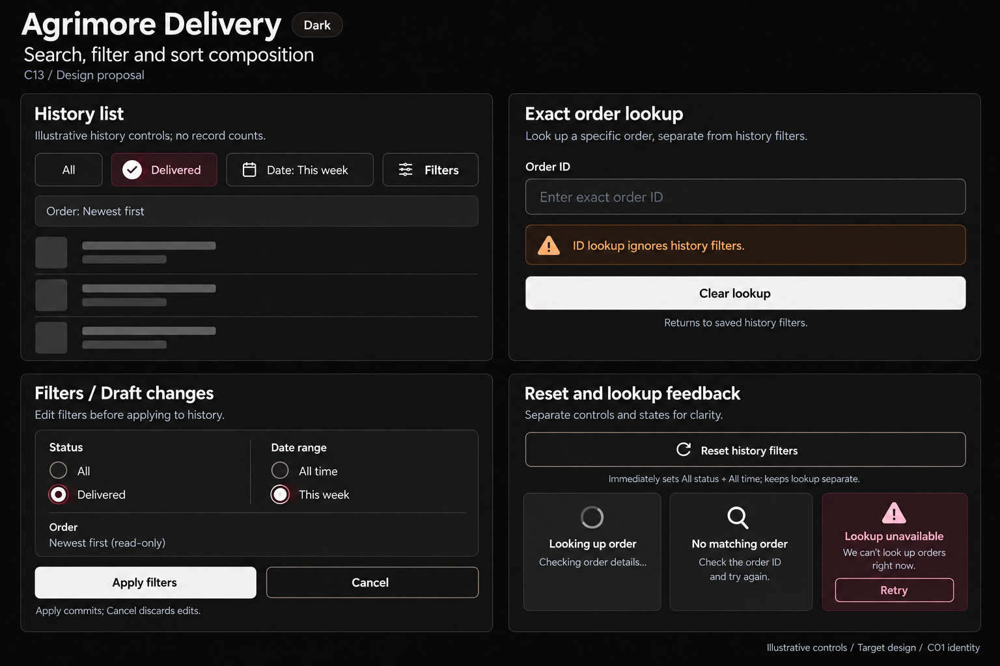

# Agrimore Delivery — C13 search, filter and sort composition

**PROVISIONAL_DIRECTION / TARGET_IMPLEMENTATION · v1 · 2026-10-03.** C01 is approved and locked; C13 owner approval is pending.

High-contrast black/white history discovery, burgundy history context and burnt-orange mode/scope guidance; simple controls for field use.

[Ten-board gallery](../../../../../docs/design-system/SEARCH_FILTER_SORT_COMPOSITION_BOARDS_2026-10-03.md) · [Codebase/domain map](../../../../../docs/design-system/SEARCH_FILTER_SORT_COMPOSITION_DOMAIN_MAP_2026-10-03.md) · [Exact prompts](prompts.md) · [Manifest](manifest.json).

## Current source

RiderHistory separates paginated history status/date filters from exact owned orderNumber lookup. Exact lookup bypasses status/date and uses a latest-search token; clearSearch restores the underlying history state. Inline status changes are immediate; HistoryFilterSheet stages choices until Apply, but Reset calls clearFilters immediately and closes. History queries order newest first.

## Target direction

Make History list and Exact order lookup visibly separate scopes. Applied history status/date remain preserved during ID lookup. Keep newest-first as read-only ordering, not an invented sort menu. Explain immediate reset versus staged Apply/Cancel.

| Panel | Domain specimen |
| --- | --- |
| History list composition | Heading History list. Single-choice chips All unselected and Delivered selected with check, applied Date: This week chip and Filters button. Read-only line Order: Newest first with no dropdown chevron. Caption Illustrative history controls; no record counts. |
| Exact lookup scope | Separate mini surface heading Exact order lookup with empty field labelled Order ID, placeholder Enter exact order ID. No ID values or fake order. Burnt-orange guidance ID lookup ignores history filters. Small return control Clear lookup with helper Returns to saved history filters. This is a separate mode specimen, never a combined search+history query. |
| Staged history filters | Inset sheet Filters / Draft changes. Status radio Delivered selected, All unselected. Date range This week selected, All time unselected. Apply filters and Cancel actions; helper Apply commits; Cancel discards edits. Read-only Newest first note; no sort dropdown or Apply-count. |
| Reset and lookup feedback | Reset history filters button, helper Immediately sets All status + All time; keeps lookup separate. Small independent state cards Looking up order, No matching order, Lookup unavailable with Retry. Exact failure is not not-found. No future tracking promise, ETA, address, handover code or fake numeric values. |

Preservation and gaps:

- Current screen keeps history controls alongside exact lookup; target mode separation/scope wording is a proposed UI enhancement, not a new combined query.
- Reset filters changes status/date only; clearFilters does not clearSearch. Never claim it clears order lookup.
- Week presets use IST bounds; custom inclusive dates convert to an exclusive upper bound. Keep date semantics through the composition.
- No additional sort selector is verified for history; fixed newest-first remains explicit.

## Light

## Dark

