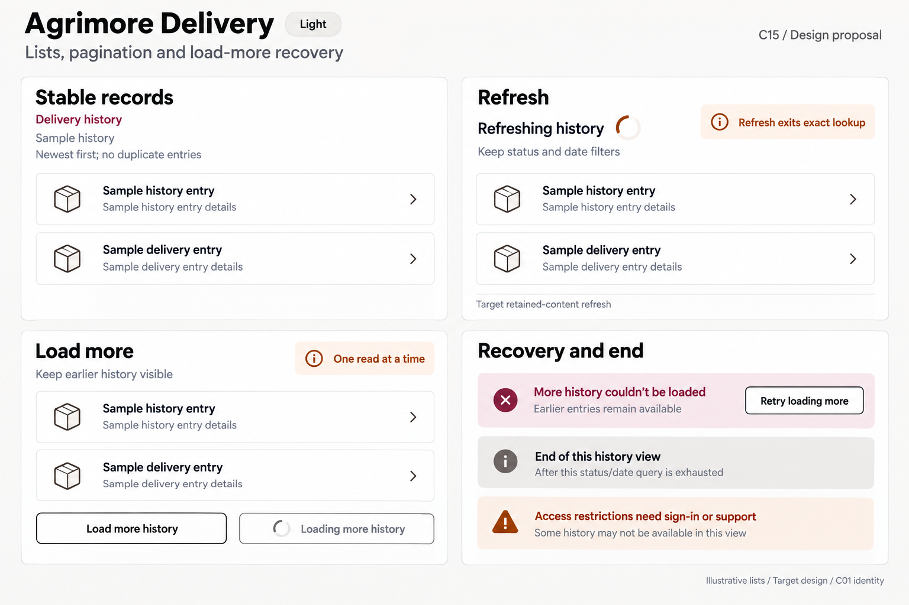
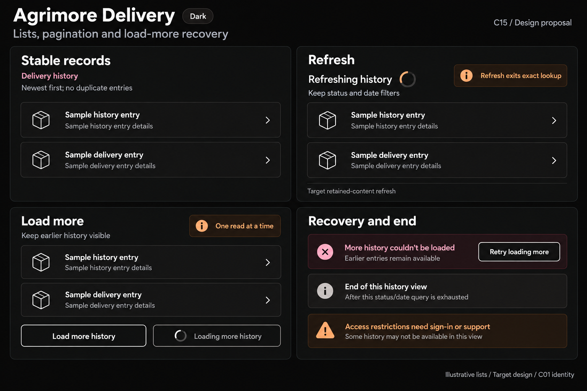

# Agrimore Delivery — C15 lists, pagination and load-more recovery

**PROVISIONAL_DIRECTION / TARGET_IMPLEMENTATION · v1 · 2026-10-03.** C01 is approved and locked; C15 owner approval is pending.

High-contrast black/white delivery-history rows, burgundy historical context and burnt-orange connection hints, with generous field-use footer controls.

[Ten-board gallery](../../../../../docs/design-system/LISTS_PAGINATION_LOAD_MORE_RECOVERY_BOARDS_2026-10-03.md) · [Codebase/domain map](../../../../../docs/design-system/LISTS_PAGINATION_LOAD_MORE_RECOVERY_DOMAIN_MAP_2026-10-03.md) · [Exact prompts](prompts.md) · [Manifest](manifest.json).

## Current source

RiderHistory reads cursor pages newest-first with one extra raw document to determine hasMore; the raw-page cursor advances independently of client-side historyMatches filtering. It guards concurrent reads and stale generation, and deduplicates against existing order IDs. Retry keeps the last successful cursor and loaded rows. refresh clears search and pagination, then reloads the first page. History screen already retains rows with a footer loading/error/load-more/end state. Statement paging separately guards cursor progress and deduplicates statement order IDs.

## Target direction

Retain real history pagination and localized footer recovery while making stable records, scope and pending state clear. Preserve status/date through same-history retry. Show a target refresh that keeps safe previous rows and clearly exits exact lookup rather than claiming current refresh preserves search.

| Panel | Domain specimen |
| --- | --- |
| Stable records | History list labelled "Sample history". Two simple parcel-outline rows titled "Sample history entry" and "Sample delivery entry", with no IDs, addresses, money, dates or ETA. Burgundy small context label "Delivery history". Helper "Newest first; no duplicate entries". No invented completed status or payment outcome. |
| Refresh | Same sample history rows retained under text "Refreshing history" and a compact spinner. Helper "Keep status and date filters". Burnt-orange board annotation "Refresh exits exact lookup". A tiny "Target retained-content refresh" caption. No claim that lookup search stays unchanged. |
| Load more | Wide secondary OUTLINED black/white control "Load more history". Separate disabled outlined pending variant "Loading more history" with spinner. Helper "Keep earlier history visible". Small burnt-orange note "One read at a time". No page numbers, task counts or automatic work acceptance. |
| Recovery and end | Separate examples. Connection failure "More history couldn’t be loaded", helper "Earlier entries remain available", OUTLINED action "Retry loading more". End marker "End of this history view", caption "After this status/date query is exhausted". Tiny note "Access restrictions need sign-in or support". Never add a permission-bypass retry or settlement guarantee. |

Preservation and gaps:

- Current history refresh clears items/search before reading; retained-row refresh is a target change, and refresh leaves exact order lookup intentionally.
- History deduplication compares incoming rows against existing IDs but does not explicitly add incoming IDs to the seen set during the batch; robust append should prevent within-batch duplicates too.
- Current history footer maps permission failures but still provides retry. Permission/account restriction belongs to C14 recovery, not blind next-page retry.
- A page that has no visible matching records may still have a raw cursor and more pages; continue within disclosed bounds, not a fake end or unbounded loop.
- Statement cursor-progress/auto-continue limits apply to statement flow; do not claim those guards are already used in RiderHistory.

## Light

## Dark

