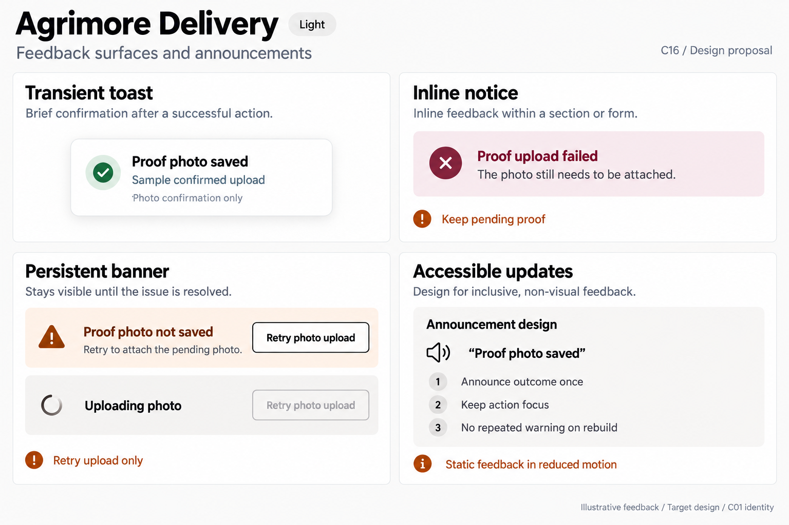
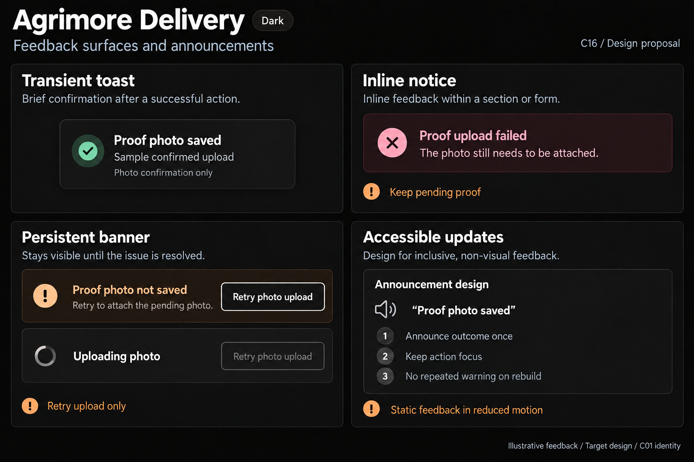

# Agrimore Delivery — C16 feedback surfaces and announcements

**PROVISIONAL_DIRECTION / TARGET_IMPLEMENTATION · v1 · 2026-10-03.** C01 is approved and locked; C16 owner approval is pending.

High-contrast black/white field feedback, burgundy error context, burnt-orange recovery guidance and generous labelled actions.

[Ten-board gallery](../../../../../docs/design-system/FEEDBACK_SURFACES_ANNOUNCEMENTS_BOARDS_2026-10-03.md) · [Codebase/domain map](../../../../../docs/design-system/FEEDBACK_SURFACES_ANNOUNCEMENTS_DOMAIN_MAP_2026-10-03.md) · [Exact prompts](prompts.md) · [Manifest](manifest.json).

## Current source

DeliveryToast replaces current snackbar and uses tone pairs; no explicit reduced-motion or liveRegion wrapper appears in that function. DeliveryBanner makes warning/danger live regions automatically. PendingProofBanner persists local proof entries and guards each retry; it retries saveDeliveryProof only, never confirmDelivery. Successful upload clears/discards the pending entry; failure retains it. Expired/missing photo paths allow explicit local dismissal.

## Target direction

Persistent proof-photo recovery with independent idle/pending examples, truthful photo-only confirmation and safe inline upload failure. Announce only newly meaningful conditions, not every banner rebuild. Preserve existing completion versus proof distinction without fabricating a delivered outcome on the board.

| Panel | Domain specimen |
| --- | --- |
| Transient toast | High-contrast neutral toast "Proof photo saved" with small success icon. Caption "Sample confirmed upload" and note "Photo confirmation only". No Delivered tick, earnings, payment claim or Undo. |
| Inline notice | Burgundy error notice "Proof upload failed", body "The photo still needs to be attached." Burnt-orange board annotation "Keep pending proof". No delivered/paid status and no disappearing error timer. |
| Persistent banner | Persistent warning banner "Proof photo not saved", body "Retry to attach the pending photo." Generous OUTLINED black/white action "Retry photo upload". Separate small pending variant "Uploading photo" with spinner and disabled outlined action. Board note "Retry upload only". No dismiss X on recoverable entry. |
| Accessible updates | Explicit "Announcement design" section. Quoted text "Proof photo saved" with speaker icon. Rules "Announce outcome once", "Keep action focus", "No repeated warning on rebuild". Orange supporting note "Static feedback in reduced motion". |

Preservation and gaps:

- Proof retry must not reconfirm delivery or imply payment/settlement.
- Automatic warning liveRegion needs coalescing across dashboard rebuilds; test native toast semantics before adding another wrapper.
- Keep cached pending entry while upload fails; expiry/missing file and dismissal are separate reasons.
- One retry in flight per proof; disable the same action during upload, preserve accessible label/focus.

## Light

## Dark

