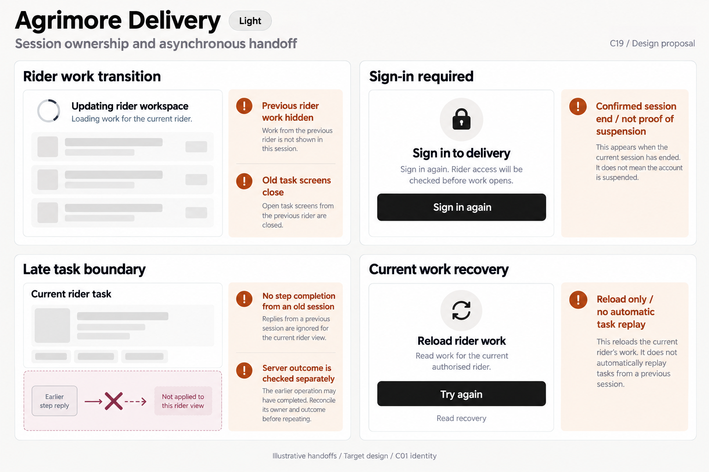
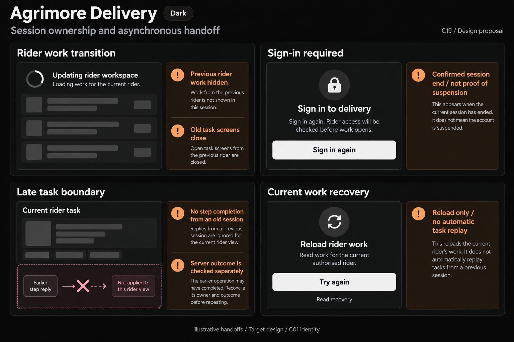

# Agrimore Delivery — C19 session ownership and asynchronous handoff

**PROVISIONAL_DIRECTION / TARGET_IMPLEMENTATION · v1 · 2026-10-03.** C01 is approved and locked; C19 owner approval is pending.

High-contrast black/white rider rebinding, burgundy stale-task boundaries, burnt-orange field guidance and large single-purpose recovery controls.

[Ten-board gallery](../../../../../docs/design-system/SESSION_OWNERSHIP_ASYNCHRONOUS_HANDOFF_BOARDS_2026-10-03.md) · [Codebase/domain map](../../../../../docs/design-system/SESSION_OWNERSHIP_ASYNCHRONOUS_HANDOFF_DOMAIN_MAP_2026-10-03.md) · [Exact prompts](prompts.md) · [Manifest](manifest.json).

## Current source

DeliveryAuthProvider ties projection and actions to current UID/session. RiderSessionGate binds order/history state to the currently operable rider; when the binding ends it closes old routes, clears offer launches/notifications and stops location tracking. DeliveryOrderProvider.bind increments a generation, clears previous work/counters/errors and drops old stream/read results. advanceStep/releaseOrder protect shared error state with generation but still return the original invocation result to its caller. ActiveOrderScreen checks mounted after awaited step and then updates local step/toast; the gate closing old routes is a mitigating lifecycle behavior, not a universal caller-owned ticket. PendingProofStore data in the inspected record shape is keyed by order and has no explicit owner field; safe cross-account proof recovery must be demonstrated by authorised order/assignment checks rather than assumed.

## Target direction

Show rider work cleared while rebinding, sign-in required without an online claim, no late step response applied to a different rider task, and read-only retry of current rider work. Preserve current gate cleanup. Never replay a step, confirm delivery or upload another rider proof merely because a UI session changed.

| Panel | Domain specimen |
| --- | --- |
| Rider work transition | Card "Updating rider workspace", indeterminate spinner and "Loading work for the current rider." EMPTY work-row skeletons. Orange BOARD notes "Previous rider work hidden" and "Old task screens close". No job values, rider name, live-map marker, online toggle or assigned-count metric. |
| Sign-in required | Card "Sign in to delivery", lock icon, body "Sign in again. Rider access will be checked before work opens." black PRIMARY "Sign in again" in light, off-white with dark text in dark. Orange BOARD note "Confirmed session end / not proof of suspension". No delivered/online/suspended badge. |
| Late task boundary | Neutral card "Current rider task", EMPTY task skeleton. Burgundy BOARD diagram "Earlier step reply" arrow crossed at "Not applied to this rider view". Orange board note "No step completion from an old session" and "Server outcome is checked separately". No delivered tick, replay step, proof-photo thumbnail or released-order success. |
| Current work recovery | Card "Reload rider work", body "Read work for the current authorised rider." PRIMARY "Try again", small "Read recovery" caption. Orange BOARD note "Reload only / no automatic task replay". No accept offer, resume proof, reconfirm delivery, online state, location or task-count value. |

Preservation and gaps:

- Retain the existing route-pop, offer cleanup and tracking stop when work binding ends; these are current behaviors, not new guarantees.
- Provider suppression of shared errors does not automatically suppress an awaited screen result; verify route, rider, task and episode around screen feedback.
- Proof recovery owner is not explicitly stored in the inspected PendingProof schema. No automatic cross-account proof resume or deletion guarantee in boards.
- A session change is not a delivered/completed/released outcome and does not cancel server step execution.
- Retry current work reads only; auth approval, offline status and assignment state remain separate.

## Light

## Dark

