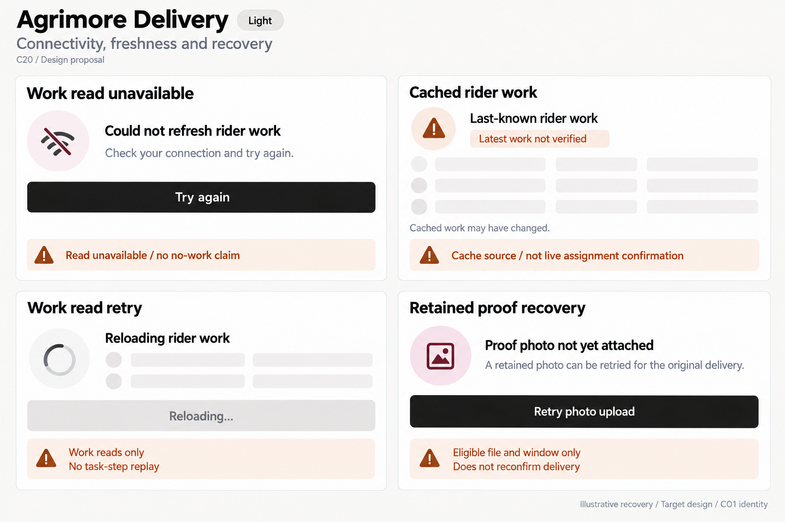
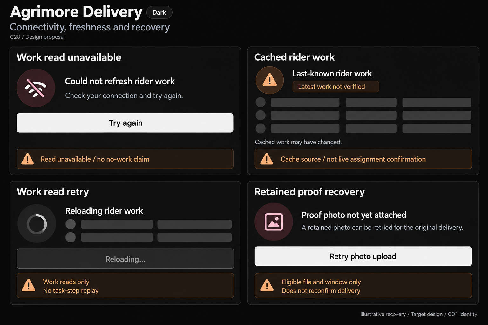

# Agrimore Delivery — C20 connectivity, freshness and recovery

**PROVISIONAL_DIRECTION / TARGET_IMPLEMENTATION · v1 · 2026-10-03.** C01 is approved and locked; C20 owner approval is pending.

High-contrast black/white field recovery, burgundy proof attention, burnt-orange stale-work guidance and large comfortable single-purpose controls.

[Ten-board gallery](../../../../../docs/design-system/CONNECTIVITY_FRESHNESS_RECOVERY_BOARDS_2026-10-03.md) · [Codebase/domain map](../../../../../docs/design-system/CONNECTIVITY_FRESHNESS_RECOVERY_DOMAIN_MAP_2026-10-03.md) · [Exact prompts](prompts.md) · [Manifest](manifest.json).

## Current source

DeliveryOrderProvider uses includeMetadataChanges and ActiveSnapshot.fromCache from Firestore isFromCache. ActiveWork.failed retains last-known orders; dashboard shows StaleDataBanner when cached/error records exist and separate ActiveWorkError if no records. unavailable/deadline-exceeded maps to RiderDataError.offline, a coarse read classification rather than definitive network measurement. retry rebinds current rider reads. PendingProofStore durably records order/photo path/type/capture time; retry reads bytes and attaches proof only, never reconfirms delivery. Missing file is explained and dismissed, expired local window exposes dismiss, in-flight retries disabled. Backend attachProofCore checks original assignment, delivered state, existing attachment and proof window. Local schema has no explicit owner field, so do not claim account-keyed journal.

## Target direction

Show work read unavailable separately from cached rider work, read retry progress, and a retained eligible proof-upload action. Keep last-known work labelled; proof retained locally is not attached, and rider availability toggle is not internet connectivity.

| Panel | Domain specimen |
| --- | --- |
| Work read unavailable | Card "Could not refresh rider work", connection-slash icon, body "Check your connection and try again." PRIMARY "Try again", black light / off-white with dark labels dark. Orange BOARD note "Read unavailable / no no-work claim". No rider Online toggle, map/location or assignment count. |
| Cached rider work | Card "Last-known rider work", orange caution "Latest work not verified", EMPTY work-row skeletons. Body "Cached work may have changed." Orange BOARD note "Cache source / not live assignment confirmation". No task identifier, Delivered tick, refreshed timestamp or invented count. |
| Work read retry | Card "Reloading rider work", indeterminate spinner and EMPTY rows, DISABLED "Reloading…" control. Orange BOARD note "Work reads only" and "No task-step replay". No accept-offer, online status or route map. |
| Retained proof recovery | Card "Proof photo not yet attached", small outlined photo icon without thumbnail, body "A retained photo can be retried for the original delivery." PRIMARY "Retry photo upload". Burgundy attention accent. Orange BOARD notes "Eligible file and window only" and "Does not reconfirm delivery". No delivered-success tick, file values, photo, countdown or guaranteed upload success. |

Preservation and gaps:

- isFromCache is evidence of cache source, not proof device is offline. Read error retaining previous rows is last-known data, not necessarily a cache snapshot.
- Pending proof retry requires retained bytes, eligible window and actual authorised assignment; missing/expired cases need distinct recovery, not a forever Retry button.
- Retry uploads/attaches photo only; no reconfirm delivery, repeat step, new assignment or delivered-success claim.
- Backend rejects other-rider proof attachment; local journal lacks owner field. Add/check owner-scoped presentation before showing prior account artifacts; no automatic cross-account resume.
- Counts unavailable/stale are not zero; maps, location permission, app lifecycle tracking and rider online availability are separate states.

## Light

## Dark

