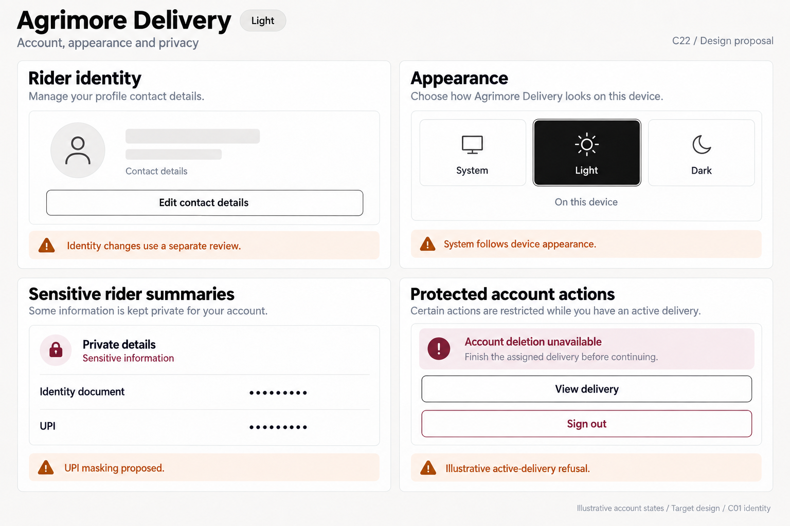
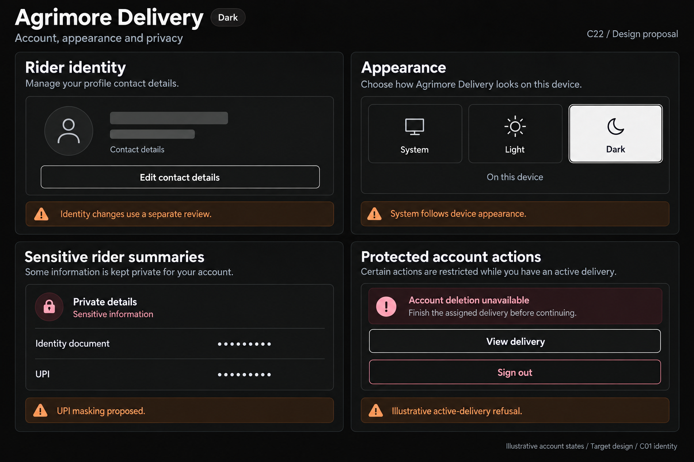

# Agrimore Delivery — C22 account, appearance and privacy presentation

**PROVISIONAL_DIRECTION / TARGET_IMPLEMENTATION · v1 · 2026-10-03.** C01 is approved and locked; C22 owner approval is pending.

Field-readable black/white identity, burgundy sensitive-action context, burnt-orange appearance guidance and large clear targets.

[Ten-board gallery](../../../../../docs/design-system/ACCOUNT_APPEARANCE_PRIVACY_PRESENTATION_BOARDS_2026-10-03.md) · [Codebase/domain map](../../../../../docs/design-system/ACCOUNT_APPEARANCE_PRIVACY_PRESENTATION_DOMAIN_MAP_2026-10-03.md) · [Exact prompts](prompts.md) · [Manifest](manifest.json).

## Current source

Rider profile has real System/Light/Dark AppearanceScope. Bank tail and Aadhaar are masked, but inspected UPI summary is raw; maskTail returns short strings unchanged. Contact changes differ from reviewed identity/document changes. Sign-out/deletion callers capture owner/session and recheck after confirmation. Deletion proactively blocks active deliveries and held cash/unsettled earnings; server also refuses pending/on-hold statements. Local missing account data does not certify eligibility. Backend retains financial/safety records and leaves incident-retention policy open.

## Target direction

Preserve session guards, distinguish contact edits from reviewed identity changes, mask UPI summary and show evidenced blocked deletion with domain recovery. Unknown eligibility remains unknown; no all-data-erased promise.

| Panel | Domain specimen |
| --- | --- |
| Rider identity | Card "Rider profile", generic person outline icon, EMPTY name skeleton, small label "Contact details"; SECONDARY "Edit contact details". Orange BOARD note "Identity changes use a separate review". No rider initials/phone/vehicle/verified badge/document photo. |
| Appearance | Card "Appearance", THREE choices "System", "Light", "Dark". Select matching board theme only. Below "On this device"; orange note "System follows device appearance". Use black selected light / off-white selected dark with dark inverse text. |
| Sensitive rider summaries | Card "Private details", rows "Identity document" and "UPI", values ONLY "••••••••". Small burgundy contextual label "Sensitive information". Orange BOARD note "UPI masking proposed". No IDs/digits/document photograph/eye control or all-private assurance. |
| Protected account actions | Card "Account deletion unavailable", body "Finish the assigned delivery before continuing." SECONDARY "View delivery". Below a separate outline "Sign out" action. Orange BOARD note "Illustrative active-delivery refusal". Burgundy is context, no Delete now, eligibility/success/paid/erasure checkmark. |

Preservation and gaps:

- UPI masking is a target fix, not already implemented. No identity document photo or identifier on these boards.
- Server deletion refusal remains authoritative; active deliveries, cash and pay requirements differ.
- No complete-erasure, privacy-policy compliance, document verification or payout completion guarantees.

## Light

## Dark

