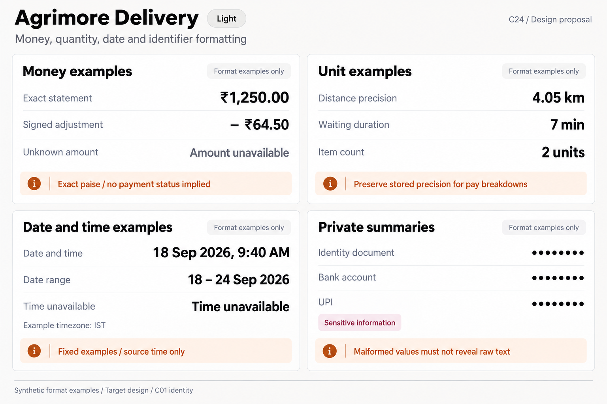
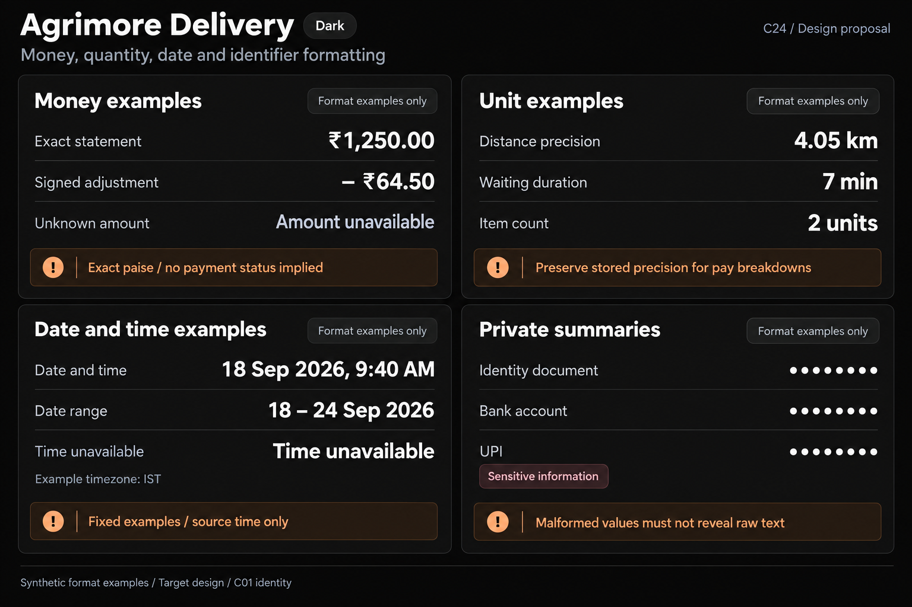

# Agrimore Delivery — C24 money, quantity, date and identifier formatting

**PROVISIONAL_DIRECTION / TARGET_IMPLEMENTATION · v1 · 2026-10-03.** C01 is approved and locked; C24 owner approval is pending.

High-contrast black/white statement figures and field units, burgundy identifier context and burnt-orange precision/time guidance.

[Ten-board gallery](../../../../../docs/design-system/MONEY_QUANTITY_DATE_IDENTIFIER_FORMATTING_BOARDS_2026-10-03.md) · [Codebase/domain map](../../../../../docs/design-system/MONEY_QUANTITY_DATE_IDENTIFIER_FORMATTING_DOMAIN_MAP_2026-10-03.md) · [Exact prompts](prompts.md) · [Manifest](manifest.json).

## Current source

DeliveryFormat money/moneyExact round to paise, optional versus exact decimal roles and Unicode minus with a space. Money screens use DeliveryFormat.rupees exact; earningBreakdown uses AgFormat exact money, stored distance with two decimals and whole waiting minutes. Offer distances often use one decimal. Helper comment mentions distance but no dedicated distance formatter method exists in inspected DeliveryFormat. Date helpers have year/range but no conversion themselves. Delivery profile local masks differ from helper; UPI raw summary and paidToUpi destination text can remain raw. maskUpi returns malformed no-at text unchanged; maskTail/Aadhaar retain short/tail values.

## Target direction

Keep exact monetary statements, preserve stored billable-distance precision separately from map approximation, label minutes/counts and date/time source. Unify conservative identifier summaries without changing destination/record IDs; malformed raw values must not leak by fallback.

| Panel | Domain specimen |
| --- | --- |
| Statement precision and signs | Card "Money examples", rows "Exact statement" = "₹1,250.00", "Signed adjustment" = "− ₹64.50", "Unknown amount" = "Amount unavailable". Orange BOARD note "Exact paise / no payment status implied". No balance, cash-held, paid tick, payout date or financial action. |
| Billable distance and field units | Card "Unit examples", rows "Distance precision" = "4.05 km", "Waiting duration" = "7 min", "Item count" = "2 units". Orange BOARD note "Preserve stored precision for pay breakdowns". No pay rate, computed fee, route/ETA or precision guarantee about GPS. |
| Rider dates and time | Card "Date and time examples", "18 Sep 2026, 9:40 AM", date range "18 – 24 Sep 2026"; separate "Time unavailable". Small "Example timezone: IST". Orange BOARD note "Fixed examples / source time only". No payment schedule, countdown, delivered/paid timeline, live clock or Today. |
| Sensitive rider identifiers | Card "Private summaries", rows "Identity document" = "••••••••", "Bank account" = "••••••••", "UPI" = "••••••••". Small burgundy label "Sensitive information". Orange BOARD note "Malformed values must not reveal raw text". No last digits, ID, photo, actual UPI handle, eye/reveal or verified/encrypted claim. |

Preservation and gaps:

- Map/offer rounding must never be used to recompute rider pay; two-decimal billable breakdown is intentional.
- Statement date zone and calendar-week meaning need explicit policy; helper formatting alone does not resolve timezone.
- Existing DeliveryFormat.maskUpi does not imply all delivery screens use it; malformed/short masks need tests.
- No statement amount/date on the board proves paid, cash received or delivery completion.

## Light

## Dark

