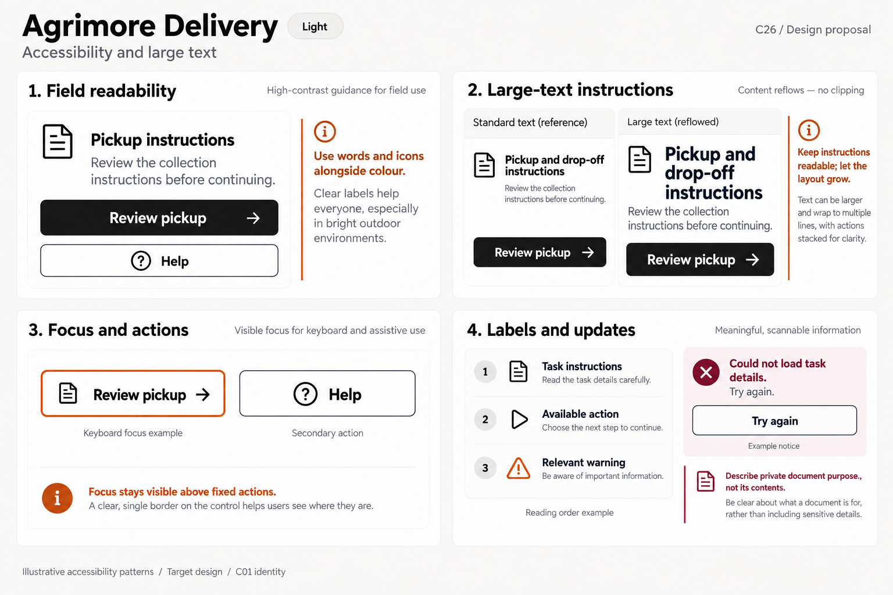
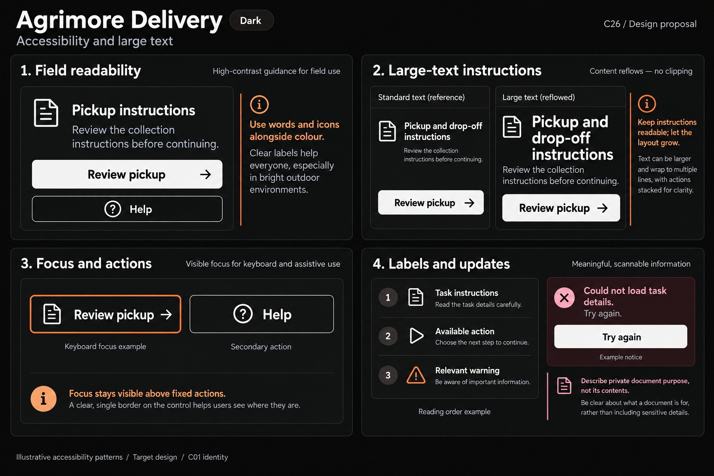

# Agrimore Delivery — C26 accessibility and large text

**PROVISIONAL_DIRECTION / TARGET_IMPLEMENTATION · v1 · 2026-10-03.** C01 is approved and locked; C26 owner approval is pending.

High-contrast black/white field guidance, burnt-orange own-border focus and burgundy document-context notes.

[Ten-board gallery](../../../../../docs/design-system/ACCESSIBILITY_LARGE_TEXT_BOARDS_2026-10-03.md) · [Codebase/domain map](../../../../../docs/design-system/ACCESSIBILITY_LARGE_TEXT_DOMAIN_MAP_2026-10-03.md) · [Exact prompts](prompts.md) · [Manifest](manifest.json).

## Current source

DeliveryFocusTracker/outline use own inside keyboard border; button minimum heights and semanticLabel exist, with non-loading labels capped at two lines/loading one. DeliveryBanner warning/danger use liveRegion, while generic loading/notice semantics vary. Route card merges/excludes some decorative icons and combines labels. Document viewer uses image loading/error without showing private data in this audit. Explicit textScaler adaptation is sparse; min height alone does not ensure large labels fit.

## Target direction

Keep rider task instructions full and actions reachable, readable names for route/help/document controls, field-friendly high contrast and one orange focus border. Large text stacks instructions/actions, keeps error next action readable; media/maps supplement text rather than substitute it.

| Panel | Domain specimen |
| --- | --- |
| High-contrast field controls | Panel "Field readability": title "Pickup instructions" and readable body "Review the collection instructions before continuing."; primary black/white "Review pickup"; secondary "Help". Orange note "Use words and icons alongside colour". No actual address, map route, ETA, delivery/paid/completed outcome. |
| Instruction reflow | Panel "Large-text instructions": Standard text and Large text specimens with EXACT SAME title "Pickup and drop-off instructions" and secondary "Review pickup". Large title wraps and action STACKS below body; full label legible, tall control. Orange note "Keep instructions readable; let the layout grow". No clipped route/address or fake system text-size toggle. |
| Rider focus and targets | Panel "Focus and actions": "Review pickup" outlined button with single strong burnt-orange own border, caption "Keyboard focus example"; secondary "Help" with labelled help icon. Orange note "Focus stays visible above fixed actions". No glow/second ring, actual keyboard overlay or coordinate. |
| Meaningful reading | Panel "Labels and updates": ordered rows "Task instructions", "Available action", "Relevant warning"; external "Reading order example". Independent warning+text "Could not load task details. Try again.", outlined "Try again", caption "Example notice". Burgundy small note "Describe private document purpose, not its contents". No identity document number/verified tick, completed delivery, safety guarantee or emergency dispatch. |

Preservation and gaps:

- Two-line/one-line label caps can truncate long translations/loading labels at large text.
- Minimum touch height is not proof actual hit area/focus unobscured with sticky footer/keyboard.
- Keyboard focus and accessibility focus are separate; tracker appearance does not prove screen-reader traversal.
- Private document image alternative should describe purpose/state without exposing sensitive identifiers; no identity or delivery outcome announced here.

## Light

## Dark

