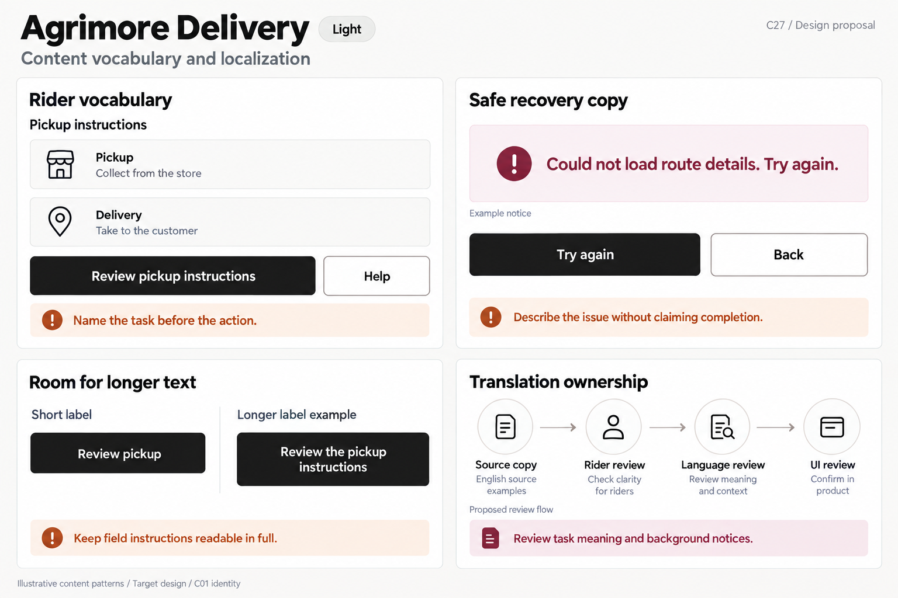
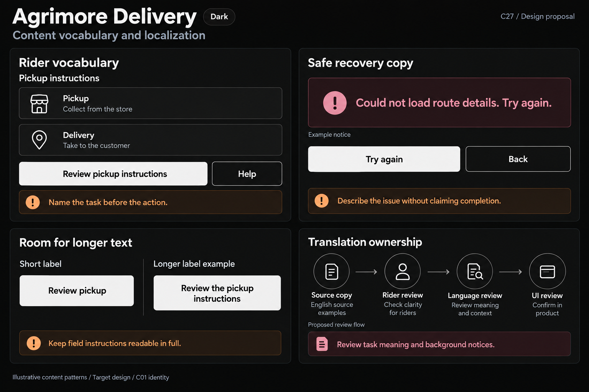

# Agrimore Delivery — C27 content vocabulary and localization

**PROVISIONAL_DIRECTION / TARGET_IMPLEMENTATION · v1 · 2026-10-04.** C01 is approved and locked; C27 owner approval is pending.

Monochrome rider instructions with burnt-orange action guidance and burgundy context notes.

[Ten-board gallery](../../../../../docs/design-system/CONTENT_VOCABULARY_LOCALIZATION_BOARDS_2026-10-04.md) · [Codebase/domain map](../../../../../docs/design-system/CONTENT_VOCABULARY_LOCALIZATION_DOMAIN_MAP_2026-10-04.md) · [Exact prompts](prompts.md) · [Manifest](manifest.json).

## Current source

Delivery has one English ARB catalog, generated supported English locale and delegates at the root. authProblemText maps RiderAuthProblem to localized sentences. confirmDelivery catches FirebaseFunctionsException, logs details, and uses a code/reason-specific copy mapper; catch-all returns deliverFailed. deviceLocalizations selects a supported device language or English for background/local notification strings. ARB placeholders/plurals exist; some server-authored notes/status fallbacks are passed through, requiring separate trust/context review.

## Target direction

Use clear pickup, delivery and instruction terms; distinguish viewing directions from recording completion. Localize visible and background messages from the rider catalog; failure copy and available actions must reflect the real typed state, not a raw transport message or automatic replay of a delivery command.

| Panel | Domain specimen |
| --- | --- |
| Rider vocabulary | Panel "Rider vocabulary": title "Pickup instructions"; definition rows "Pickup" / "Collect from the store", "Delivery" / "Take to the customer". Primary "Review pickup instructions", secondary "Help". Orange note "Name the task before the action". Glossary only; no current task, address, dispatch or delivered state. |
| Safe route copy | Panel "Safe recovery copy": notice "Could not load route details. Try again." with icon; primary "Try again", secondary "Back"; caption "Example notice". Orange note "Describe the issue without claiming completion". No map API error, confirm-delivery retry, emergency command or server success. |
| Rider instruction expansion | Panel "Room for longer text": "Short label" / "Longer label example"; actions "Review pickup" and "Review the pickup instructions"; long action wraps/grows. Orange note "Keep field instructions readable in full". No clipped instruction, fixed-width language setting or translated support claim. |
| Rider copy ownership | Panel "Translation ownership": stages "Source copy", "Rider review", "Language review", "UI review"; burgundy note "Review task meaning and background notices"; caption "Proposed review flow", "English source examples". Do not insert actual push notification, sensitive content, emergency number or reviewer tick. |

Preservation and gaps:

- Device-language fallback does not provide a translation when only English is supported.
- Safety/emergency wording, delivery confirmation, lockout timings and photo-proof outcomes need separate domain review; no such outcome or safety guarantee is illustrated here.
- Background notices need their own locale and privacy review; foreground selection cannot be assumed to propagate into another isolate.
- User/store/customer content and server notes are not automatically translated UI strings; sanitize/review fallback display separately.

## Light

## Dark

