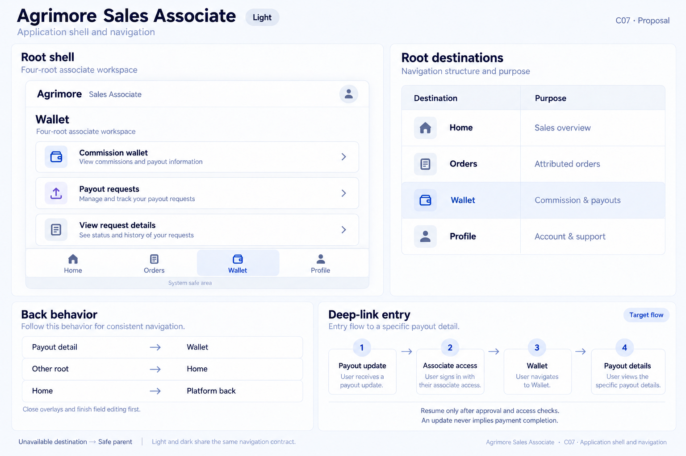
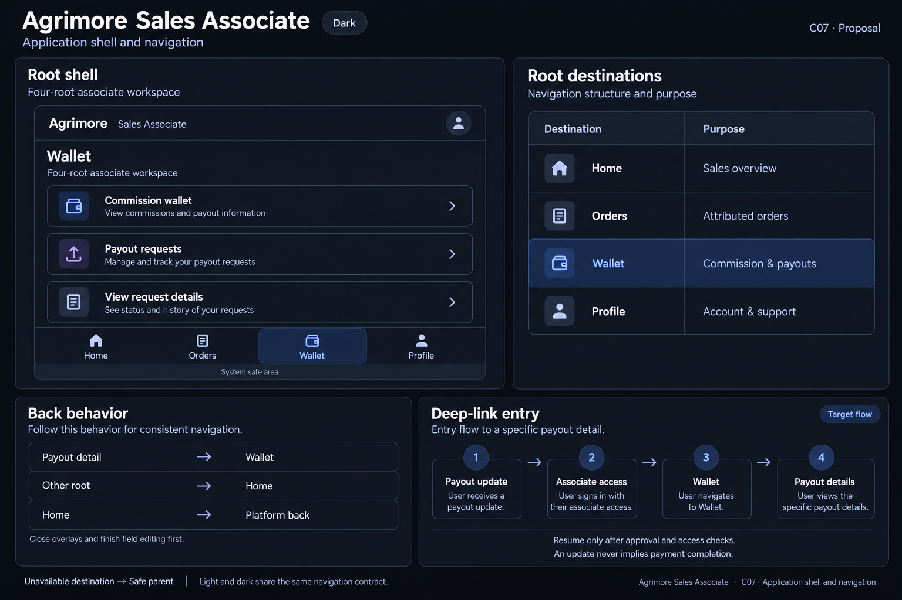

# Agrimore Sales Associate — C07 application shell and navigation

**PROVISIONAL_DIRECTION / TARGET_IMPLEMENTATION · v1 · 2026-10-03.** C01 identity stays approved and locked. Static review references; runtime and asset registration are unchanged.

Identity: Premium royal blue with muted indigo, pearl and slate support.

| Theme | Board |
| --- | --- |
| Light | [Open light](agrimore-sales-associate-application-shell-navigation-light.png) |
| Dark | [Open dark](agrimore-sales-associate-application-shell-navigation-dark.png) |

[Exact prompts](prompts.md) · [Manifest](manifest.json) · [All five apps](../../../../../docs/design-system/APPLICATION_SHELL_NAVIGATION_BOARDS_2026-10-03.md) · [Codebase/domain mapping](../../../../../docs/design-system/APPLICATION_SHELL_NAVIGATION_DOMAIN_MAP_2026-10-03.md) · [C01 approval](../../../../../docs/design-system/COLOR_ROLES_THEME_IDENTITY_LOCK_2026-10-02.md).

Frame: **Four-root associate workspace**. Selected specimen: **Wallet**.

| Root destination | Purpose |
| --- | --- |
| Home | Sales overview |
| Orders | Attributed orders |
| Wallet | Commission & payouts |
| Profile | Account & support |

## Current source

EmployeeShellScreen has four roots: Home, Orders, Wallet and Profile, retained in an IndexedStack. initialTab is clamped and a controller can switch roots. Navigation labels are always visible. No shell-level PopScope was found, so the proposed non-Home-back-to-Home policy is new. Internal app path remains employee; user-facing name is Sales Associate.

MaterialApp uses a navigator key, direct MaterialPageRoute pushes, and onUnknownRoute returning the live auth gate. Shared named-route notification navigation therefore falls back to that gate; it does not prove that a payout-specific destination opens. Android declares agrimore-employee, but no URI resolver was found. Payout update → Wallet → detail is a target intent contract.

## Target direction

Keep the four roots and add one explicit root-back policy. Introduce typed notification intents after live associate approval checks, with Wallet as the cold-entry parent. Never label a payout paid merely because navigation succeeded.

Back behavior:

- Payout detail → Wallet
- Other root → Home
- Home → Platform back

Target entry: Payout update → Associate access → Wallet → Payout details.

- Resume only after approval and access checks.
- An update never implies payment completion.

48px minimum interaction targets are proposed; labels and controls must grow for text. Safe areas are system measured. Flow cards explain the intended route relationship, not implemented external-URL support. Illustrations are not pixel-scale runtime screenshots.

## Light

## Dark

