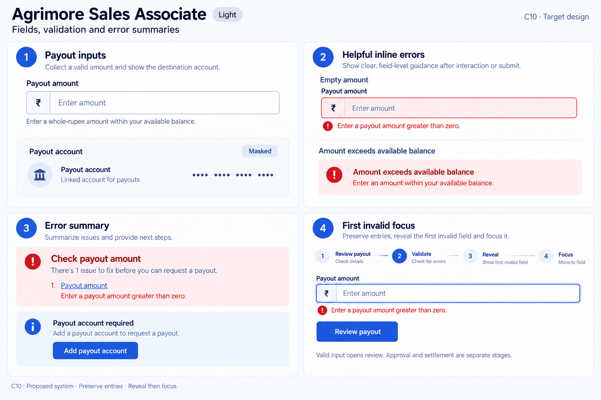
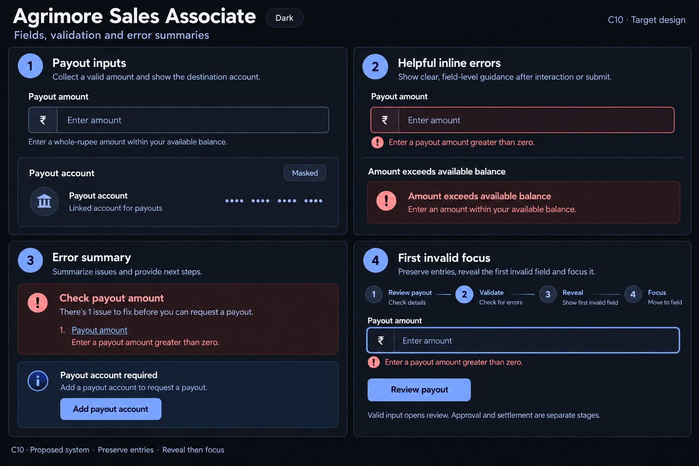

# Agrimore Sales Associate — C10 fields, validation and error summaries

**PROVISIONAL_DIRECTION / TARGET_IMPLEMENTATION · v1 · 2026-10-03.** C01 remains approved and locked.

Premium royal-blue payout form with indigo guidance, masked destination and deliberate money hierarchy.

[All ten boards](../../../../../docs/design-system/FIELDS_VALIDATION_ERROR_SUMMARIES_BOARDS_2026-10-03.md) · [Domain map](../../../../../docs/design-system/FIELDS_VALIDATION_ERROR_SUMMARIES_DOMAIN_MAP_2026-10-03.md) · [Exact prompts](prompts.md) · [Manifest](manifest.json).

## Current source

Payout request uses a digits-only TextFormField, validates positive amount against wallet balance, requires a saved payout account and navigates to review. No summary/first-invalid coordinator was found in this focused flow. Account screen has its own field validators.

## Proposed direction

Make payout amount labels and whole-rupee input policy explicit, link errors to the amount field and provide a reachable account prerequisite action without confusing validation with settlement.

| Panel | Intent |
| --- | --- |
| Payout inputs | Field Payout amount with ₹ prefix, empty hint Enter amount, helper Enter a whole-rupee amount within your available balance. Separate destination card Masked payout account; no invented IDs, balances or amounts. |
| Helpful inline errors | Payout amount empty with error Enter a payout amount greater than zero. Separate explanatory specimen Amount exceeds available balance — Enter an amount within your available balance. Show these as alternate states, not simultaneous errors. |
| Error summary | Title Check payout amount. One linked item Payout amount — Enter a payout amount greater than zero. Separate prerequisite callout Payout account required and enabled Add payout account action. |
| First invalid focus | Review payout → Validate → Reveal Payout amount → Focus. Preserve entry. Valid input opens review. Request approval and settlement are separate. |

Preservation and gaps:

- Current request input is digits-only; do not invent a decimal-entry policy or broaden it silently.
- Missing account is a prerequisite with Add payout account action, not a fictitious amount error.
- Recheck authoritative balance at submission; a locally valid amount does not mean payout paid.

## Light

## Dark

