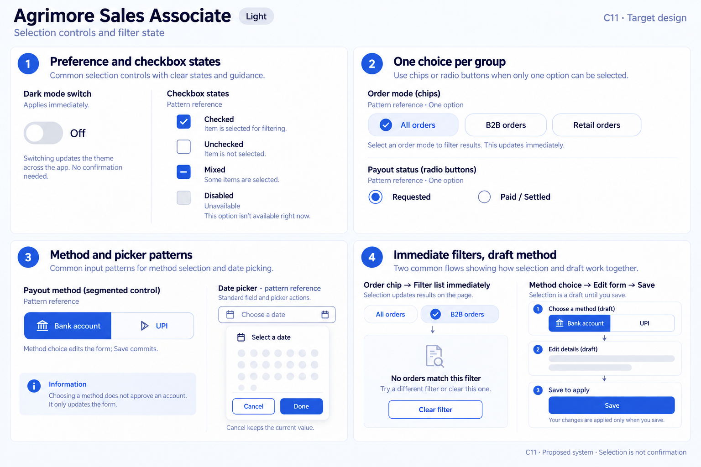
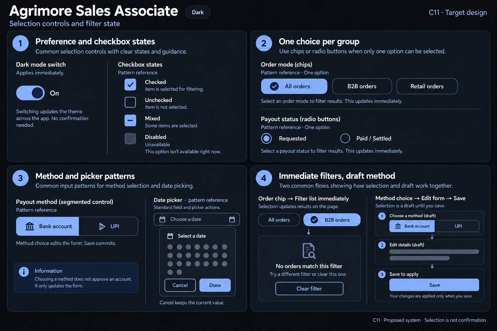

# Agrimore Sales Associate — C11 selection controls and filter state

**PROVISIONAL_DIRECTION / TARGET_IMPLEMENTATION · v1 · 2026-10-03.** C01 remains approved and locked.

Premium royal-blue relationship and payout filters, indigo guidance and restrained pearl/slate control surfaces.

[All ten boards](../../../../../docs/design-system/SELECTION_CONTROLS_FILTER_STATE_BOARDS_2026-10-03.md) · [Domain map](../../../../../docs/design-system/SELECTION_CONTROLS_FILTER_STATE_DOMAIN_MAP_2026-10-03.md) · [Exact prompts](prompts.md) · [Manifest](manifest.json).

## Current source

Orders, wallet and payout history use single-choice ChoiceChip enums updated immediately. Payout account method uses a custom two-way Bank account/UPI gesture segment; choice changes form mode without saving destination. Profile Dark Mode switch changes theme immediately. Focused flow has no multi-order selection or filter date-range picker.

## Proposed direction

Make one-choice groups explicit with selected symbols and semantics; distinguish selecting a payout method from saving/approving it. Include checkbox and picker atoms as future reference patterns without implying new operational features.

| Panel | Intent |
| --- | --- |
| Preference and checkbox states | Dark mode switch uses current board theme (OFF in LIGHT, ON in DARK), helper Applies immediately. Checkbox strip explicitly Pattern reference: Checked / Unchecked / Mixed dash / Disabled with Unavailable helper. No new bulk-order functionality. |
| One choice per group | Order-mode chips All orders selected, B2B orders unselected, Retail orders unselected. Separate payout status radio group Requested selected, Paid / Settled unselected. Each group is independent and single choice; selection is filtering, not payout approval. |
| Method and picker patterns | Payout method segment Bank account selected, UPI unselected. Helper Method choice edits the form; Save commits. Small date picker field labelled Date picker · pattern reference with empty Choose a date, Cancel / Done. No account IDs, dates, numeric amounts or invented date-filter feature. |
| Immediate filters, draft method | Two clean mini-flows: Order chip → Filter list immediately; Method choice → Edit form → Save. Text Choosing a method does not approve an account. Neutral empty-state example No orders match this filter with Clear filter action. No fabricated records or counts. |

Preservation and gaps:

- Do not turn Requested/Paid/Settled choices into payout actions or guarantees.
- Payout method segment is a form draft choice, not a saved destination or approved account.
- Generic checkbox/date picker specimens are target patterns only; source does not establish bulk-order selection or a payout date filter.

## Light

## Dark

