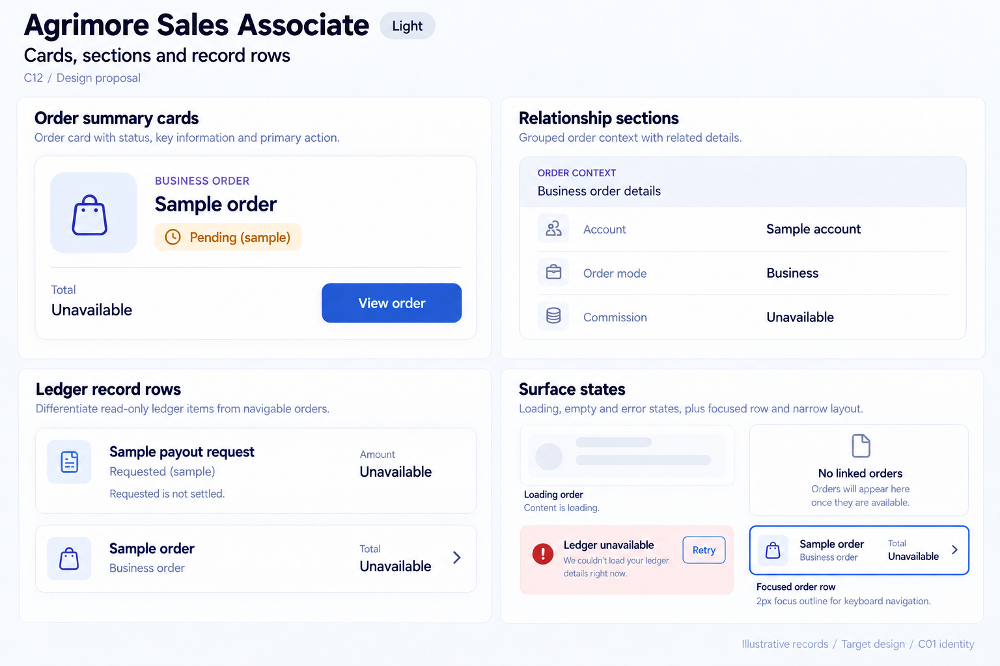
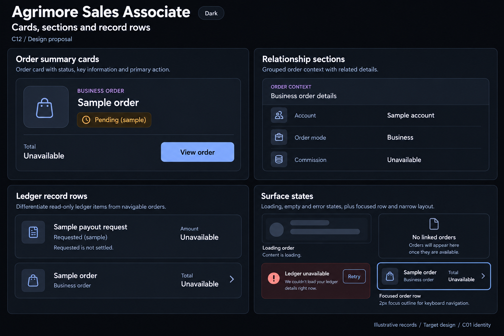

# Agrimore Sales Associate — C12 cards, sections and record rows

**PROVISIONAL_DIRECTION / TARGET_IMPLEMENTATION · v1 · 2026-10-03.** C01 is approved and locked; C12 owner approval is pending.

Premium royal-blue relationship and order surfaces, indigo supporting cues, pearl/slate rows and clear separation of commercial versus ledger information.

[Ten-board gallery](../../../../../docs/design-system/CARDS_SECTIONS_RECORD_ROWS_BOARDS_2026-10-03.md) · [Codebase/domain map](../../../../../docs/design-system/CARDS_SECTIONS_RECORD_ROWS_DOMAIN_MAP_2026-10-03.md) · [Exact prompts](prompts.md) · [Manifest](manifest.json).

## Current source

OrdersScreen builds tappable order containers using saTokens, identity, stage, mode/date and total. WalletScreen builds read-only transaction ListTile containers. Both targeted sources coerce missing monetary values to 0.0; the proposal instead requires explicit unavailable values. This snapshot does not assert a live financial defect.

## Target direction

Reusable order/relationship summary anatomy with readable identities and indigo context; group order details separately from commission/payout records. Navigable order rows have an affordance; read-only ledger rows have none.

| Panel | Domain specimen |
| --- | --- |
| Order summary cards | Refined Sample order card with subtle bag outline, Business order subtitle, Pending (sample) chip, Total / Unavailable, View order action. Indigo is a small context accent, no invented customer identity. |
| Relationship sections | Single grouped Order context surface, rows Account / Sample account; Order mode / Business; Commission / Unavailable. Pearl/slate background and indigo eyebrow. No invented commission percentage or eligibility promise. |
| Ledger record rows | Read-only Sample payout request row with Requested (sample), Amount unavailable, no chevron. Clearly separate Sample order row with chevron. Small explanation Requested is not settled. |
| Surface states | Loading order skeleton; No linked orders quiet empty-state surface; Ledger unavailable scoped Retry. Separate Focused order row 2px blue outline. Narrow example stacks label and value. Footnote Missing amount stays unavailable. |

Preservation and gaps:

- Preserve separate order stage, commission eligibility and payout settlement semantics.
- Unavailable monetary values must not display as a known zero.
- Retain saTokens reuse; verify long identity and date/value layouts with text scaling.

## Light

## Dark

