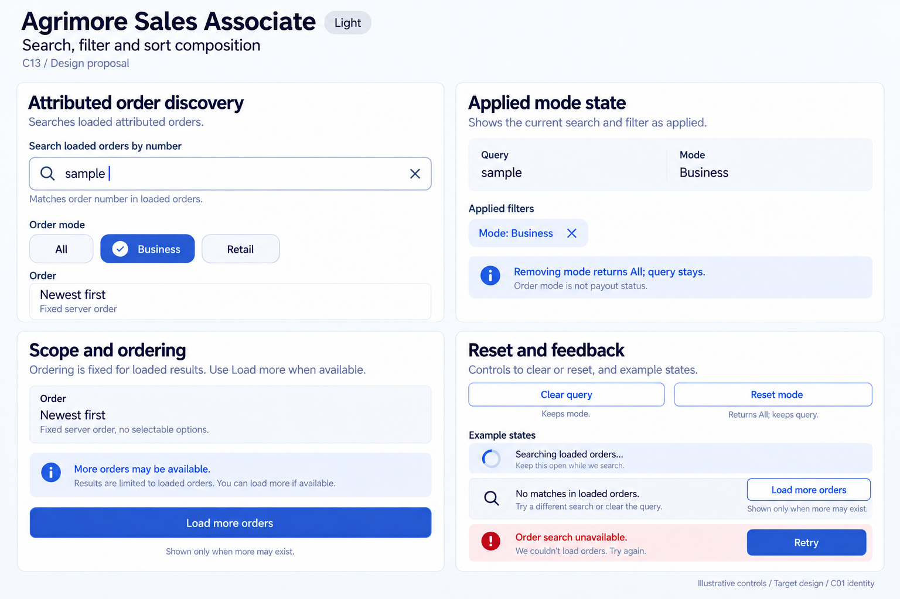
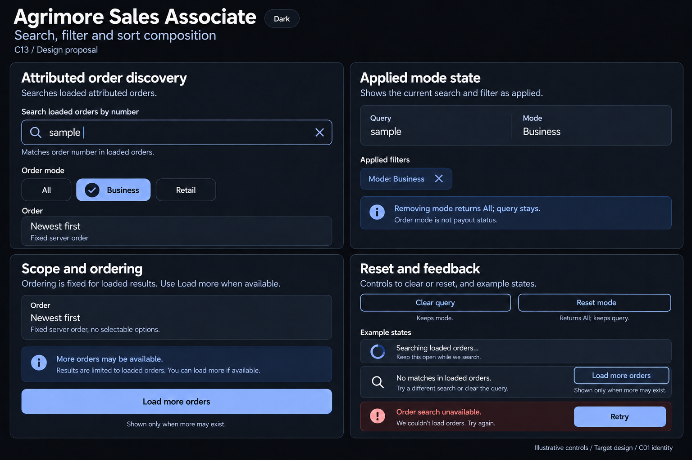

# Agrimore Sales Associate — C13 search, filter and sort composition

**PROVISIONAL_DIRECTION / TARGET_IMPLEMENTATION · v1 · 2026-10-03.** C01 is approved and locked; C13 owner approval is pending.

Premium royal-blue loaded-order discovery, indigo business/retail context and pearl/slate scope cues; relationship and ledger filters remain distinct.

[Ten-board gallery](../../../../../docs/design-system/SEARCH_FILTER_SORT_COMPOSITION_BOARDS_2026-10-03.md) · [Codebase/domain map](../../../../../docs/design-system/SEARCH_FILTER_SORT_COMPOSITION_DOMAIN_MAP_2026-10-03.md) · [Exact prompts](prompts.md) · [Manifest](manifest.json).

## Current source

OrdersScreen streams attributed orders newest-first with limit(_pageSize), then filters orderNumber/doc ID substring and mode locally. Search and All/B2B/Retail mode chips apply immediately; Load more increases the loaded prefix. PayoutHistory separately uses local status filters over a bounded newest-first stream.

## Target direction

Order discovery names its loaded scope and single mode selection. Query clear preserves mode; mode reset returns All and preserves query. Newest first is read-only server order. No invented date picker or sort selector for this screen.

| Panel | Domain specimen |
| --- | --- |
| Attributed order discovery | Search loaded orders field entered synthetic query sample with clear X. Single-choice mode chips All unselected, Business selected with check, Retail unselected. Read-only text Order: Newest first, no chevron. Caption Searches loaded attributed orders. |
| Applied mode state | Pearl/slate summary Query / sample; Mode / Business. Removable applied chip Mode: Business X. Indigo helper Removing mode returns All; query stays. Small note Order mode is not payout status. No real IDs, customer names or amounts. |
| Scope and ordering | Read-only ordering specimen Newest first with description Fixed server order, no selectable radio or dropdown. Separate bounded-search explanation More orders may be available. Button Load more orders, labelled Shown only when more may exist. No fake order count or end-of-results claim. |
| Reset and feedback | Clear query button with helper Keeps mode; Reset mode button with helper Returns All; keeps query. Independent states Searching loaded orders; No matches in loaded orders with Load more orders conditional note; Order search unavailable with Retry. Failure never shows as no-match. No fabricated total, commission or payout claim. |

Preservation and gaps:

- A no-match in the loaded prefix does not prove no attributed order exists; offer Load more when more may exist.
- Current stream error interpolates snap.error into UI; target uses safe Order search unavailable wording and scoped retry.
- Target applied-mode removal/reset and explicit scope labels are provisional controls, not current verified widgets.
- Payout requested/approved/paid status filtering is a separate collection/workflow; do not merge it with order-stage or mode chips.

## Light

## Dark

