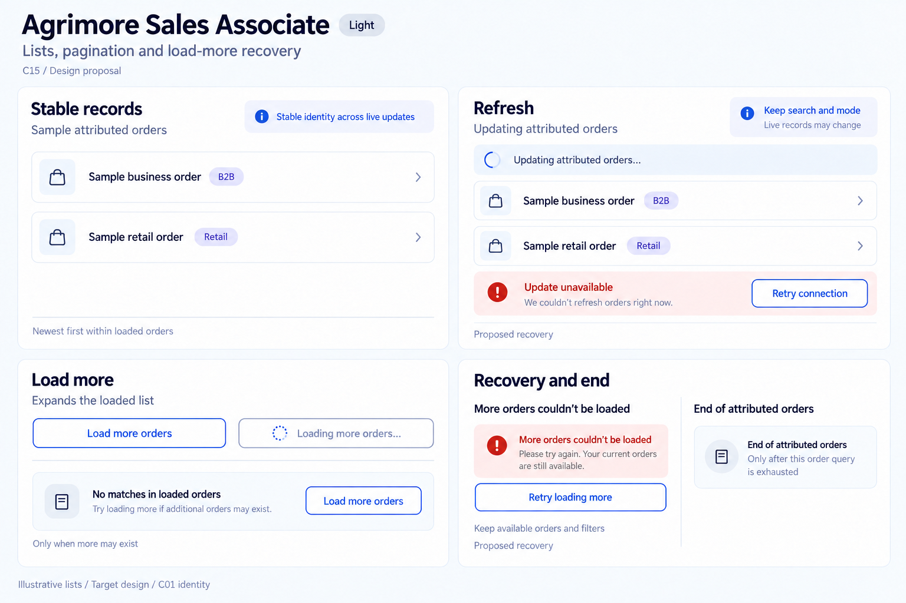
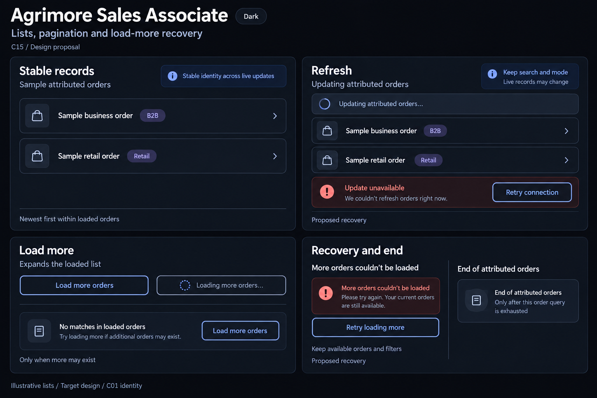

# Agrimore Sales Associate — C15 lists, pagination and load-more recovery

**PROVISIONAL_DIRECTION / TARGET_IMPLEMENTATION · v1 · 2026-10-03.** C01 is approved and locked; C15 owner approval is pending.

Premium royal-blue attributed-order rows, pearl/slate stable surfaces and indigo loaded-scope guidance; continuation expands a live prefix rather than appending cursor pages.

[Ten-board gallery](../../../../../docs/design-system/LISTS_PAGINATION_LOAD_MORE_RECOVERY_BOARDS_2026-10-03.md) · [Codebase/domain map](../../../../../docs/design-system/LISTS_PAGINATION_LOAD_MORE_RECOVERY_DOMAIN_MAP_2026-10-03.md) · [Exact prompts](prompts.md) · [Manifest](manifest.json).

## Current source

OrdersScreen, wallet transaction list and payout history use newest-first live queries with a growing _pageSize limit. Load more increases the limit rather than fetching/appending a cursor page. Local filters run over the loaded prefix; the early filtered-empty branch hides the continuation footer even when raw docs reach the limit. Existing live snapshots can change membership/order. No dedicated pending load-more guard or safe retained-data error footer is evidenced; errors render raw exception text and initial no-data is blank.

## Target direction

Preserve the expanding live-prefix mechanism explicitly. Continue beyond a filtered no-match when more may exist. Add one-in-flight pending state, safe retained-data reconnect and stable row identity/focus during snapshot replacement; do not describe this as frozen cursor history or duplicate appended pages.

| Panel | Domain specimen |
| --- | --- |
| Stable records | Relationship-style list labelled "Sample attributed orders". Two record rows titled "Sample business order" and "Sample retail order"; subtle indigo B2B and Retail context chips. No order IDs, names, amounts or status outcomes. Helper "Stable identity across live updates". Caption "Newest first within loaded orders". |
| Refresh | Retained sample order rows under a small strip "Updating attributed orders" and spinner. Helper "Keep search and mode". Indigo annotation "Live records may change". Separate small failed-update example "Update unavailable" and OUTLINED action "Retry connection"; caption "Proposed recovery". No misleading frozen-history guarantee. |
| Load more | Secondary OUTLINED royal-blue "Load more orders". Separate disabled outlined pending control "Loading more orders" with spinner. Caption "Expands the loaded list". A small distinct inset "No matches in loaded orders" with an outlined "Load more orders" control and helper "Only when more may exist". No cursor terminology in the app-facing specimen. |
| Recovery and end | Separate examples. Expanded-read failure "More orders couldn’t be loaded", helper "Keep available orders and filters", OUTLINED "Retry loading more", caption "Proposed recovery". End "End of attributed orders", helper "Only after a complete current read". No earnings amount, balance, paid status, earning promise or global search claim. |

Preservation and gaps:

- Full-prefix refetch is not cursor pagination; increased limit needs a guarded pending state and safe retention while the expanded stream reconnects.
- No matches in loaded orders is not a global absence. Keep Load more orders accessible when the underlying query may extend, even with no visible filtered rows.
- A full raw prefix only means more may exist; verify exhaustion before End of attributed orders wording.
- Use IDs to reconcile live snapshot changes and protect focus/scroll, not list indexes. Deletions/order changes are live data changes rather than pagination duplicates.
- Order, transaction and payout continuations are distinct owned queries; failure or end never implies zero earnings, commission settlement or paid payout.

## Light

## Dark

