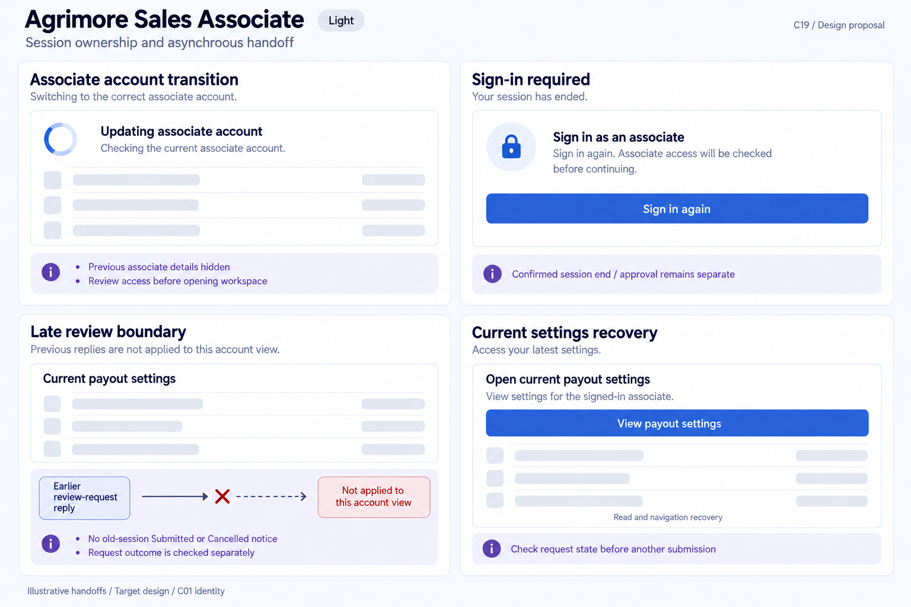
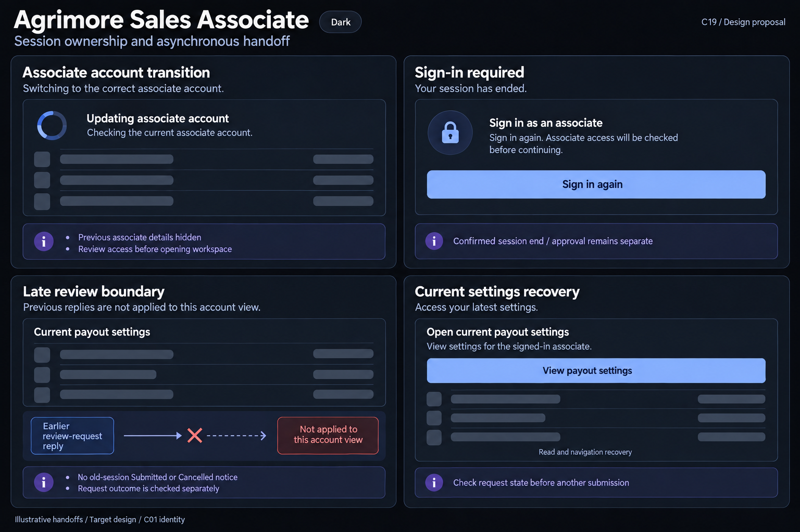

# Agrimore Sales Associate — C19 session ownership and asynchronous handoff

**PROVISIONAL_DIRECTION / TARGET_IMPLEMENTATION · v1 · 2026-10-03.** C01 is approved and locked; C19 owner approval is pending.

Premium royal-blue account transitions, indigo review-outcome guidance, pearl/slate payout-settings placeholders and restrained readable notices.

[Ten-board gallery](../../../../../docs/design-system/SESSION_OWNERSHIP_ASYNCHRONOUS_HANDOFF_BOARDS_2026-10-03.md) · [Codebase/domain map](../../../../../docs/design-system/SESSION_OWNERSHIP_ASYNCHRONOUS_HANDOFF_DOMAIN_MAP_2026-10-03.md) · [Exact prompts](prompts.md) · [Manifest](manifest.json).

## Current source

EmployeeAuthProvider hides non-owned projection, renews session/profile reads, clears approval on owner binding and revokes old auth commands, including later auth events for the same UID. Employee app gate requires role plus approval. PayoutAccountScreen captures payload and awaits requestEmployeePayoutChange/cancelEmployeePayoutChange but inspected feedback/finally checks mounted only. Its optional employeeUid/current UID determines displayed streams; no explicit auth epoch/route ticket is captured in these handlers. This is a presentation review gap, not proof a server permits editing someone else’s payout destination. No sensitive payout disk-draft persistence is evidenced here.

## Target direction

Separate identity/account transitions from associate access and payout review. Hide previous associate settings immediately. Old request replies cannot show Submitted/Cancelled under a new session; reopen only current authorised payout settings and read actual request state before any repeat mutation. Do not transfer sensitive unsubmitted payout input between accounts.

| Panel | Domain specimen |
| --- | --- |
| Associate account transition | Card "Updating associate account", indeterminate spinner and "Checking the current associate account." Empty settings-row skeletons. Indigo BOARD notes "Previous associate details hidden" and "Review access before opening workspace". No code, jurisdiction, commission or payout value. |
| Sign-in required | Card "Sign in as an associate", lock icon and "Sign in again. Associate access will be checked before continuing." royal-blue PRIMARY "Sign in again". Indigo BOARD annotation "Confirmed session end / approval remains separate". No fee, earnings promise or automatic workspace activation. |
| Late review boundary | Neutral card "Current payout settings", EMPTY setting-row skeletons, no bank/UPI/account values. Indigo BOARD diagram "Earlier review-request reply" arrow crossed at "Not applied to this account view". Note "No old-session Submitted or Cancelled notice" and "Request outcome is checked separately". No Approved/paid badge or repeat submit. |
| Current settings recovery | Card "Open current payout settings", body "View settings for the signed-in associate." PRIMARY "View payout settings", small "Read and navigation recovery" caption. Indigo BOARD note "Check request state before another submission". No request-created/approved/cancelled badge, stored draft, bank detail, monetary value or Submit again control. |

Preservation and gaps:

- Extend mounted checks with current associate, auth episode, intended payout entity and route before feedback or navigation.
- Submitting changes is not approval, settlement or payment; C18 pending-review gate remains separate.
- Unknown request outcome must be read before repeat submit/cancel; no automatic resubmission after sign-in.
- Discard sensitive input on account change under a deliberate policy; do not invent encrypted disk recovery or Save draft guarantees.
- Optional employeeUid preview/deep-link context never overrides caller authorization; validate current permitted record before showing settings.

## Light

## Dark

