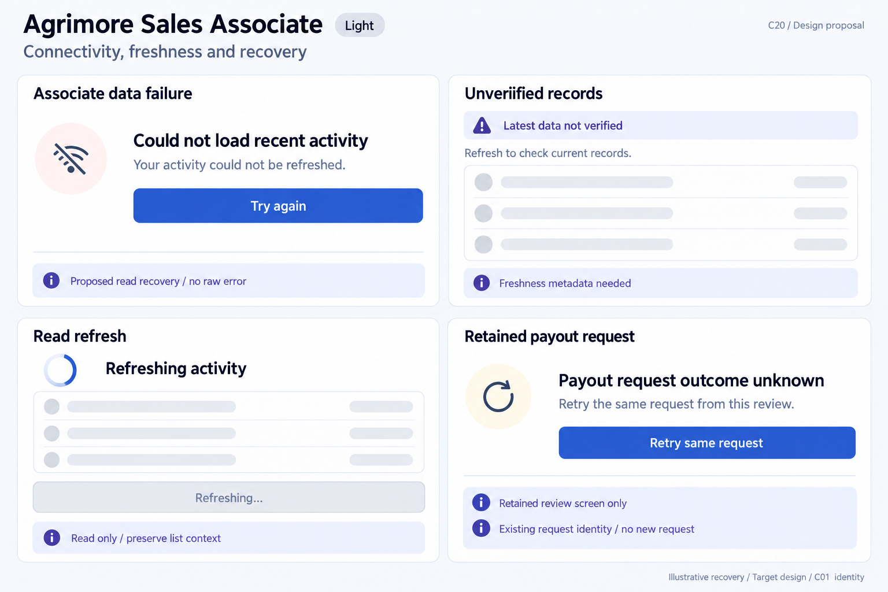
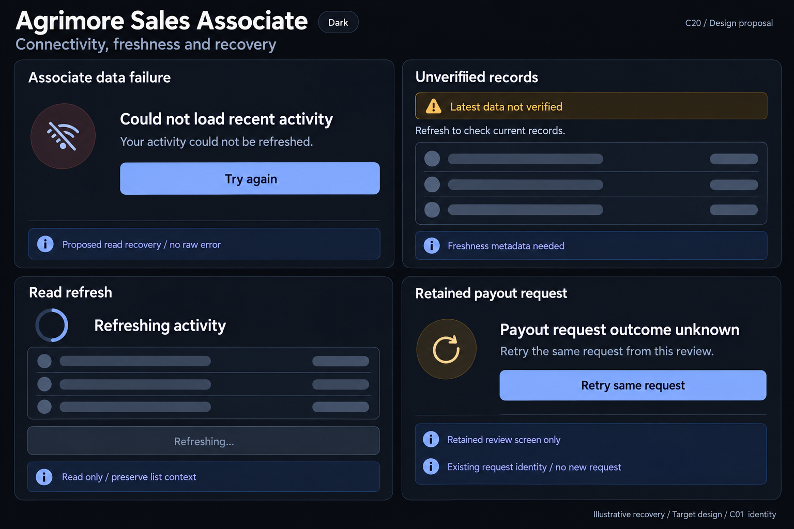

# Agrimore Sales Associate — C20 connectivity, freshness and recovery

**PROVISIONAL_DIRECTION / TARGET_IMPLEMENTATION · v1 · 2026-10-03.** C01 is approved and locked; C20 owner approval is pending.

Premium royal-blue associate read recovery, indigo request-outcome caution, pearl/slate operational rows and restrained payout request guidance.

[Ten-board gallery](../../../../../docs/design-system/CONNECTIVITY_FRESHNESS_RECOVERY_BOARDS_2026-10-03.md) · [Codebase/domain map](../../../../../docs/design-system/CONNECTIVITY_FRESHNESS_RECOVERY_DOMAIN_MAP_2026-10-03.md) · [Exact prompts](prompts.md) · [Manifest](manifest.json).

## Current source

Dashboard recent-order and payout-history StreamBuilders have hasError/loading/data branches but inspected streams do not expose freshness metadata; error text includes raw error details and no dedicated retry affordance in inspected blocks. PayoutReviewScreen retains one requestId for its mounted lifetime with duplicate-submit guard; retry invokes the same logical requested amount. Backend requestEmployeePayout requires approved employee and actor-scoped requestId, checks existing amount and returns original result without a second debit. Destination is read server-side transactionally; client review fields do not guarantee destination consistency. No disk-persisted payout request journal or across-restart retry identity is evidenced.

## Target direction

Separate operational read failure, unverified list freshness, current-account read refresh and a clearly bounded payout retry. Unknown payout reply is not failure, payment settlement or approval; retained same-screen identity may retry the same request while actual history/status is checked.

| Panel | Domain specimen |
| --- | --- |
| Associate data failure | Card "Could not load recent activity", connection-slash icon, body "Your activity could not be refreshed." PRIMARY "Try again". Indigo BOARD note "Proposed read recovery / no raw error". No account name, order value or offline guarantee. |
| Unverified records | Card "Recent activity", indigo caution chip "Latest data not verified", EMPTY neutral record rows. Body "Refresh to check current records." BOARD note "Freshness metadata needed". No Cached badge, earnings, wallet value, paid badge or timestamp. |
| Read refresh | Card "Refreshing activity", indeterminate spinner, EMPTY rows, DISABLED "Refreshing…" control. Indigo BOARD note "Read only / preserve list context". No new payout button, completion tick or numeric progress. |
| Retained payout request | Card "Payout request outcome unknown", body "Retry the same request from this review." PRIMARY "Retry same request". Indigo BOARD notes "Retained review screen only" and "Existing request identity / no new request". No paid/approved/settled/failed badge, amount, destination, guarantee of future payment or claim restart recovery exists. |

Preservation and gaps:

- A stream record is not a server-fresh financial guarantee; propose metadata exposure and readable failure instead of raw exceptions.
- Keep zero/empty/paid status separate from unavailable reads; no fake balance, earnings or settled badge in specimens.
- Same-request retry is supported for this retained review screen only; after leaving/restart do not mint a new request to resolve an unknown outcome.
- Backend rereads payout destination; server result/history is authoritative, not the original UI destination snapshot.
- Preserve C19 current account/session/route safeguards before retry feedback/navigation; same requestId is not session ownership.

## Light

## Dark

