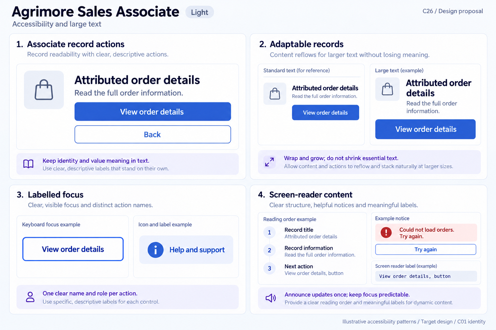
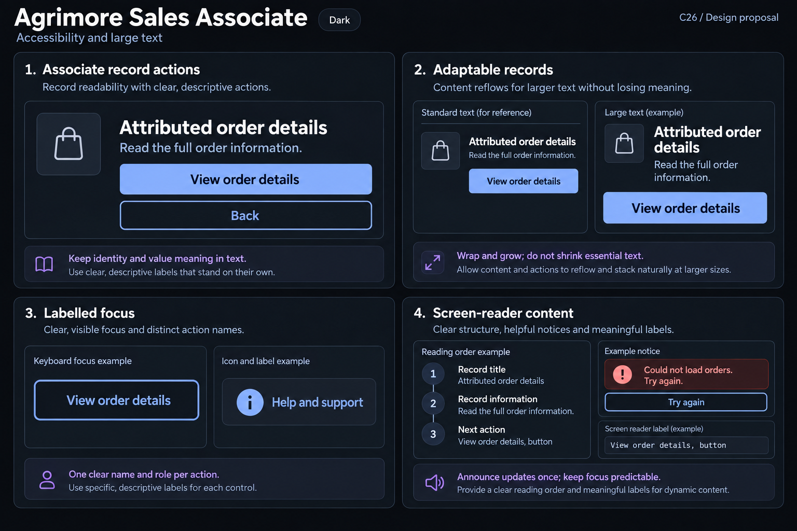

# Agrimore Sales Associate — C26 accessibility and large text

**PROVISIONAL_DIRECTION / TARGET_IMPLEMENTATION · v1 · 2026-10-03.** C01 is approved and locked; C26 owner approval is pending.

Premium royal-blue record actions, indigo reading/reflow notes and pearl/slate calm information hierarchy.

[Ten-board gallery](../../../../../docs/design-system/ACCESSIBILITY_LARGE_TEXT_BOARDS_2026-10-03.md) · [Codebase/domain map](../../../../../docs/design-system/ACCESSIBILITY_LARGE_TEXT_DOMAIN_MAP_2026-10-03.md) · [Exact prompts](prompts.md) · [Manifest](manifest.json).

## Current source

Profile/onboarding/dashboard contain some LayoutBuilder and textScale threshold adaptations; shell increases NavigationBar height from 64 to72 at scale(1)>1.2. SaLoadingButton min-height/semantic name exists but caps labels at two lines and wraps Semantics around Material button without excluding children, so combined tree needs duplicate-name review. SaInfoBanner adds container/label but not liveRegion. Monetary display uses FittedBox scaleDown in several screens. Catalogue textScale control is preview tooling, not a production appearance/accessibility setting. Existing linear text-scale tests inspect overflow in selected widgets.

## Target direction

Full attributed-record titles and value meaning should remain readable at system large text without shrink-to-fit; stacked identity/status/action layout, single labelled focus target and useful announcement semantics. Keep current app functions; do not invent production text-size slider or infer commission/payout status.

| Panel | Domain specimen |
| --- | --- |
| Record readability | Panel "Associate record actions": title "Attributed order details", neutral bag icon and readable helper "Read the full order information."; primary "View order details", secondary "Back". Indigo note "Keep identity and value meaning in text". No order number, amount, commission/payout/approval outcome or fake person. |
| Large-text record cards | Panel "Adaptable records": Standard text and Large text samples with same title "Attributed order details" and secondary "View order details". Large title wraps; supporting label and action move below with taller button. Indigo note "Wrap and grow; do not shrink essential text". No FittedBox visual tiny values or numeric text-scale pass claim. |
| Focus and names | Panel "Labelled focus": outlined "View order details" uses one strong royal-blue own border, "Keyboard focus example"; separate icon-plus-label "Help and support". Indigo note "One clear name and role per action". No duplicate external ring, photo/referral code or production font-size setting. |
| Reading and notices | Panel "Screen-reader content": ordered text "Record title", "Record information", "Next action", caption "Reading order example". Independent info/error notice "Could not load orders. Try again." and secondary "Try again", caption "Example notice". External label sample "View order details, button". Indigo note "Announce updates once; keep focus predictable". No AT pass, guaranteed benefit, pending/success financial state. |

Preservation and gaps:

- Fixed nav 64/72 threshold is partial adaptation, not unlimited text-scale support.
- FittedBox.scaleDown can negate increased text; enlarge/wrap/scroll with typed value meaning rather than hiding or clipping.
- Semantics wrapper plus child Material semantics may need merging/exclusion based on actual semantics tree, not source-count assumption.
- Tests exist but were not run; one Continue fixture and 150% banner cannot certify all screens/device AT behavior.

## Light

## Dark

