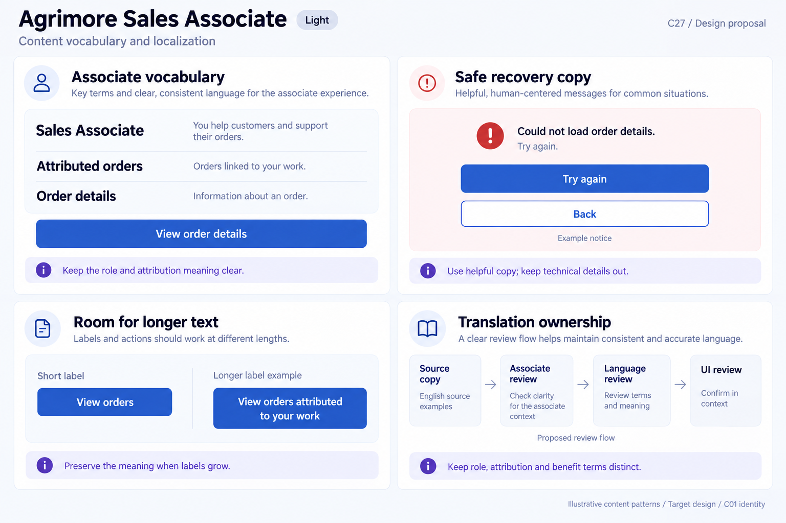
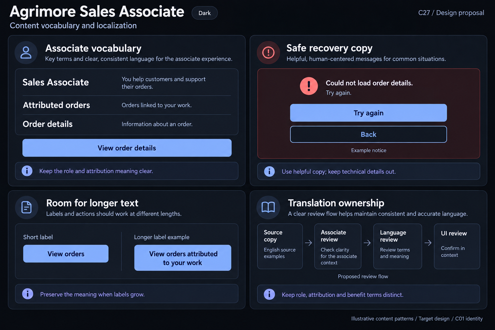

# Agrimore Sales Associate — C27 content vocabulary and localization

**PROVISIONAL_DIRECTION / TARGET_IMPLEMENTATION · v1 · 2026-10-04.** C01 is approved and locked; C27 owner approval is pending.

Premium royal-blue associate language, indigo terminology guidance and pearl/slate record surfaces.

[Ten-board gallery](../../../../../docs/design-system/CONTENT_VOCABULARY_LOCALIZATION_BOARDS_2026-10-04.md) · [Codebase/domain map](../../../../../docs/design-system/CONTENT_VOCABULARY_LOCALIZATION_DOMAIN_MAP_2026-10-04.md) · [Exact prompts](prompts.md) · [Manifest](manifest.json).

## Current source

Sales Associate root uses the correct role title but has no app localization delegates/catalog wired. Many labels and error strings remain inline English. NotificationsScreen renders interpolated exception text on mark-read failure. PayoutReviewScreen passes FirebaseFunctionsException.message or interpolates an arbitrary error into its visible error message. These are source-confirmed copy risks, not evidence of a production data incident. Auth gate currently matches pending/suspended substrings in provider error strings, so translating that routing value directly can change behavior.

## Target direction

Use Sales Associate in visible role copy while preserving employee identifiers internally. Distinguish attributed orders, earned commissions and any separate Product Credit program without inventing financial terms. Future locale messages must be separated from typed access/error state; redact technical failure details and preserve exact business meaning.

| Panel | Domain specimen |
| --- | --- |
| Associate role language | Panel "Associate vocabulary": role heading "Sales Associate"; rows "Attributed orders" / "Orders linked to your work", "Order details" / "Information about an order". Primary "View order details". Indigo note "Keep the role and attribution meaning clear". No actual attributed record, commission, program fee, money or eligibility claim. |
| Safe associate copy | Panel "Safe recovery copy": icon and "Could not load order details. Try again."; primary "Try again", secondary "Back"; caption "Example notice". Indigo note "Use helpful copy; keep technical details out". No raw exception, payout action or confirmed result. |
| Associate action expansion | Panel "Room for longer text": "Short label" / "Longer label example"; actions "View orders" and "View orders attributed to your work". Longer wraps and grows, full wording readable. Indigo note "Preserve the meaning when labels grow". Source-English specimen, not language release. |
| Associate translation review | Panel "Translation ownership": four stages "Source copy", "Associate review", "Language review", "UI review"; note "Keep role, attribution and benefit terms distinct"; caption "Proposed review flow", "English source examples". No reviewer identity, approved benefit, enrollment promise or technical identifier. |

Preservation and gaps:

- Do not translate identifiers or strings used as behavioral state; first separate typed state from localized presentation.
- Product Credit, where supported, must keep its product-redemption meaning; it is not a generic cash wallet label.
- Do not reword policy-sensitive onboarding/benefit/payment language as ordinary localization; actual domain/owner review is needed before future runtime changes.
- A safe read error and retry sample does not authorize resubmitting a payout or imply money moved.

## Light

## Dark

