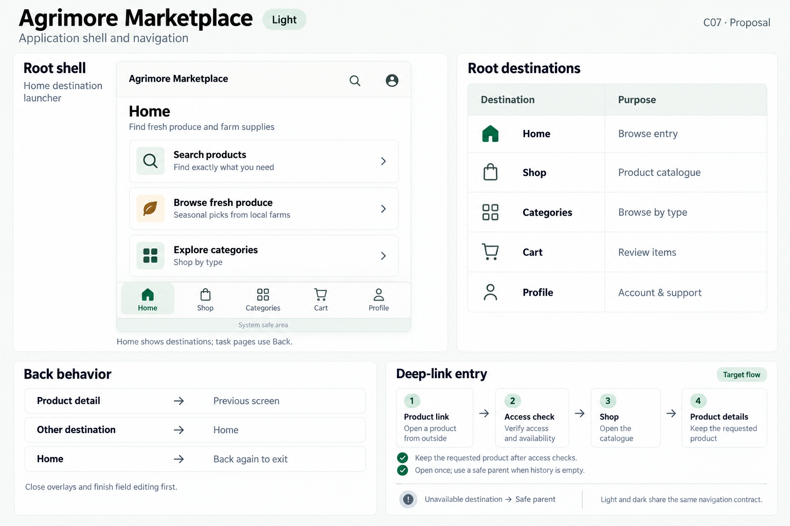
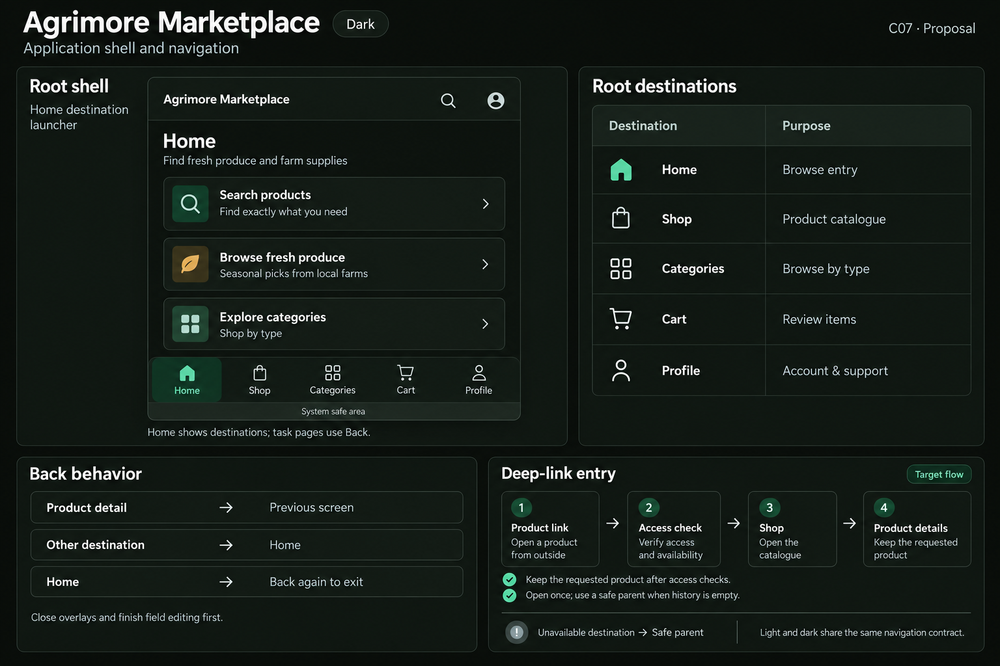

# Agrimore Marketplace — C07 application shell and navigation

**PROVISIONAL_DIRECTION / TARGET_IMPLEMENTATION · v1 · 2026-10-03.** C01 identity stays approved and locked. Static review references; runtime and asset registration are unchanged.

Identity: Professional green with warm gold and natural stone support.

| Theme | Board |
| --- | --- |
| Light | [Open light](agrimore-marketplace-application-shell-navigation-light.png) |
| Dark | [Open dark](agrimore-marketplace-application-shell-navigation-dark.png) |

[Exact prompts](prompts.md) · [Manifest](manifest.json) · [All five apps](../../../../../docs/design-system/APPLICATION_SHELL_NAVIGATION_BOARDS_2026-10-03.md) · [Codebase/domain mapping](../../../../../docs/design-system/APPLICATION_SHELL_NAVIGATION_DOMAIN_MAP_2026-10-03.md) · [C01 approval](../../../../../docs/design-system/COLOR_ROLES_THEME_IDENTITY_LOCK_2026-10-02.md).

Frame: **Home destination launcher**. Selected specimen: **Home**.

| Root destination | Purpose |
| --- | --- |
| Home | Browse entry |
| Shop | Product catalogue |
| Categories | Browse by type |
| Cart | Review items |
| Profile | Account & support |

## Current source

MainScreen lazily builds and retains Home, Shop, Categories, Cart and Profile in an IndexedStack. Its navigation bar appears only on Home and can hide on scroll. Other destinations use onBack callbacks to select Home. Android Home uses a two-second second-back exit policy. The current bar label Category is normalized to Categories in this proposal. Tab URLs are replaced via history.replaceState; app/app.dart installs the pop-state listener and replaces the named route on browser history changes.

routes.dart resolves /product/:id, /category/:id, /order/:id and other named routes; main.dart handles order/product notification taps. Dynamic product/order handlers are not themselves wrapped in AuthGuard. AuthGuard passes mobile children through and gates web children. DeepLinkService.initialize and navigateFromUrl call sites were not found. Platform filters and route parsing do not prove cold/warm app-link behavior or domain association verification.

## Target direction

Retain Home-only destination launch bar, give Categories the full label, remove decorative prominence that confuses root destinations with actions, keep focus/labels and safe inset treatment consistent. Product entry receives a deterministic Shop fallback when no prior stack exists. Retained tab state does not imply independent per-tab detail stacks.

Back behavior:

- Product detail → Previous screen
- Other destination → Home
- Home → Back again to exit

Target entry: Product link → Access check → Shop → Product details.

- Keep the requested product after access checks.
- Open once; use a safe parent when history is empty.

48px minimum interaction targets are proposed; labels and controls must grow for text. Safe areas are system measured. Flow cards explain the intended route relationship, not implemented external-URL support. Illustrations are not pixel-scale runtime screenshots.

## Light

## Dark

