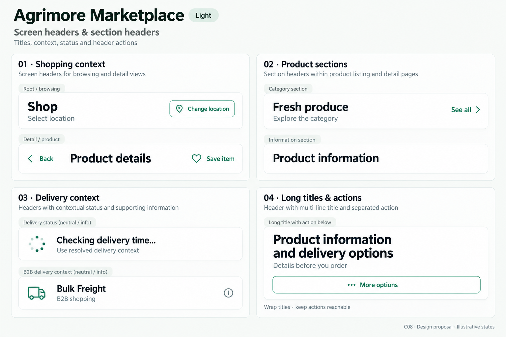
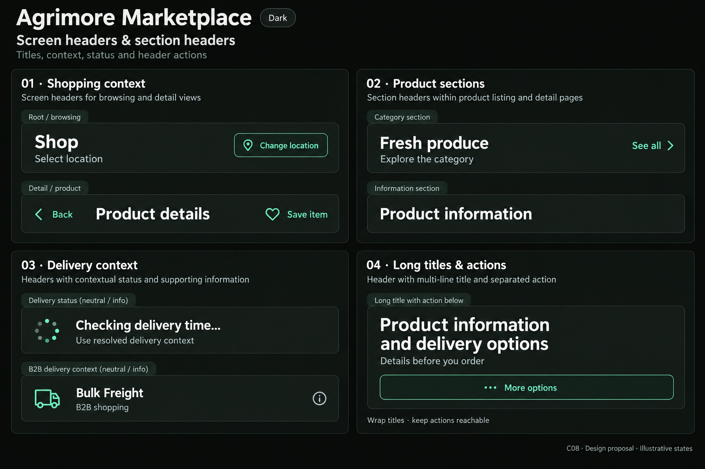

# Agrimore Marketplace — C08 screen headers and section headers

**PROVISIONAL_DIRECTION / TARGET_IMPLEMENTATION · v1 · 2026-10-03.** C01 identity remains approved and locked. These static boards illustrate a target, not migrated application widgets.

Identity: Professional green with warm gold and natural stone support.

| Theme | Board |
| --- | --- |
| Light | [Open light](agrimore-marketplace-screen-headers-section-headers-light.png) |
| Dark | [Open dark](agrimore-marketplace-screen-headers-section-headers-dark.png) |

[Exact prompts](prompts.md) · [Manifest](manifest.json) · [All five apps](../../../../../docs/design-system/SCREEN_HEADERS_SECTION_HEADERS_BOARDS_2026-10-03.md) · [Domain mapping](../../../../../docs/design-system/SCREEN_HEADERS_SECTION_HEADERS_DOMAIN_MAP_2026-10-03.md) · [C01 approval](../../../../../docs/design-system/COLOR_ROLES_THEME_IDENTITY_LOCK_2026-10-02.md).

## Current implementation

HomeAppBar resolves retail ETA from location settings and B2B to Bulk Freight; its delivery line and address are ellipsized. ShopAppBar has a fixed 138px preferred height. ProductSectionWidget uses a single-line section title and a GestureDetector See all action. Shared photo headers collapse title/subtitle to single lines.

## Target direction

A shopping context header separates page title, delivery location and live serviceability. Product/category sections remain visually quieter. Do not invent an ETA before location resolution or hide the current B2B mode.

| Panel | Specimen intent |
| --- | --- |
| 01 · Shopping context | Root specimen: title 'Shop'; subtitle 'Select location'; compact outlined action 'Change location'. Detail specimen below: Back icon, title 'Product details', secondary action heart labeled 'Save item'. No root Back. |
| 02 · Product sections | Section title 'Fresh produce'; subtitle 'Explore the category'; trailing green text action 'See all'. Second quiet section 'Product information' with no action. No invented quantity badges. |
| 03 · Delivery context | Two separate status specimens: neutral/info 'Checking delivery time...' with small progress glyph; neutral/info 'Bulk Freight' with truck glyph and caption 'B2B shopping'. Caption: 'Use resolved delivery context'. Do not display a fabricated minutes estimate or availability success. |
| 04 · Long titles & actions | Large-text specimen title split visibly across two lines 'Product information / and delivery options' (slash denotes newline, do not print slash); subtitle 'Details before you order'; outlined 'More options' moved onto a separate row below title. Footer note 'Wrap titles · keep actions reachable'. |

Source gaps and preservation rules:

- Retain current location/B2B resolution semantics while replacing literal typography and fixed heights.
- Use a real labeled button and generous hit region for See all; preserve category routing.
- Expanded and collapsed photo headers need one accessible page heading and scale-aware height.

Use one accessible page heading, 4px title/subtitle gap, quieter section headings, 24px section rhythm and scale-aware height. Proposed actions have minimum 48px hit regions; required task titles wrap and crowded actions move below. Delivery retains its existing 40px visual-circle decision, with larger invisible hit regions proposed. Actual text scaling, translations, accessibility and layout must be verified in later implementation. Synthetic status examples are not financial, duty or delivery confirmation.

## Light

## Dark

