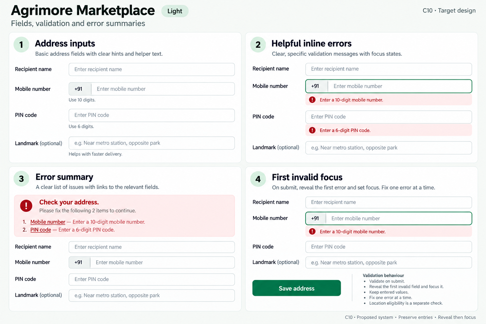
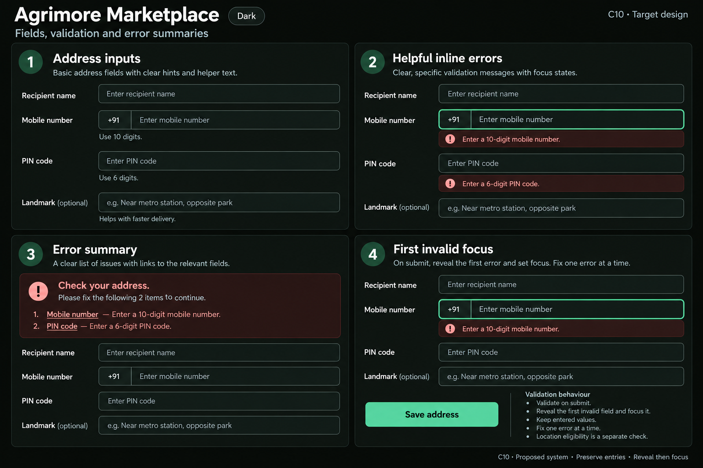

# Agrimore Marketplace — C10 fields, validation and error summaries

**PROVISIONAL_DIRECTION / TARGET_IMPLEMENTATION · v1 · 2026-10-03.** C01 remains approved and locked.

Welcoming address form, clear regional dependencies and generous helper text.

[All ten boards](../../../../../docs/design-system/FIELDS_VALIDATION_ERROR_SUMMARIES_BOARDS_2026-10-03.md) · [Domain map](../../../../../docs/design-system/FIELDS_VALIDATION_ERROR_SUMMARIES_DOMAIN_MAP_2026-10-03.md) · [Exact prompts](prompts.md) · [Manifest](manifest.json).

## Current source

Address saving runs Form.validate, then sequential snackbar checks for name, 10-digit phone, building/road and regional choices; pincode fields use short Required/6 digits errors. Signup has explicit next-field focus, but address submit has no observed first-invalid summary routing.

## Proposed direction

Persistent labels and helper patterns, inline address errors mirrored by a linked summary, and focus/scroll to the earliest invalid address control after failed Save.

| Panel | Intent |
| --- | --- |
| Address inputs | Fields: Recipient name, Mobile number, PIN code, Landmark (optional). Use empty input hints; helper Mobile number: Use 10 digits. PIN code: Use 6 digits. No personal data. |
| Helpful inline errors | Mobile number field empty, error Enter a 10-digit mobile number. PIN code field empty, error Enter a 6-digit PIN code. Show focus on Mobile number with visible outline. |
| Error summary | Title Check your address. Exactly two linked items: Mobile number — Enter a 10-digit mobile number; PIN code — Enter a 6-digit PIN code. Preserve other entries. |
| First invalid focus | Save address → Validate → Reveal Mobile number → Focus. Failed submit keeps values. Fix one error at a time. Location eligibility is a separate check. |

Preservation and gaps:

- Replace ambiguous Required and 6 digits with field-specific corrections.
- Preserve manual state/district/city mode and entered values; reveal the active control before focusing.
- Format validation does not prove address serviceability or a saved address.

## Light

## Dark

