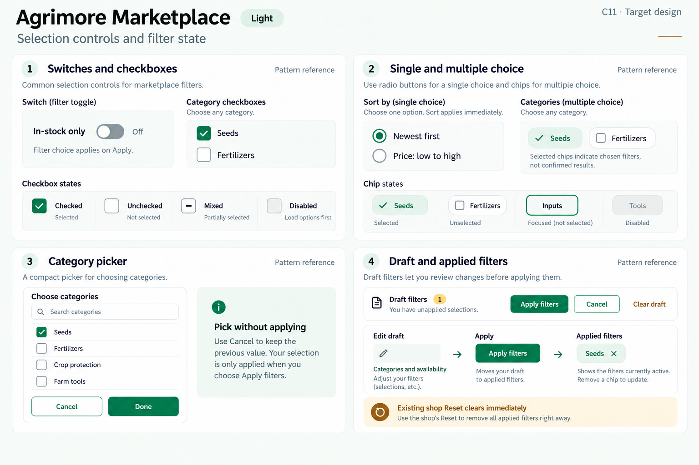
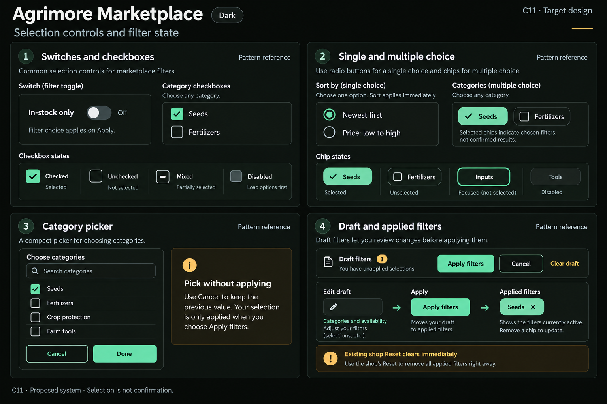

# Agrimore Marketplace — C11 selection controls and filter state

**PROVISIONAL_DIRECTION / TARGET_IMPLEMENTATION · v1 · 2026-10-03.** C01 remains approved and locked.

Professional-green shopping filters with warm-gold guidance, spacious category choices and removable applied chips.

[All ten boards](../../../../../docs/design-system/SELECTION_CONTROLS_FILTER_STATE_BOARDS_2026-10-03.md) · [Domain map](../../../../../docs/design-system/SELECTION_CONTROLS_FILTER_STATE_DOMAIN_MAP_2026-10-03.md) · [Exact prompts](prompts.md) · [Manifest](manifest.json).

## Current source

SearchFilters clones current filter state, stages multi-category/price/rating edits and applies on confirmation; Clear All there resets the draft. Shop FilterDrawer instead applies Reset immediately and closes. SortBottomSheet immediately chooses one option and closes. Category controls are custom gesture containers; hardcoded white search-filter surfaces remain.

## Proposed direction

Keep category multi-select separate from single-choice sort; use explicit selected indicators, accessible control roles, staged Apply/Cancel and clearly named immediate Reset where retained. Applied filter chips mirror committed query state.

| Panel | Intent |
| --- | --- |
| Switches and checkboxes | In-stock only switch OFF with visible Off text, helper Filter choice applies on Apply. Category checkbox examples Seeds checked and Fertilizers unchecked, label Choose any; category labels illustrative, not live inventory. Small state strip Checked / Unchecked / Mixed / Disabled (Load options first). Mixed has a dash, not a check. |
| Single and multiple choice | Sort radio group: Newest first selected, Price: low to high unselected. Separate multi-select chips Seeds selected with check and Fertilizers unselected. Only one sort, any categories. Selected is a choice, not success. |
| Category picker | Standalone compact picker surface titled Choose categories, search field Search categories, checkbox rows Seeds checked, Fertilizers unchecked; Done action. No sidebar. No prices, fake category counts or real records. |
| Draft and applied filters | Draft filters badge; Apply filters primary, Cancel secondary, Clear draft text action. Diagram Edit draft → Apply → Applied chips. Applied chip Seeds ×; removing it changes applied state. Small annotation Existing shop Reset clears immediately; label this clearly. No result count. |

Preservation and gaps:

- Search and shop reset semantics differ; standardize deliberately or label them clearly, not silently.
- The two flows use different price filter keys/shapes (minPrice/maxPrice versus priceRange); a canonical filter model is a future implementation decision.
- Do not invent query result counts or treat rating/sort choice as a success status.

## Light

## Dark

