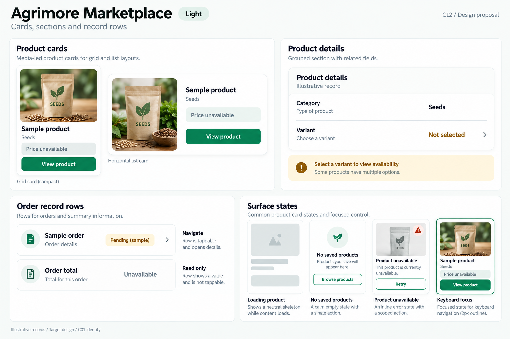
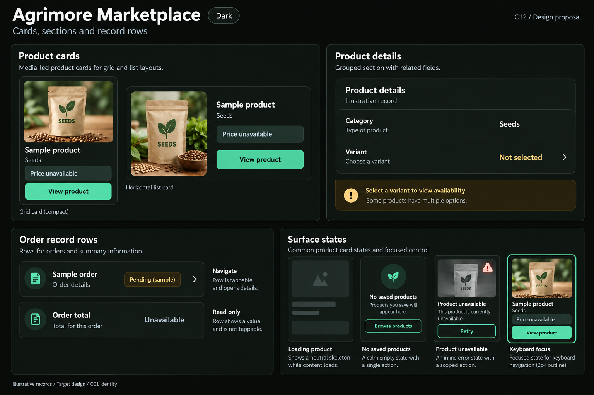

# Agrimore Marketplace — C12 cards, sections and record rows

**PROVISIONAL_DIRECTION / TARGET_IMPLEMENTATION · v1 · 2026-10-03.** C01 is approved and locked; C12 owner approval is pending.

Media-led shopping surfaces, generous product hierarchy and calm stone sections with green actions and restrained gold guidance.

[Ten-board gallery](../../../../../docs/design-system/CARDS_SECTIONS_RECORD_ROWS_BOARDS_2026-10-03.md) · [Codebase/domain map](../../../../../docs/design-system/CARDS_SECTIONS_RECORD_ROWS_DOMAIN_MAP_2026-10-03.md) · [Exact prompts](prompts.md) · [Manifest](manifest.json).

## Current source

UnifiedProductCard defines six layouts, while compact, search, shop and order-specific cards still coexist. Its grid uses a 12px radius, 0.5px border and multiple overlapping badges; this is a current implementation snapshot, not evidence that consolidation is complete.

## Target direction

One product anatomy with grid/list/compact variants, controlled media ratio, explicit variant/availability and price provenance. Order summaries and wallet/product-credit rows remain different record types.

| Panel | Domain specimen |
| --- | --- |
| Product cards | Two beautiful media-led specimens, a compact grid card and horizontal list card. Neutral seed-pack illustration, no brand claims. Exact content: Sample product; Seeds; Price unavailable; View product. A price slot is clearly unavailable, never zero. No ratings, verified badges or sale percentages. |
| Grouped sections | Heading Product details, caption Illustrative record, single grouped surface with rows Category / Seeds and Variant / Not selected. Plain divider, no separate card for each label. Gold is a small guidance accent. |
| Order record rows | One tappable row Sample order, neutral chip Pending (sample), helper Order details, right chevron. Separate static row Order total / Unavailable with no chevron. Annotate Navigate versus Read only. |
| Surface states | Three compact specimens Loading product with neutral skeleton; No saved products with quiet empty-state outline; Product unavailable with Retry scoped to this card. Small focused outline example labelled Keyboard focus. Footer Wrap long titles; keep price readable. |

Preservation and gaps:

- Consolidate anatomy deliberately without removing variant, B2B, stock or independent wishlist behavior.
- C01 target card radius is 16px; existing 12px layouts are a future migration, not changed here.
- Missing price, image or stock must remain explicit; badges require verified source data.

## Light

## Dark

