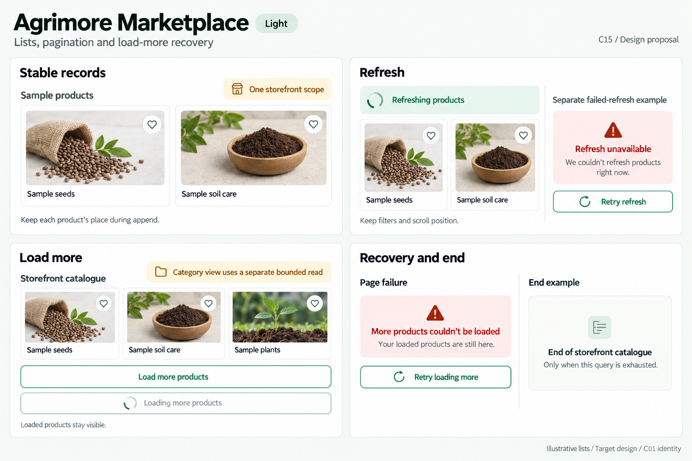
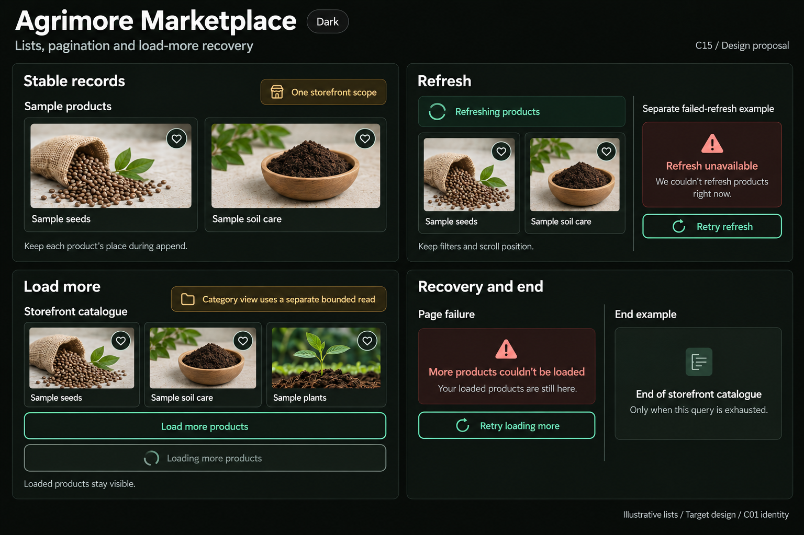

# Agrimore Marketplace — C15 lists, pagination and load-more recovery

**PROVISIONAL_DIRECTION / TARGET_IMPLEMENTATION · v1 · 2026-10-03.** C01 is approved and locked; C15 owner approval is pending.

Professional-green storefront product grids, natural-stone tile surfaces and warm-gold scope hints; continuation belongs to one seller’s visible catalogue.

[Ten-board gallery](../../../../../docs/design-system/LISTS_PAGINATION_LOAD_MORE_RECOVERY_BOARDS_2026-10-03.md) · [Codebase/domain map](../../../../../docs/design-system/LISTS_PAGINATION_LOAD_MORE_RECOVERY_DOMAIN_MAP_2026-10-03.md) · [Exact prompts](prompts.md) · [Manifest](manifest.json).

## Current source

BusinessProfileScreen fetches seller-scoped products with a document cursor and busy guard. Visible products are filtered after the raw page is read; hasMore follows raw page length. Initial reload replaces the visible screen with a loading body. Load-more failure keeps products/cursor and shows safe snackbar copy. Selected categories use a separate bounded server fetch cached by category, and the main continuation footer is hidden in category mode. ProductGrid nests a non-scrolling shrink-wrapped grid in the outer list and creates cards without explicit per-product keys.

## Target direction

Keep existing storefront cursor continuation, but show stable product identity, retained-content refresh and persistent inline next-page recovery. Main seller catalogue and bounded category fetches remain distinct scopes; never claim a full category has been traversed when it has not.

| Panel | Domain specimen |
| --- | --- |
| Stable records | A small storefront product grid explicitly labelled "Sample products". Two simple neutral thumbnails; titles "Sample seeds" and "Sample soil care". No price, stock, ratings or quantity. Helper "Keep each product’s place during append". Small warm-gold annotation "One storefront scope". |
| Refresh | Retained sample product tiles visible beneath a small refresh strip "Refreshing products". Compact spinner, no percentage. Helper "Keep filters and scroll position". Separate quiet last-known note "Refresh unavailable" and action "Retry refresh", labelled "Separate failed-refresh example". Never replace available products with blank skeletons. |
| Load more | A list-tail example labelled "Storefront catalogue". Secondary OUTLINED green action "Load more products". Separate pending variant with spinner and "Loading more products" inside a disabled outlined control. Helper "Loaded products stay visible". Gold caption "Category view uses a separate bounded read". No fake page numbers or global totals. |
| Recovery and end | Two clearly separate small examples. Page failure: "More products couldn’t be loaded", helper "Your loaded products are still here", OUTLINED action "Retry loading more". End example: "End of storefront catalogue", small caption "Only when this query is exhausted". Never use end-of-category or all-products global completion claim. |

Preservation and gaps:

- No explicit business sort/orderBy is present in the storefront product query; agree a stable business ordering before changing it, and keep cursor/order/filter consistent.
- Load-more append currently adds records without ID deduplication or a request-generation guard; refresh/category/account changes must invalidate stale responses.
- An empty visible page can still have raw pages to traverse. Do not show an end marker based on visible item count alone.
- Category fetch is capped and has no own continuation footer. A category fetch error is logged only; future UI must distinguish failed, bounded no-match and complete results.
- Retaining content during refresh and inline page retry are target enhancements; current refresh/loading hides the list and page failure is transient snackbar feedback.

## Light

## Dark

