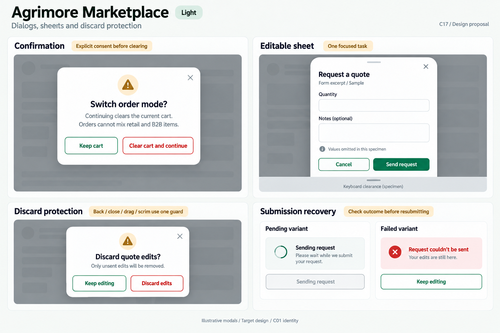
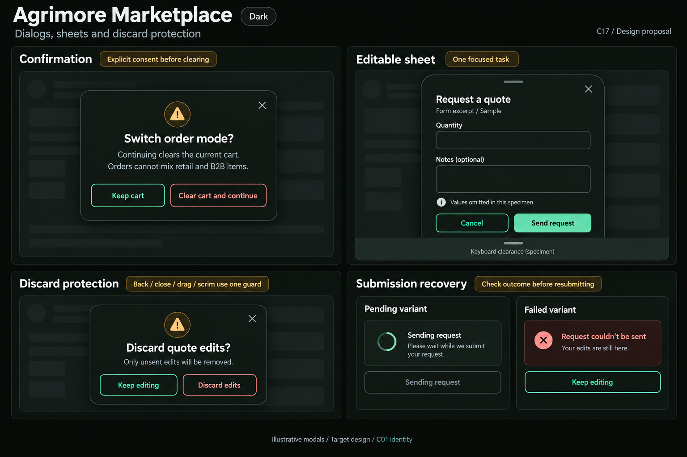

# Agrimore Marketplace — C17 dialogs, sheets and discard protection

**PROVISIONAL_DIRECTION / TARGET_IMPLEMENTATION · v1 · 2026-10-03.** C01 is approved and locked; C17 owner approval is pending.

Professional-green buyer dialogs, warm-gold consequences, natural-stone scrims and rounded quote-request sheets.

[Ten-board gallery](../../../../../docs/design-system/DIALOGS_SHEETS_DISCARD_PROTECTION_BOARDS_2026-10-03.md) · [Codebase/domain map](../../../../../docs/design-system/DIALOGS_SHEETS_DISCARD_PROTECTION_DOMAIN_MAP_2026-10-03.md) · [Exact prompts](prompts.md) · [Manifest](manifest.json).

## Current source

confirmCartModeSwitch shows a clear-cart consequence and only clears after confirmed==true. RequestQuoteSheet owns quantity/price/notes controllers, keyboard inset padding and a disabled submitting button; it closes after createRfq returns but has no explicit dirty/PopScope guard in the inspected file. Success messaging uses the popped sheet context. Its failure path uses provider error, which can contain callable e.message.

## Target direction

Preserve explicit mode-switch consent. Add consistent close/back/drag/scrim protection to an edited quote sheet, retain edits on safe failure and own outcome messaging on the destination. Sheet dismiss is never consent to clear a cart or send a quote.

| Panel | Domain specimen |
| --- | --- |
| Confirmation | Small centered dialog on a softly dimmed neutral specimen backdrop. Title "Switch order mode?". Body "Continuing clears the current cart. Orders cannot mix retail and B2B items." Two labelled OUTLINED actions "Keep cart" in app-primary and "Clear cart and continue" in semantic danger. Gold board note "Explicit consent before clearing". No cart contents, totals, or order-confirmed claims. |
| Editable sheet | Bottom-anchored rounded sheet titled "Request a quote", small caption "Form excerpt / Sample" and labelled close X. Fields "Quantity" and "Notes (optional)" with values deliberately omitted, small annotation "Values omitted in this specimen". OUTLINED "Cancel" and green PRIMARY "Send request". Clear scrolling body and footer separated from a simple labelled keyboard-clearance strip, not a detailed keyboard. Gold note "One focused task". |
| Discard protection | Dialog title "Discard quote edits?", body "Only unsent edits will be removed." Actions OUTLINED "Keep editing" in app-primary and "Discard edits" in semantic danger. Board annotation "Back / close / drag / scrim use one guard". No save-draft button or claim that a draft is already persisted. |
| Submission recovery | Two independent examples explicitly labelled "Pending variant" and "Failed variant". Pending disabled outlined control with spinner and "Sending request". Failed inline message "Request couldn’t be sent" and helper "Your edits are still here." Gold board note "Check outcome before resubmitting". No live success, percentages or blind Retry button. Any failed-variant action is secondary "Keep editing", returning to retained editor input, never server retry or discard. |

Preservation and gaps:

- A dirty form needs one serialized confirmation across every exit path; current RFQ file does not implement it.
- Idle Cancel closes the edit; Discard removes unsent local edits only, never a submitted RFQ or checkout recovery journal.
- Submitting disables duplicate sends and edited payload changes; unknown result requires outcome reconciliation before retry.
- Keep safe field errors and keyboard clearance; no raw callable messages or torn-down context toast.

## Light

## Dark

