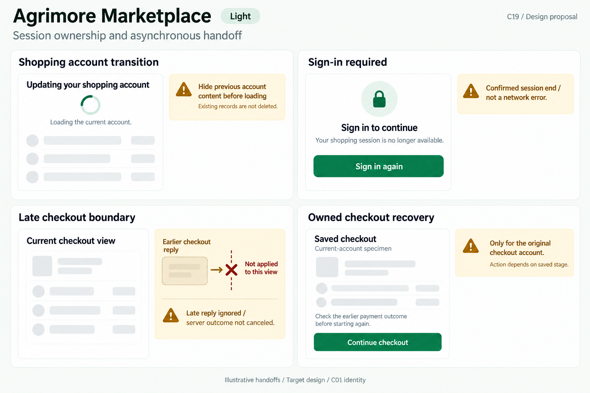
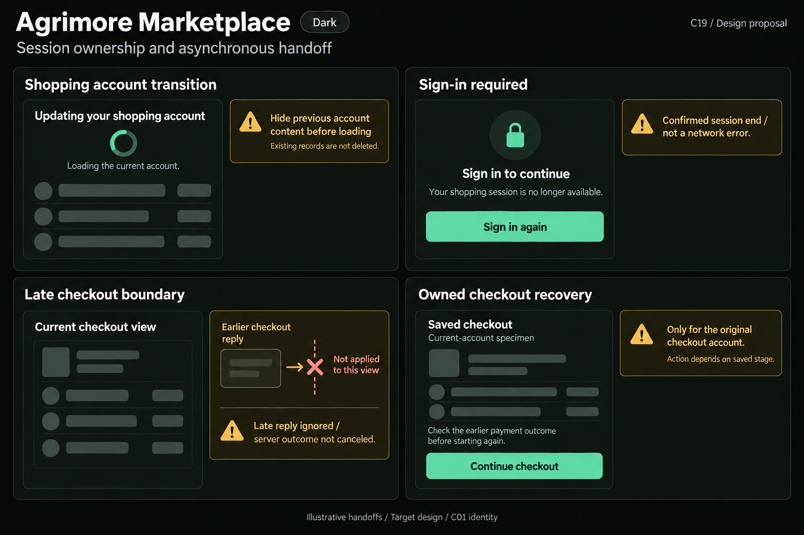

# Agrimore Marketplace — C19 session ownership and asynchronous handoff

**PROVISIONAL_DIRECTION / TARGET_IMPLEMENTATION · v1 · 2026-10-03.** C01 is approved and locked; C19 owner approval is pending.

Professional-green shopper transitions, warm-gold outcome guidance, natural-stone cards and generous checkout-recovery spacing.

[Ten-board gallery](../../../../../docs/design-system/SESSION_OWNERSHIP_ASYNCHRONOUS_HANDOFF_BOARDS_2026-10-03.md) · [Codebase/domain map](../../../../../docs/design-system/SESSION_OWNERSHIP_ASYNCHRONOUS_HANDOFF_DOMAIN_MAP_2026-10-03.md) · [Exact prompts](prompts.md) · [Manifest](manifest.json).

## Current source

AuthProvider exposes owned projection, sessionOwner/sessionVersion/isSessionCurrent and renews epochs on auth events. MobileCheckoutFlow exposes pending only for the current UID, serializes work and checks live UID/disposal around awaits; CheckoutRecoveryService locks/checks the original owner. finishMobileCheckout rechecks mounted/current UID after receipt read, cart change and acknowledgement before navigation, validates receipt/order ownership and preserves a changed cart. These checkout checks are UID-based rather than a universal auth-epoch guard. RfqProvider now tracks owner/session/list generations, clears scoped state and rejects late commands; ProductCreditProvider hides stale balance/ledger and uses load ownership. Shared restoreSession can return a fallback user model on read/reload failure; failure alone is not evidence of session expiry.

## Target direction

Show a clean shopper-account transition, confirmed sign-in-required boundary, no old checkout reply in a new account, and owned saved-checkout recovery only after account/access checks. Preserve checkout journals and reconcile server outcome before another purchase; no automatic payment replay or cart clearing from a stale response.

| Panel | Domain specimen |
| --- | --- |
| Shopping account transition | Card "Updating your shopping account", indeterminate spinner, body "Loading the current account." Empty skeleton rows, no cart/order/balance values. Gold BOARD annotation "Hide previous account content before loading" and "Existing records are not deleted". No success tick or account-switch button. |
| Sign-in required | Card "Sign in to continue", lock icon, body "Your shopping session is no longer available." green PRIMARY "Sign in again". Gold BOARD note "Confirmed session end / not a network error". No timer, password/code fields, bank data or promise the checkout is paid/canceled. |
| Late checkout boundary | Neutral card "Current checkout view" with EMPTY record skeleton, NO order/paid/success badge. Separate gold board diagram: "Earlier checkout reply" arrow to a small crossed boundary "Not applied to this view". Board note "Late reply ignored / server outcome not canceled". No foreign account or receipt values; do not put an old-customer toast into current account. |
| Owned checkout recovery | Card "Saved checkout", caption "Current-account specimen", body "Check the earlier payment outcome before starting again." green PRIMARY "Continue checkout". Gold board note "Only for the original checkout account" and "Action depends on saved stage". No charge-again, new payment, cancellation, refund, confirmed order or successful-payment indicator. |

Preservation and gaps:

- Extend route/action episode checks where UID-only ownership cannot distinguish a later same-account session; do not claim all checkout paths already use auth epochs.
- A stale UI response does not cancel or roll back an earlier server order/payment; keep recovery journal ownership and original request identity.
- Never reveal old cart, order, quote, credit or customer details while a new account is loading.
- Use known auth absence/expiry for Sign in again; network/profile read failure stays a read-recovery state.
- Saved-checkout controls depend on actual journal stage; no generic Continue that recharges, no invented payment-complete badge.

## Light

## Dark

