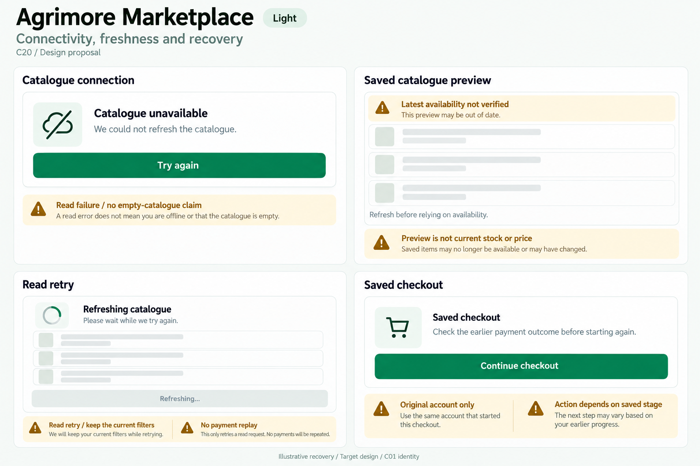
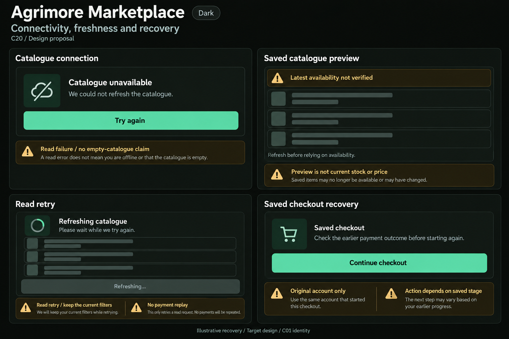

# Agrimore Marketplace — C20 connectivity, freshness and recovery

**PROVISIONAL_DIRECTION / TARGET_IMPLEMENTATION · v1 · 2026-10-03.** C01 is approved and locked; C20 owner approval is pending.

Professional-green shopping recovery, warm-gold freshness notes, natural-stone catalogue surfaces and generous checkout spacing.

[Ten-board gallery](../../../../../docs/design-system/CONNECTIVITY_FRESHNESS_RECOVERY_BOARDS_2026-10-03.md) · [Codebase/domain map](../../../../../docs/design-system/CONNECTIVITY_FRESHNESS_RECOVERY_DOMAIN_MAP_2026-10-03.md) · [Exact prompts](prompts.md) · [Manifest](manifest.json).

## Current source

ProductProvider loads a SharedPreferences catalogue preview, including an expired blob, before another database fetch; preserves preview on fetch error and supports forceRefresh. It stores local cache-write time, not a proven server verification time, and DatabaseService model-returning reads do not expose snapshot metadata here. OrderProvider supplies loading/errors and streams without cache metadata presentation. MobileCheckoutFlow serializes current-UID/disposal guarded recovery; saved checkout stages distinguish unpaid draft (review cart), awaiting_payment (existing payment order outcome/reopen eligibility), ready and completed. The journal is owner-scoped; no general offline payment queue is evidenced.

## Target direction

Separate catalogue read unavailability, a labelled saved preview that does not certify price/stock, read-only refresh and original-account saved checkout. Preserve draft review and actual stage-dependent recovery; never start another payment merely because a reply was lost.

| Panel | Domain specimen |
| --- | --- |
| Catalogue connection | Card "Catalogue unavailable", connection-slash icon, body "We could not refresh the catalogue." PRIMARY "Try again". Gold BOARD note "Read failure / no empty-catalogue claim". No definitive Offline badge from an unclassified error. |
| Saved catalogue preview | Card "Saved catalogue preview", compact gold warning "Latest availability not verified". EMPTY neutral product-row skeletons. Body "Refresh before relying on availability." Gold BOARD note "Preview is not current stock or price". No product/photo/value/time/count badge. |
| Read retry | Card "Refreshing catalogue", indeterminate spinner, EMPTY skeleton rows, muted DISABLED "Refreshing…" control. BOARD note "Read retry / keep the current filters" and "No payment replay". No percentage, completed tick or timed progress. |
| Saved checkout recovery | Card "Saved checkout", body "Check the earlier payment outcome before starting again." PRIMARY "Continue checkout". Gold BOARD annotations "Original account only" and "Action depends on saved stage". No Pay again, guaranteed paid/confirmed/cancelled status or claim offline checkout works. |

Preservation and gaps:

- A persisted catalogue timestamp is local cache-write time, not server last-synced proof; no fabricated age or Latest badge.
- Expired cached catalogue may still be previewed; keep stale label and revalidate availability/pricing through canonical checkout.
- Inspect cache location/query/ownership scope before treating a stored catalogue as appropriate for current context; no generic account-sensitive cache guarantee.
- Read retry cannot repeat payment/order mutation. Saved checkout can reopen its existing eligible gateway order; do not claim recovery is entirely read-only or automatic.
- No global connectivity detector was found in the scoped lib search; a timeout does not prove the device has no internet.

## Light

## Dark

