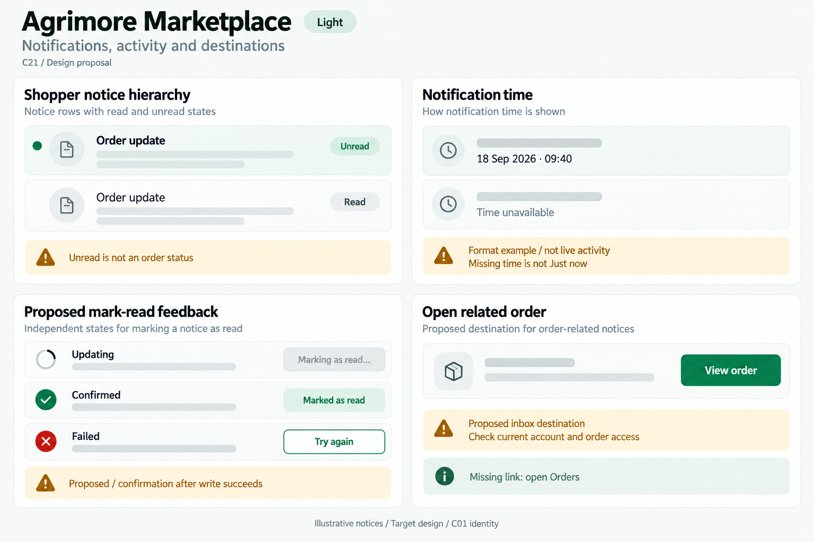
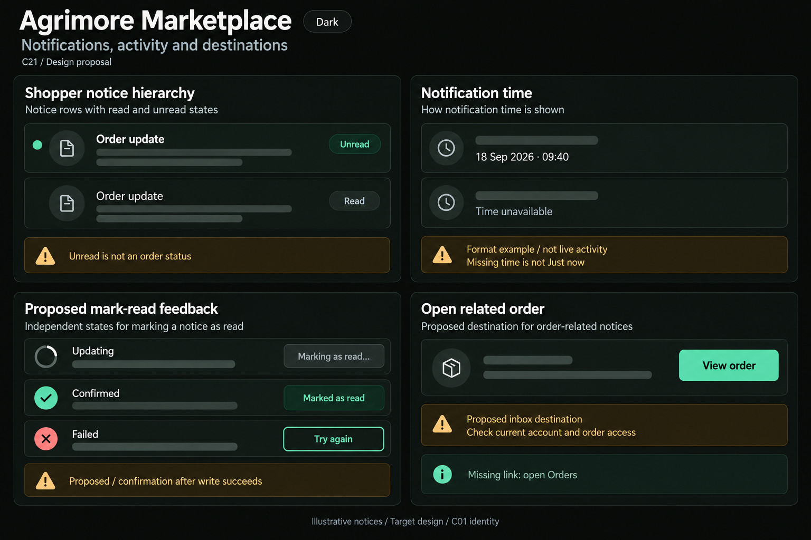

# Agrimore Marketplace — C21 notifications, activity and destinations

**PROVISIONAL_DIRECTION / TARGET_IMPLEMENTATION · v1 · 2026-10-03.** C01 is approved and locked; C21 owner approval is pending.

Professional-green shopper notice rows, warm-gold timestamp/destination guidance, natural-stone surfaces and generous calm notification spacing.

[Ten-board gallery](../../../../../docs/design-system/NOTIFICATIONS_ACTIVITY_DESTINATIONS_BOARDS_2026-10-03.md) · [Codebase/domain map](../../../../../docs/design-system/NOTIFICATIONS_ACTIVITY_DESTINATIONS_DOMAIN_MAP_2026-10-03.md) · [Exact prompts](prompts.md) · [Manifest](manifest.json).

## Current source

Inbox does a one-shot users/uid/notifications get ordered by createdAt; unread requires unread==true, time renders only a Timestamp. Rows have no mark-read or destination handler. Fetch error only clears loading, which can show the empty/caught-up state; inspected fetch setState lacks mounted/session-generation guards. Separate FCM tap code routes typed order/product/offer and safe missing-ID lists/main; shared local tap handling uses actionUrl. These push handlers are not the inbox row implementation.

## Target direction

Add explicit readable unread/read row variants, provenance-aware time, owner-scoped mark-read feedback and safe inbox destination handling. Proposed row navigation can use existing order routes after current access/entity checks; a notification is not an authoritative order/payment result.

| Panel | Domain specimen |
| --- | --- |
| Shopper notice hierarchy | Two synthetic notice rows titled "Order update", EMPTY muted body skeletons: first bold with green dot and explicit "Unread" label, second normal weight with "Read" label and no dot. No outcome, ID, count, money or record status. Gold BOARD note "Unread is not an order status". No navigation sidebar. |
| Notice time provenance | Card "Notification time", clock icon, exact fixed FORMAT EXAMPLE "18 Sep 2026 · 09:40"; second smaller row "Time unavailable". Gold BOARD notes "Format example / not live activity" and "Missing time is not Just now". No age/countdown/Today tag. |
| Proposed mark-read feedback | Three separate SMALL feedback specimens labelled "Updating", "Confirmed", "Failed": Updating has indeterminate spinner and DISABLED neutral "Marking as read…"; Confirmed has readable inline "Marked as read"; Failed has "Could not update read status" and SECONDARY "Try again". Gold BOARD annotation "Proposed / confirmation after write succeeds". Read status alone is confirmed, no order/payment success. |
| Order destination handling | Card "Open related order", outline order icon, EMPTY record context skeleton, PRIMARY "View order". Gold BOARD notes "Proposed inbox destination" and "Check current account and order access". Smaller muted line "Missing link: open Orders". No raw URL, order ID, completed order or claim payload grants access. |

Preservation and gaps:

- Keep error separate from caught up; unknown count is not zero. One-shot local list count is not a live global unread total.
- Inbox mark-read and row destinations are target implementation, not existing features. Do not confuse working push tap code with working inbox rows.
- Normalize writer/read conventions deliberately; Firestore owner updates permit unread/read/readAt, not arbitrary isRead mutations.
- Keep safe missing-order/product ID fallbacks and add typed routing/deduplication across foreground, background, cold start and inbox; no indefinite delayed navigation across auth changes.
- Proposed date format improves existing raw numeric date/time; no missing timestamp becomes Just now/Today.

## Light

## Dark

