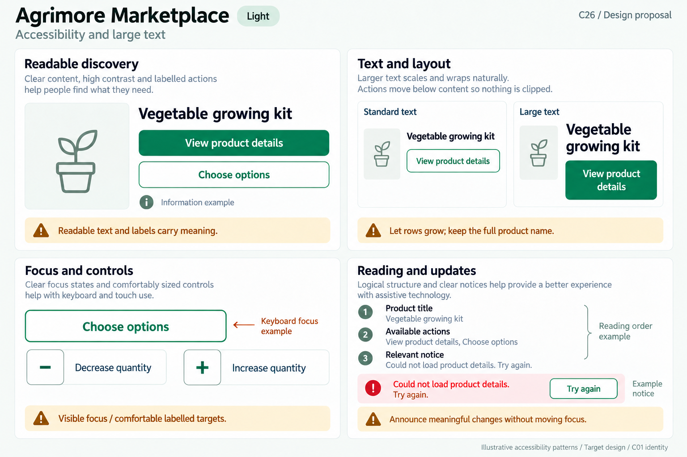
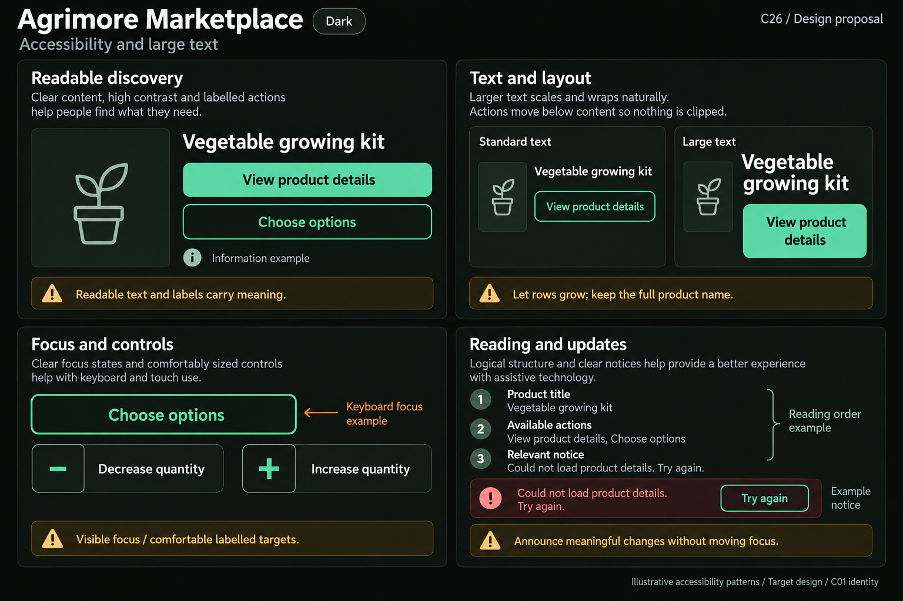

# Agrimore Marketplace — C26 accessibility and large text

**PROVISIONAL_DIRECTION / TARGET_IMPLEMENTATION · v1 · 2026-10-03.** C01 is approved and locked; C26 owner approval is pending.

Professional-green discovery and labelled controls, warm-gold accessibility notes, natural-stone readable surfaces.

[Ten-board gallery](../../../../../docs/design-system/ACCESSIBILITY_LARGE_TEXT_BOARDS_2026-10-03.md) · [Codebase/domain map](../../../../../docs/design-system/ACCESSIBILITY_LARGE_TEXT_DOMAIN_MAP_2026-10-03.md) · [Exact prompts](prompts.md) · [Manifest](manifest.json).

## Current source

Catalogue product titles commonly maxLines/ellipsis with fixed grids/actions; quantity selector contains small 28px busy indicator (not itself proof of target size). Direct semantic labels on the examined product/quantity widgets are sparse; Material controls still provide default semantics, so absence of explicit Semantics does not prove every control inaccessible. Shared CustomButton hardcodes white text/spinner for all variants, including outlined/text, and does not explicitly adapt content. Profile/save owner guards are outside accessibility presentation.

## Target direction

Prioritize full product names/details, scalable quantity/action labels, useful names for add/remove/wishlist controls and keyboard operation for web discovery. Use actual theme contrast pairs and visible own-border focus; replace constrained layouts rather than shrink text.

| Panel | Domain specimen |
| --- | --- |
| Readable discovery contrast | Panel "Readable discovery": title "Vegetable growing kit" above neutral product-outline icon. Primary filled "View product details"; secondary outlined "Choose options". Beneath small text-plus-info-icon "Information example". Gold note "Readable text and labels carry meaning". No price, availability, added-to-cart outcome or real product image. |
| Scalable product layout | Panel "Text and layout": two comparable specimens labelled "Standard text" and "Large text". EXACT SAME title "Vegetable growing kit" and secondary "View product details". Large title visibly bigger, wraps into two lines, action moves BELOW title and grows vertically with wrapped label as needed; no clipping/ellipsis/shrinking. Gold note "Let rows grow; keep the full product name". |
| Keyboard and touch | Panel "Focus and controls": outlined action "Choose options" has ONE strong own border labelled "Keyboard focus example"; below labelled minus and plus actions "Decrease quantity" / "Increase quantity", each comfortably sized, no numeric quantity. Gold note "Visible focus / comfortable labelled targets". No outer ring, glow, duplicate border, fake cursor or stock limit. |
| Screen-reader presentation | Panel "Reading and updates": three ordered text rows "Product title", "Available actions", "Relevant notice" with small sequential guide markers, external caption "Reading order example". Separate info notice "Could not load product details. Try again." with outlined "Try again", labelled "Example notice". Gold note "Announce meaningful changes without moving focus". No device speech bubble/audio icon as proof, live shopping state or compliance badge. |

Preservation and gaps:

- Ellipsis is a risk to essential product/variant/action text; keep a supported full-text path without relying solely on hover.
- Small spinner/icon dimensions do not establish actual hit target; measure rendered tap bounds.
- CustomButton outlined/text white labels need later theme-aware correction; C26 uses locked primary/onPrimary and readable secondary roles.
- Screen-reader order, quantity changes and cart notices need runtime semantics/device checks; no real cart result asserted.

## Light

## Dark

