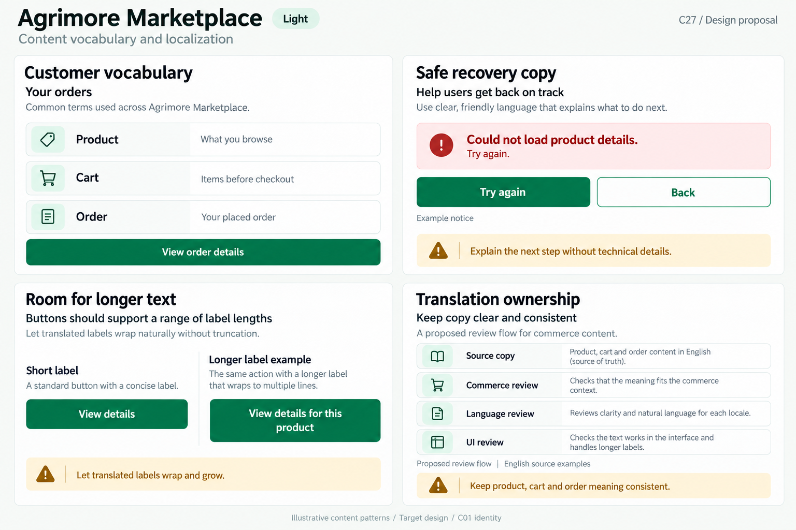
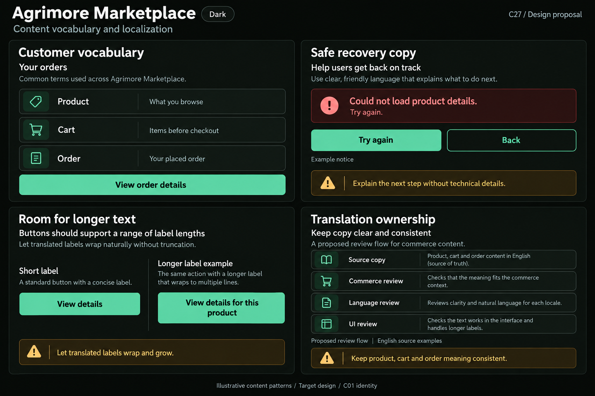

# Agrimore Marketplace — C27 content vocabulary and localization

**PROVISIONAL_DIRECTION / TARGET_IMPLEMENTATION · v1 · 2026-10-04.** C01 is approved and locked; C27 owner approval is pending.

Professional-green customer vocabulary, warm-gold content guidance and natural-stone discovery surfaces.

[Ten-board gallery](../../../../../docs/design-system/CONTENT_VOCABULARY_LOCALIZATION_BOARDS_2026-10-04.md) · [Codebase/domain map](../../../../../docs/design-system/CONTENT_VOCABULARY_LOCALIZATION_DOMAIN_MAP_2026-10-04.md) · [Exact prompts](prompts.md) · [Manifest](manifest.json).

## Current source

Marketplace MaterialApp has no app localization delegates or supportedLocales wired. LanguageScreen starts with a local English selection, lists English/Tamil, changes only its local state and Apply Language pops the route. SettingsProvider separately persists a language string; this screen does not call it, and the root does not bind it to Locale. Existing product/order/settings copy is largely inline English. Shared ErrorView has a fixed English heading and retry label; its supplied message is not sanitized by the widget.

## Target direction

Keep shopper-facing product, cart and order terms consistent; name the next action precisely. Extract complete sentences with context into a reviewed app catalog in later implementation, then connect supported locale selection to the root. A visible language choice must describe only genuinely available translations.

| Panel | Domain specimen |
| --- | --- |
| Customer vocabulary | Panel "Customer vocabulary": heading "Your orders"; neutral glossary rows "Product" / "What you browse", "Cart" / "Items before checkout", "Order" / "Your placed order". Primary "View order details". These are glossary definitions, not live cart/order outcomes. |
| Safe recovery copy | Panel "Safe recovery copy": example error notice with icon and "Could not load product details. Try again."; primary "Try again", secondary "Back". Gold note "Explain the next step without technical details"; caption "Example notice". No exception/code/path/permission message. |
| Longer label layout | Panel "Room for longer text": side-by-side labelled "Short label" and "Longer label example"; buttons "View details" and "View details for this product". Longer button wraps and grows vertically; full labels preserved, same primary roles. Gold note "Let translated labels wrap and grow". English length illustration, not a released translation. |
| Commerce translation review | Panel "Translation ownership": proposed review flow with readable four stacked rows "Source copy", "Commerce review", "Language review", "UI review". Small note "Keep product, cart and order meaning consistent"; clear caption "Proposed review flow" and "English source examples". No real person/approval/checkmark or new settings UI. |

Preservation and gaps:

- English/Tamil options do not prove Tamil product copy exists or a locale changes. Do not display an operational language picker in C27.
- Keep user-entered product titles distinct from translated interface labels; never automatically rewrite seller content.
- Translate whole messages with typed placeholders/plurals rather than joining English fragments.
- Checkout/payment/stock outcomes must remain tied to confirmed server state; read retry is not a command retry.

## Light

## Dark

