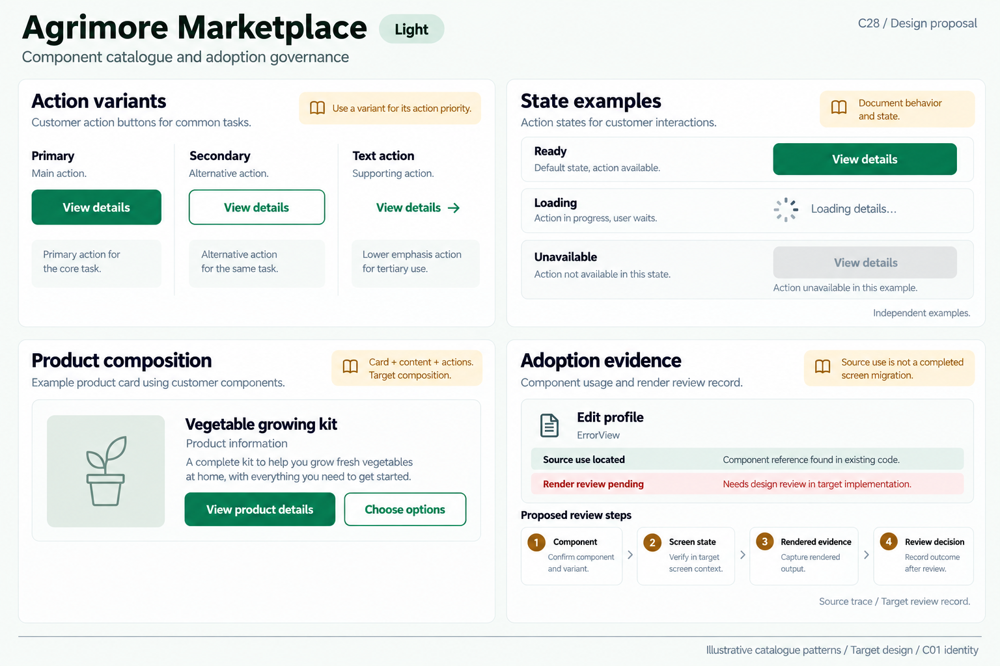
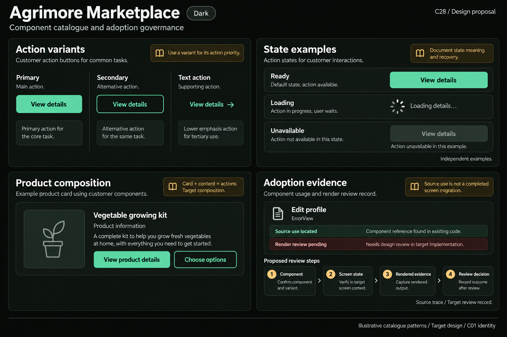

# Agrimore Marketplace — C28 component catalogue and adoption governance

**PROVISIONAL_DIRECTION / TARGET_IMPLEMENTATION · v1 · 2026-10-04.** C01 is approved and locked; C28 owner approval is pending.

Professional-green customer components, warm-gold catalogue annotations and natural-stone surfaces.

[Ten-board gallery](../../../../../docs/design-system/COMPONENT_CATALOGUE_ADOPTION_GOVERNANCE_BOARDS_2026-10-04.md) · [Codebase/domain map](../../../../../docs/design-system/COMPONENT_CATALOGUE_ADOPTION_GOVERNANCE_DOMAIN_MAP_2026-10-04.md) · [Exact prompts](prompts.md) · [Manifest](manifest.json).

## Current source

Marketplace root uses shared AppTheme, while screens also have app-local widgets and inline Material/literal presentation. Shared CustomButton declares filled/outlined/text with loading and null-callback disabling, but its explicit child text/spinner is white for all variants. ErrorView is used in EditProfileScreen session-change refusal; this proves a source use in that branch, not that every profile state is migrated or visually verified.

## Target direction

Catalogue customer action variants, read states and product composition with locked C01 roles. Track each screen/branch against component source and rendered state evidence; later package ownership should give Marketplace its own folder/API without moving shopper behavior or conflating shared imports with adoption.

| Panel | Domain specimen |
| --- | --- |
| Customer action variants | Panel "Action variants": three independently labelled examples "Primary", "Secondary", "Text action", each with exact action "View details"; filled, outlined and text-only using C01 primary. Gold note "Use a variant for its action priority". |
| Read-state examples | Panel "State examples": compact independent rows "Ready" with View details button, "Loading" with static neutral progress icon plus "Loading details…", "Unavailable" with disabled View details and helper "Action unavailable in this example". Caption "Independent examples". Gold note "Document state meaning and recovery". No percentage, real task or outcome. |
| Customer composition | Panel "Product composition": synthetic neutral product icon, title "Vegetable growing kit", small text "Product information", primary "View product details" and outlined "Choose options". External annotation "Card + content + actions" and "Target composition". No price, availability or cart result. |
| Honest screen adoption | Panel "Adoption evidence": a developer-documentation record "Edit profile" with "ErrorView", rows "Source use located" and "Render review pending"; below proposed review steps "Component", "Screen state", "Rendered evidence", "Review decision". Gold note "Source use is not a completed screen migration". Explicit "Source trace / Target review record". No completed/approved/pass badge, progress percentage or operational user workflow. |

Preservation and gaps:

- Shared CustomButton and the hidden CustomButton in custom_bottom_nav are separate declarations; textual symbol matches need import resolution.
- Catalogue variants require correct foreground roles; C28 depicts target C01 roles rather than copying current white-label secondary risk.
- Account/session refusal branches are not ordinary retry branches; do not replace their recovery with a generic retry.
- A product/domain card can compose canonical primitives without deleting merchant/customer domain content.

## Light

## Dark

