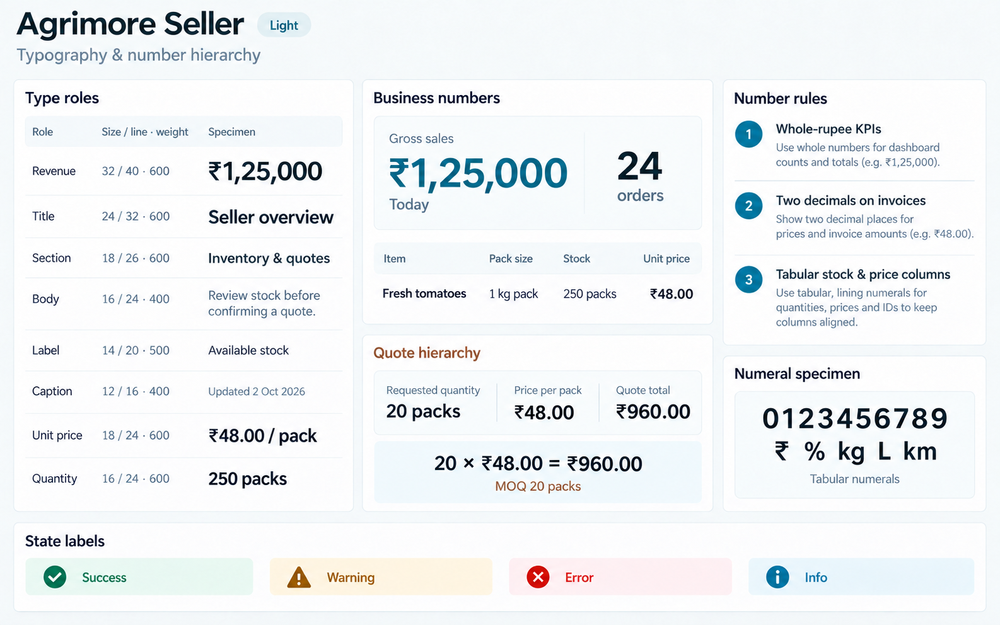
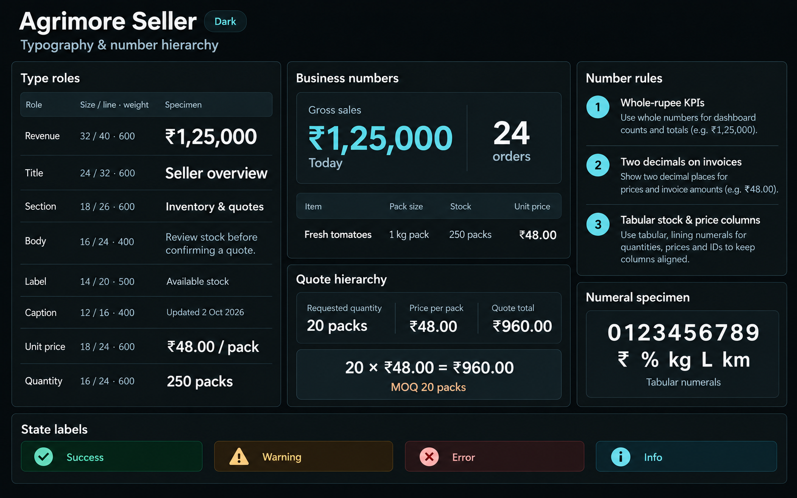

# Agrimore Seller — typography and number hierarchy

C02 · v1 · 2026-10-02 · **Typography proposal for owner review**

Business revenue → workload → stock quantity → unit price/MOQ → quote or invoice total.

## Light

## Dark

These are the selected final pair, using the approved [C01 visual system](../01-color-roles-theme-identity/README.md). See [prompts.md](prompts.md) for exact prompts and role/color/status specifications, [manifest.json](manifest.json) for checksums and provenance, the [domain map](../../../../../docs/design-system/TYPOGRAPHY_NUMBER_HIERARCHY_DOMAIN_MAP_2026-10-02.md), and [all ten final boards](../../../../../docs/design-system/TYPOGRAPHY_NUMBER_HIERARCHY_BOARDS_2026-10-02.md).
