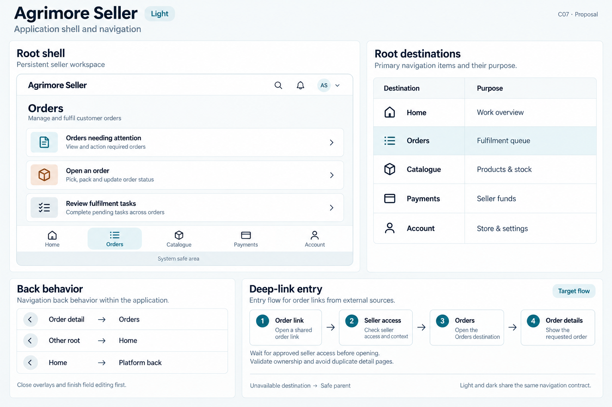
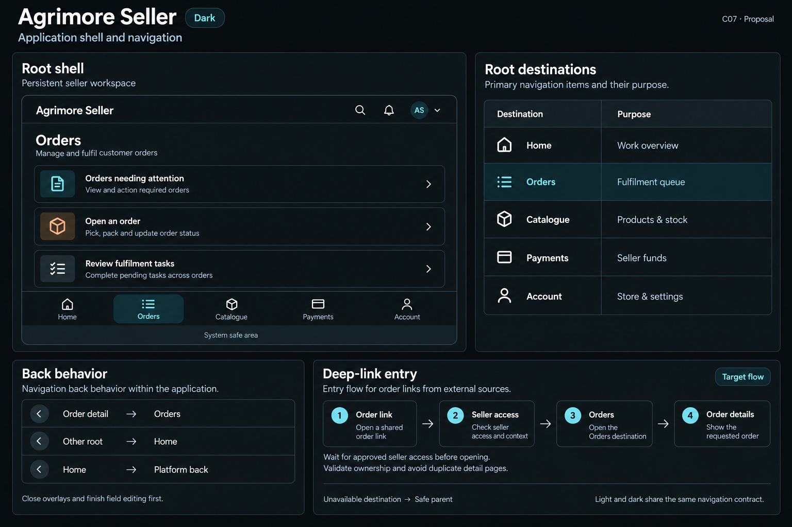

# Agrimore Seller — C07 application shell and navigation

**PROVISIONAL_DIRECTION / TARGET_IMPLEMENTATION · v1 · 2026-10-03.** C01 identity stays approved and locked. Static review references; runtime and asset registration are unchanged.

Identity: Blue-teal with warm copper and cool neutral support.

| Theme | Board |
| --- | --- |
| Light | [Open light](agrimore-seller-application-shell-navigation-light.png) |
| Dark | [Open dark](agrimore-seller-application-shell-navigation-dark.png) |

[Exact prompts](prompts.md) · [Manifest](manifest.json) · [All five apps](../../../../../docs/design-system/APPLICATION_SHELL_NAVIGATION_BOARDS_2026-10-03.md) · [Codebase/domain mapping](../../../../../docs/design-system/APPLICATION_SHELL_NAVIGATION_DOMAIN_MAP_2026-10-03.md) · [C01 approval](../../../../../docs/design-system/COLOR_ROLES_THEME_IDENTITY_LOCK_2026-10-02.md).

Frame: **Persistent seller workspace**. Selected specimen: **Orders**.

| Root destination | Purpose |
| --- | --- |
| Home | Work overview |
| Orders | Fulfilment queue |
| Catalogue | Products & stock |
| Payments | Seller funds |
| Account | Store & settings |

## Current source

SellerShell has Home, Orders, Catalogue, Payments and Account roots, an IndexedStack, selection haptics and a pending-action order badge. PopScope returns non-Home roots to Home. A rail is used from the non-compact layout (600dp in current layout logic). The compact shell is shown here to respect the no-sidebar board format.

App uses MaterialApp with SellerAuthGate and direct imperative detail navigation. Android declares agrimore-seller; no app-level URI receiver, named-route resolver or deep-link coordinator was found in the scanned app lib. The Order link flow is a target proposal, not working URL support.

## Target direction

Keep the five root labels and retained workspace. Root selection is an identity, not a primary action. Add typed, allowlisted detail intents with seller access and order ownership checks before constructing a detail route; preserve unsaved-edit guard behavior. No fabricated notification badges.

Back behavior:

- Order detail → Orders
- Other root → Home
- Home → Platform back

Target entry: Order link → Seller access → Orders → Order details.

- Wait for approved seller access before opening.
- Validate ownership and avoid duplicate detail pages.

48px minimum interaction targets are proposed; labels and controls must grow for text. Safe areas are system measured. Flow cards explain the intended route relationship, not implemented external-URL support. Illustrations are not pixel-scale runtime screenshots.

## Light

## Dark

